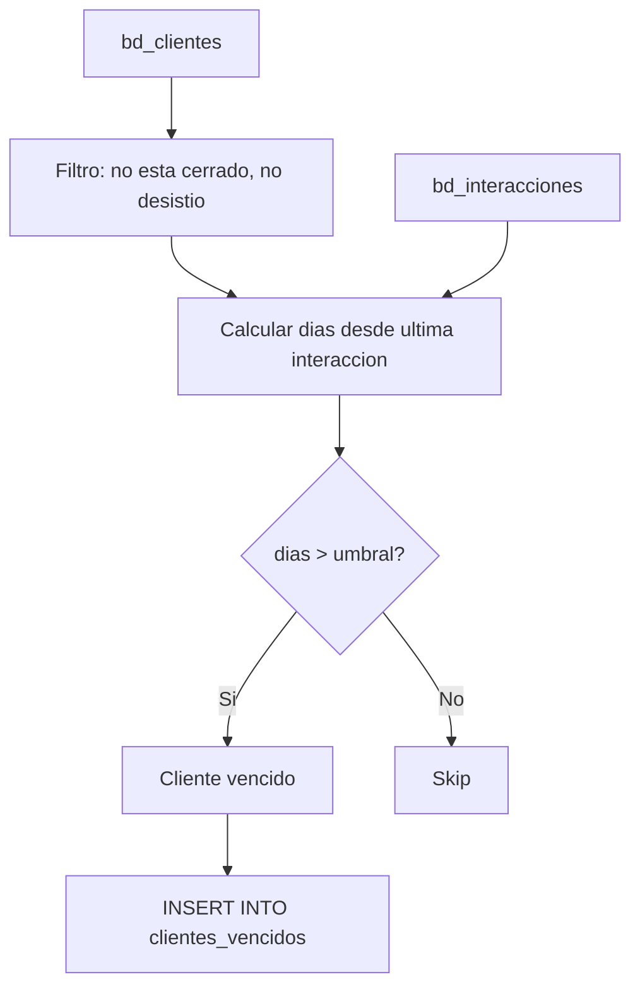

# `clientes_vencidos`

## ¿Qué representa?

Clientes que **no han tenido actividad reciente** y deberían ser contactados o reasignados. Los dashboards usan esta tabla para alertar al equipo comercial sobre leads "perdidos".

---

## Granularidad

```
Una fila = un cliente vencido
```

---

## Reglas de negocio

### ¿Qué se considera "vencido"?

Un cliente entra a esta tabla si:
1. **Su última interacción** es anterior a un umbral (ej. > 30 días, > 60 días — el umbral exacto está en el SQL).
2. **No tiene proceso de venta cerrado** (no es ya cliente comprador).
3. **No está marcado como `ha_desistido`**.

### Umbrales típicos
- 30 días sin interacción → alerta amarilla.
- 60 días sin interacción → alerta roja.
- 90 días sin interacción → cliente "frío".

(Los umbrales exactos están en CASE WHEN del SQL.)

---

## ¿De dónde vienen los datos?

| Tabla | Aporta |
|---|---|
| `bd_clientes` | Cliente base |
| `bd_interacciones` | Para `fecha_ultima_interaccion` |
| `bd_procesos` | Para excluir clientes ya cerrados |
| `bd_proyectos` | Identificación del proyecto |
| `bd_usuarios` | Asesor responsable (para reasignar) |

---

## Lógica



---

## Columnas destacadas

| Columna | Qué guarda |
|---|---|
| Identificación | `id_cliente`, nombres, apellidos, contacto |
| Proyecto | `id_proyecto`, `nombre_proyecto` |
| Asesor | `nombre_responsable`, `username` |
| Fechas clave | `fecha_registro`, `fecha_ultima_interaccion`, `dias_sin_actividad` |
| Estado | `nivel_interes`, `estado_cliente` |
| Categoría de vencimiento | `nivel_alerta` (amarillo, rojo, frío) |

---

## Cosas a tener en cuenta

- **Se reconstruye en cada corrida.** Un cliente que tuvo interacción ayer va a salir de `clientes_vencidos` en la próxima corrida. No hay histórico de "fue vencido".
- **El umbral de "vencido" puede variar entre Evolta y Sperant.** Si negocio define el umbral globalmente, hay que verificar las 3 versiones.
- **Clientes sin asesor asignado igual aparecen** — no hay filtro por `responsable`. Los dashboards los muestran como "SIN ASIGNAR".
- **Si un cliente desistió sin que el CRM lo registre como tal**, va a aparecer en vencidos. Buena oportunidad para que el asesor lo cierre formalmente.

---

## Referencia al código

- Evolta: `calculate_cliente_vencido_evolta(...)`.
- Sperant: `calculate_cliente_vencido_sperant(...)`.
- Joined: `calculate_cliente_vencido_sperant_evolta(...)`.
- Schema: `dashboard_tables_helper.py` → `create_clientes_vencidos_table(...)`.
