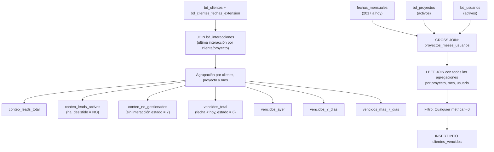

# `clientes_vencidos` — fact table de gestión y vencimiento de leads

## ¿Qué representa?

A pesar de su nombre, esta tabla **no es un listado cliente por cliente**. En realidad, es una **tabla de hechos agregada** que mide el performance de gestión de los asesores comerciales. Agrupa métricas mensuales por **proyecto, mes y usuario (asesor)**.

Sirve para los dashboards de control de gestión, permitiendo responder preguntas como: *"¿Cuántos leads activos tuvo el asesor X en el proyecto Y durante el mes Z? ¿Cuántos dejó sin gestionar? ¿Cuántos se le vencieron ayer o hace más de 7 días?"*.

---

## Granularidad

**Una fila = Un Proyecto + Un Mes + Un Asesor (Usuario)**

Solo se guardan filas donde el asesor tuvo algún lead, lead activo, no gestionado, o algún tipo de vencimiento.

---

## ¿Por qué existe?

Para evitar calcular métricas de vencimiento y gestión on-the-fly en las herramientas de BI. Al tener las volumetrías precalculadas por asesor, el tablero de control carga instantáneamente la bolsa de leads de cada vendedor y su nivel de atraso en el seguimiento.

---

## Lógica

### Diagrama de flujo

### Fuentes

| Tabla fuente | Qué aporta |
|---|---|
| `bd_proyectos` / `bd_empresa` | Estructura base: `grupo_inmobiliario`, `nombre_empresa`, `team_performance`. |
| `bd_usuarios` | Listado maestro de asesores (`nombre_consolidado`). |
| `bd_clientes` / `extension` | Leads captados, fecha de registro y si han desistido (`ha_desistido`). |
| `bd_interacciones` | Vital para determinar si un lead fue contactado (estado `7`) o si la tarea expiró (estado `6`). Se usa para calcular los vencimientos. |

---

## Métricas / atributos consolidados

| Columna | Descripción |
|---|---|
| **Estructura** | `grupo_inmobiliario`, `nombre_empresa`, `team_performance`, `nombre_proyecto`, `is_visible`, `mes_anio`, `usuario` |
| **Volumen** | `total_leads` (Todos los prospectos/clientes), `leads_activos` (Excluye `ha_desistido = SI`) |
| **Gestión** | `no_gestionados` (Leads activos que nunca tuvieron una interacción con estado `7` - contactado) |
| **Vencimientos** | `vencidos_total` (Interacciones estado `6` cuya fecha ya pasó) |
| **Detalle Vencidos** | `vencidos_ayer` (Vencidos exactamente el día anterior a la fecha de proceso) |
| **Detalle Vencidos** | `vencidos_ultimos_7_dias` (Vencidos entre hace 2 y 7 días) |
| **Detalle Vencidos** | `vencidos_mas_7_dias` (Vencidos hace más de 7 días) |

---

## Reglas de negocio

### 1. Asignación del "Mes" (`mes_anio`)
El mes se basa en la `fecha_registro` del cliente (fecha de entrada al embudo). Por tanto, un vendedor en enero tendrá los leads que entraron en enero, y sobre esa cohorte se miden sus vencimientos y no gestionados de esa base en particular.

### 2. ¿Qué es un lead "No Gestionado"?
Un lead (donde `ha_desistido = 'NO'`) se considera no gestionado si **no existe** ninguna interacción para ese cliente y proyecto que tenga `estado = '7'`. 

### 3. ¿Qué es un lead "Vencido"?
Es un lead (donde `ha_desistido = 'NO'`) cuya última interacción tiene `estado = '6'` y la `fecha_interaccion` es menor a la fecha actual de proceso (`CURRENT_DATE()`).

### 4. Determinación del Usuario Responsable
El vendedor se calcula de forma mixta:
- Para 'PROSPECTO': se usa el `responsable_consolidado` directo de `bd_clientes`.
- Para 'CLIENTE': se usa el `responsable_interaccion` (el responsable de la **última** interacción registrada).
- Si lo anterior falla, se usa el `responsable_consolidado` de `bd_clientes_fechas_extension`.

---

## Cosas a tener en cuenta

- **Es una tabla agregada:** No se puede obtener el nombre o correo del cliente desde aquí. Esta tabla alimenta KPIs agregados (gráficos de barras, tacómetros).
- **El `CROSS JOIN` inicial asegura completitud:** Se genera una matriz de todos los meses, por todos los proyectos, por todos los asesores, para asegurar que si un asesor tiene "0" vencidos pero tiene leads, igual aparezca (gracias a los `LEFT JOIN` con `COALESCE`). Luego el filtro final descarta las filas donde *todo* es 0.

---

## Referencia al código

- Origen Evolta: `infra/src/etl/dashboard_operations_evolta.py` → `calculate_cliente_vencido_evolta(...)`
- Origen Sperant: `infra/src/etl/dashboard_operations_sperant.py` → `calculate_cliente_vencido_sperant(...)`
- Origen Joined: `infra/src/etl/dashboard_operations_sperant_evolta_prueba2.py` → `calculate_cliente_vencido_evolta_sperant(...)`
- Definición de Schema: `infra/src/etl/dashboard_tables_helper.py` → `create_clientes_vencidos_table(...)`
