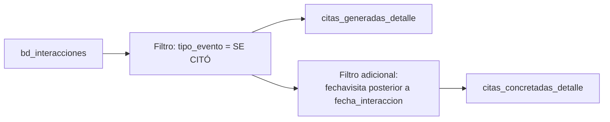

# `citas_generadas_detalle` y `citas_concretadas_detalle`

## ¿Qué representan?

Dos tablas distintas pero relacionadas:

- **`citas_generadas_detalle`** — listado de citas que **se acordaron** (cliente confirmó que vendría en una fecha futura).
- **`citas_concretadas_detalle`** — listado de citas que **efectivamente se realizaron** (el cliente vino).

Una cita concretada es siempre también una cita generada — pero no al revés (algunas se cancelan).

---

## Granularidad

```
Una fila = una cita
```

---

## ¿De dónde vienen los datos?

Misma tabla origen (`bd_interacciones`), pero con filtros distintos.

| Tabla | Aporta |
|---|---|
| `bd_interacciones` | Eventos de cita |
| `bd_clientes` | Cliente |
| `bd_proyectos` | Proyecto |
| `bd_usuarios` | Responsable |

---

## Reglas de negocio

### `citas_generadas_detalle`

Filtros:
- `tipo_evento = 'SE CITÓ'`.

Conceptualmente: el evento "SE CITÓ" significa que el asesor agendó una cita con el cliente.

### `citas_concretadas_detalle`

Filtros:
- `tipo_evento = 'SE CITÓ'`.
- `fechavisita IS NOT NULL`.
- `fechavisita > fecha_interaccion` (la visita fue posterior al acuerdo).

Conceptualmente: el cliente realmente vino al proyecto.

### Deduplicación
Ambas tablas usan `ROW_NUMBER() OVER (PARTITION BY id_cliente, id_proyecto, mes_anio)` y filtran `rn = 1`. Si un cliente generó 3 citas en el mismo mes, solo se cuenta una.

---

## Diagrama del flujo



---

## Columnas destacadas

Mismas que `visitas_detalle`, más:
- `fecha_citado` — cuándo se acordó la cita (en `citas_generadas`).
- `fecha_visita` — cuándo se concretó (en `citas_concretadas`).
- `tipo_evento` — siempre "SE CITÓ" (porque ese es el filtro).

---

## Cosas a tener en cuenta

- **`SE CITÓ` con tilde.** El filtro es exacto — sin tilde no matchea. Si Evolta cambia a "SE CITO" sin tilde, las citas dejan de contarse.
- **Una cita generada que después se concretó aparece en ambas tablas.** No es exclusivo.
- **Tasa de concretación = `concretadas / generadas`.** Es uno de los KPIs comerciales más importantes.
- **Si un cliente agendó la cita pero no vino**, queda solo en `generadas`.

---

## Referencia al código

- Generadas — Evolta: `calculate_citas_generadas_detalle_evolta(...)`.
- Generadas — Sperant: `calculate_citas_generadas_detalle_sperant(...)`.
- Generadas — Joined: `calculate_citas_generadas_detalle_sperant_evolta(...)`.
- Concretadas — Evolta: `calculate_citas_concretadas_detalle_evolta(...)`.
- Concretadas — Sperant: `calculate_citas_concretadas_detalle_sperant(...)`.
- Concretadas — Joined: `calculate_citas_concretadas_detalle_sperant_evolta(...)`.
- Schemas: `create_citas_generadas_detalle_table(...)` y `create_citas_concretadas_detalle_table(...)`.
