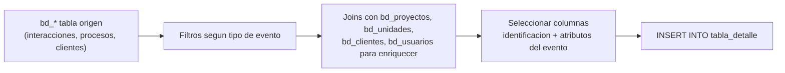

# Detalles operativos

## ¿Qué es esta carpeta?

Las tablas `*_detalle` del dashboard. A diferencia de los KPIs (que son agregaciones), estas son **listados fila-por-fila**: una fila por evento puntual con todos sus atributos.

Sirven para:
- Que un asesor abra un dashboard y vea el listado de "todas las visitas de este mes" o "todas las separaciones del trimestre".
- Que ventas vea el detalle exacto de cada venta cerrada.
- Que marketing vea fila por fila los prospectos que llegaron por META.

---

## Tablas de esta carpeta

| Tabla | Doc | Qué lista |
|---|---|---|
| `prospectos_detalle` | `prospectos.md` | Cada prospecto registrado |
| `visitas_detalle` | `visitas.md` | Cada visita realizada |
| `citas_generadas_detalle` y `citas_concretadas_detalle` | `citas.md` | Citas agendadas y concretadas |
| `separaciones_detalle` | `separaciones.md` | Cada separación de unidad |
| `ventas_detalle` | `ventas.md` | Cada venta cerrada |

---

## Patrón común de cálculo

### Pasos típicos
1. **Filtro inicial** sobre la tabla origen (`bd_interacciones`, `bd_procesos`, etc.) por tipo de evento.
2. **Joins** con tablas maestras para resolver nombres legibles (proyecto, asesor, unidad, cliente).
3. **Selección** de las columnas relevantes para el detalle.
4. **INSERT** en la tabla del dashboard.

A diferencia de los KPIs:
- **No hay `GROUP BY`** — cada fila origen genera una fila destino.
- **No hay calendario** — solo se exponen eventos reales.
- **Volumen alto** — millones de filas en esquemas grandes.

---

## Reglas comunes a todos los detalles

### 1. Identificación dual
Todas las filas tienen `id_*_evolta` y `id_*_sperant` para trazabilidad.

### 2. Enriquecimiento con nombres
- En vez de mostrar `id_proyecto = 1234`, se muestra `nombre_proyecto = "Torre Sol"`.
- Lo mismo para asesor, cliente, unidad.

### 3. Filtros de calidad
Algunos detalles aplican filtros para excluir datos malos:
- `tipo_unidad IN ('CASA', 'DEPARTAMENTO')` (excluye estacionamientos, depósitos).
- `motivo_caida NOT IN ('ERROR DATA', ...)` (excluye errores de carga).

### 4. Sin `is_visible`
A diferencia de los KPIs, los detalles **no filtran por proyecto visible**. Si negocio quiere ocultar datos de un proyecto, hay que filtrar en el dashboard.

### 5. Mes_anio + fecha
Casi todos los detalles tienen ambas columnas:
- `fecha` — fecha exacta del evento.
- `mes_anio` — string `"YYYY-MM"` para agrupar por mes.

---

## Volumen y performance

| Tabla | Filas estimadas (esquema mediano) | Periodicidad |
|---|---|---|
| `prospectos_detalle` | 50.000 - 500.000 | Acumulado histórico |
| `visitas_detalle` | 10.000 - 100.000 | Acumulado histórico |
| `citas_*_detalle` | 5.000 - 50.000 | Acumulado histórico |
| `separaciones_detalle` | 1.000 - 10.000 | Acumulado histórico |
| `ventas_detalle` | 500 - 5.000 | Acumulado histórico |

Se reconstruyen en cada corrida (TRUNCATE + INSERT).

---

## ¿Cuándo editar?

- Agregar una columna nueva al detalle (ej. UTM, GPS) → editar el `calculate_*_detalle_*` de las 3 fuentes y el schema en `dashboard_tables_helper.py`.
- Cambiar el filtro de qué cuenta como "visita" o "separación" → cuidado, esto desincroniza el detalle con los KPIs si los criterios divergen.
- Renombrar una columna → editar las 3 versiones + schema + dashboards downstream.
