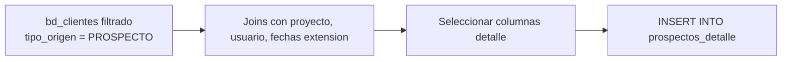

# `prospectos_detalle`

## ¿Qué representa?

Listado fila-por-fila de **cada prospecto registrado** en el CRM con todos sus atributos: contacto, fecha, medio, UTM, responsable, estado.

---

## Granularidad

```
Una fila = un prospecto
```

Todos los prospectos del histórico (no solo del mes actual).

---

## ¿De dónde vienen los datos?

| Tabla | Aporta |
|---|---|
| `bd_clientes` (filtrado por `tipo_origen = 'PROSPECTO'`) | Datos del prospecto |
| `bd_clientes_fechas_extension` | Fecha de captación, medio categoría |
| `bd_proyectos` | Nombre del proyecto |
| `bd_usuarios` | Nombre del responsable |

---

## Lógica



### Filtros
- `tipo_origen = 'PROSPECTO'` (excluye `CLIENTE` que ya está convertido).
- `correo != 'TEST@FB.COM'` (excluye datos de prueba).
- `fecha_registro IS NOT NULL`.

---

## Columnas destacadas

| Categoría | Columnas |
|---|---|
| **Identificación** | `id_cliente`, IDs duales, `id_proyecto`, `nombre_proyecto` |
| **Cliente** | `nombres`, `apellidos`, `correo`, `celular`, `nrodocumento` |
| **Captación** | `fecha_registro`, `medio_captacion`, `medio_captacion_categoria`, `canal_entrada`, UTMs |
| **Estado** | `nivel_interes`, `estado_cliente`, `ha_desistido`, `razon_desistimiento` |
| **Responsable** | `nombre_responsable`, `username` |
| **Tiempo** | `fecha_ultima_interaccion`, `total_interacciones`, `proxima_tarea` |
| **Ubicación** | `departamento`, `provincia`, `distrito` |

---

## Cosas a tener en cuenta

- **Solo prospectos**, no clientes convertidos. Si negocio quiere todos los registros incluyendo conversiones, hay que combinar con `bd_clientes` filtrando por `tipo_origen = 'CLIENTE'` también.
- **Volumen alto.** En esquemas con marketing digital fuerte (Facebook Ads), los prospectos pueden ser cientos de miles.
- **Filas con datos vacíos.** Muchos prospectos digitales solo tienen email y nombre — el resto queda NULL.

---

## Referencia al código

- Evolta: `calculate_prospectos_detalle_evolta(...)`.
- Sperant: `calculate_prospectos_detalle_sperant(...)`.
- Joined: `calculate_prospectos_detalle_sperant_evolta(...)`.
- Schema: `dashboard_tables_helper.py` → `create_prospectos_detalle_table(...)`.
- También existe `prospectos_data` (agregado): `create_prospectos_data_table(...)` y `calculate_prospectos_data_*`.
