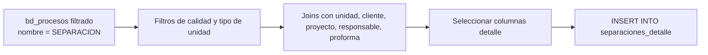

# `separaciones_detalle`

## ¿Qué representa?

Listado fila-por-fila de **cada separación** registrada (reserva de unidad por parte de un cliente).

Una separación es el paso intermedio entre proforma y venta: el cliente "reserva" una unidad pagando una señal y se compromete a cerrar la venta en cierto plazo.

---

## Granularidad

```
Una fila = una separación
```

---

## ¿De dónde vienen los datos?

| Tabla | Aporta |
|---|---|
| `bd_procesos` | Filtrado por `nombre = 'SEPARACION'` |
| `bd_unidades` | Unidad separada |
| `bd_clientes` | Cliente que separó |
| `bd_proyectos` | Proyecto |
| `bd_usuarios` | Responsable de la separación |
| `bd_proformas` | Proforma asociada (si la hay) |

---

## Lógica



### Filtros
Iguales a los del CTE `procesos_sep` en `kpis_embudo_comercial`:
- `nombre = 'SEPARACION'`.
- `motivo_caida != 'ERROR DATA'` (o NULL).
- `motivo_caida != 'ERROR EN REFINANCIAMIENTO'` (o NULL).
- `fecha_inicio IS NOT NULL`.
- `tipo_unidad IN ('CASA', 'DEPARTAMENTO')`.

---

## Columnas destacadas

| Categoría | Columnas |
|---|---|
| **Identificación** | `id_proceso`, `codigo_proforma`, IDs duales |
| **Cliente** | `nombres_cliente`, `apellidos_cliente`, `documento_cliente`, contacto |
| **Proyecto y unidad** | `nombre_proyecto`, `nombre_unidad`, `tipo_unidad`, `tipologia` |
| **Fechas** | `fecha_separacion` (= `fecha_inicio` del proceso), `fecha_proforma`, `fecha_venta` (si convirtió) |
| **Montos** | `precio_base_proforma`, `descuento_venta`, `precio_venta`, `moneda`, `tipo_cambio` |
| **Comercial** | `tipo_financiamiento`, `banco`, `aprobador_descuento`, `responsable` |
| **Estado** | `fecha_devolucion` (NULL si activa), `motivo_caida` (NULL si OK) |
| **Captación** | `medio_captacion`, `medio_captacion_categoria`, UTMs |

---

## Reglas de negocio

### 1. Separaciones devueltas siguen apareciendo
Si una separación se canceló (`fecha_devolucion IS NOT NULL`), igual aparece en este detalle. Los dashboards deben filtrar por separaciones activas si solo quieren las vigentes.

### 2. "Separación digital"
Un campo derivado: `es_separacion_digital` = TRUE si el cliente vino por canal digital (META, WEB, PORTALES, TIKTOK, MAILING). Útil para reportes de marketing.

### 3. Separación → venta
Si la separación derivó en venta, el campo `fecha_venta` está poblado. Si no, queda NULL. La conversión se calcula como `count(separaciones con fecha_venta) / count(separaciones)`.

### 4. Sin filtro por fecha
A diferencia de los KPIs (que usan calendario), el detalle expone todas las separaciones del histórico. Los dashboards filtran por fecha en runtime.

---

## Cosas a tener en cuenta

- **Una unidad puede tener múltiples separaciones a lo largo del tiempo.** Si el primer cliente devolvió la separación y un segundo cliente la volvió a separar, hay 2 filas para la misma unidad.
- **Los filtros deben ser idénticos a los de `kpis_embudo_comercial`.** Si negocio cambia la regla en uno y no en otro, los totales no cuadran.
- **Volumen moderado.** Las separaciones suelen ser cientos o miles por esquema, no decenas de miles.

---

## Referencia al código

- Evolta: `calculate_separaciones_detalle_evolta(...)`.
- Sperant: `calculate_separaciones_detalle_sperant(...)`.
- Joined: `calculate_separaciones_detalle_sperant_evolta(...)`.
- Schema: `dashboard_tables_helper.py` → `create_separaciones_detalle_table(...)`.
