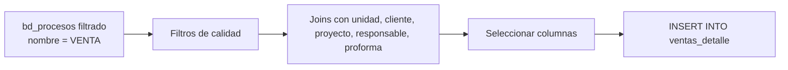

# `ventas_detalle`

## ¿Qué representa?

Listado fila-por-fila de **cada venta cerrada** (operación firmada).

Una venta es la última etapa del embudo — el cliente firmó minuta, hizo el pago inicial, y la unidad pasó formalmente a su nombre.

---

## Granularidad

```
Una fila = una venta cerrada
```

---

## ¿De dónde vienen los datos?

Mismas tablas que `separaciones_detalle`, pero con filtros distintos.

| Tabla | Aporta |
|---|---|
| `bd_procesos` | Filtrado por `nombre = 'VENTA'` |
| `bd_unidades`, `bd_clientes`, `bd_proyectos`, `bd_usuarios`, `bd_proformas` | Para enriquecer |

---

## Lógica



### Filtros
Iguales a los del CTE `procesos_venta` en `kpis_embudo_comercial`:
- `nombre = 'VENTA'`.
- `motivo_caida != 'ERROR DATA'` (o NULL).
- `momento_caida != 'ERROR EN REFINANCIAMIENTO'` (o NULL).
- `fecha_fin IS NOT NULL`.
- `tipo_unidad IN ('CASA', 'DEPARTAMENTO')`.

> **Nota**: para ventas el filtro es `momento_caida` (no `motivo_caida` como en separaciones). Es un detalle del schema de Evolta — verificar.

---

## Columnas destacadas

Casi idénticas a `separaciones_detalle`, con foco distinto en fechas:

| Categoría | Columnas |
|---|---|
| **Identificación** | `id_proceso`, `codigo_proforma`, `numero_contrato`, IDs duales |
| **Cliente** | nombres, apellidos, documento, contacto |
| **Proyecto y unidad** | nombre proyecto, unidad, tipología |
| **Fechas** | `fecha_venta` (= `fecha_fin` del proceso), `fecha_separacion` (separación previa), `fecha_devolucion` (si fue devuelta) |
| **Montos** | `precio_venta`, `descuento_venta`, `moneda`, `tipo_cambio` |
| **Comercial** | `tipo_financiamiento`, `banco`, `responsable` |
| **Estado** | `es_venta_activa` (TRUE si `fecha_devolucion IS NULL`) |
| **Captación** | medio, categoría, UTMs |

---

## Reglas de negocio

### 1. Ventas activas vs ventas brutas
- **Ventas brutas** = todas las que aparecen en este detalle.
- **Ventas activas** = solo las que NO fueron devueltas (`fecha_devolucion IS NULL`).

Para reportes financieros suele importar más la venta activa.

### 2. Una venta tiene siempre una separación previa
La `fecha_separacion` debe ser anterior a `fecha_venta`. Si no aparece, hay un dato incompleto.

### 3. Tiempo de cierre
Se puede calcular el tiempo entre separación y venta:
```
DATE_DIFF(fecha_venta, fecha_separacion, DAY)
```
Útil para dashboards de "velocidad de cierre".

### 4. Devoluciones tardías
Si una venta se devolvió 6 meses después, igual aparece como venta — solo el campo `fecha_devolucion` la marca. Los dashboards deben usar `fecha_devolucion IS NULL` para "ventas firmes".

---

## Cosas a tener en cuenta

- **Filtros deben sincronizarse con `kpis_embudo_comercial.VENTAS`.** Si difieren, totales no cuadran.
- **`momento_caida` vs `motivo_caida`**: nombres parecidos en Evolta, ambos campos pueden marcar errores. Verificar cuál se usa en cada filtro.
- **Volumen bajo.** Las ventas son las menos numerosas de toda la cadena — cientos por año por proyecto típicamente.

---

## Referencia al código

- Evolta: `calculate_ventas_detalle_evolta(...)`.
- Sperant: `calculate_ventas_detalle_sperant(...)`.
- Joined: `calculate_ventas_detalle_sperant_evolta(...)`.
- Schema: `dashboard_tables_helper.py` → `create_ventas_detalle_table(...)`.
