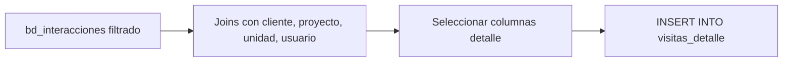

# `visitas_detalle`

## ¿Qué representa?

Listado fila-por-fila de **cada visita** que un cliente hizo a un proyecto.

---

## Granularidad

```
Una fila = una visita registrada
```

---

## ¿De dónde vienen los datos?

| Tabla | Aporta |
|---|---|
| `bd_interacciones` | Tabla principal de visitas |
| `bd_clientes` | Datos del cliente |
| `bd_proyectos` | Nombre del proyecto |
| `bd_unidades` | Unidad relacionada (si aplica) |
| `bd_usuarios` | Nombre del responsable |

---

## Lógica



### Filtros
Iguales a los del CTE `interacciones` en `kpis_embudo_comercial`:
- `tipo_origen = 'INTERACCION_CLIENTE'`.
- `origen != 'SOLO PROFORMA'`.
- `visita_unica_mes = 'SI'`.
- `fechavisita IS NOT NULL`.

---

## Columnas destacadas

| Categoría | Columnas |
|---|---|
| **Evento** | `id_interaccion`, `fecha_visita`, `mes_anio` |
| **Cliente** | `id_cliente`, `nombres_cliente`, `apellidos_cliente`, `documento_cliente`, `correo`, `celular` |
| **Proyecto** | `id_proyecto`, `nombre_proyecto` |
| **Unidad** | `id_unidad`, `nombre_unidad` (si la visita fue sobre una unidad puntual) |
| **Responsable** | `nombre_responsable`, `username` |
| **Marketing** | `medio_captacion`, `medio_captacion_categoria`, `canal_entrada`, UTMs |
| **Origen** | `origen` (regular, transito, evento), `tipo_evento`, `nivel_interes` |

---

## Reglas de negocio importantes

### 1. "Visita única del mes"
Si un cliente visita el mismo proyecto 3 veces en un mes, solo la primera cuenta. Esto se controla con `visita_unica_mes = 'SI'`.

### 2. Distinción visita vs cita
- **Visita** = el cliente vino al proyecto (presencial).
- **Cita** = se acordó una fecha de visita (puede haber sido concretada o no).

`visitas_detalle` lista las visitas reales. Las citas están en `citas_*_detalle`.

### 3. Origen de la visita
- `origen != 'SOLO PROFORMA'` excluye casos donde el cliente solo pidió cotización sin visitar.
- Hay otros valores como `'TRANSITO'` (visita walk-in sin cita previa).

---

## Cosas a tener en cuenta

- **Mismos filtros que los KPIs.** Si los KPIs de visitas dicen 30 y este detalle tiene 45, hay un bug — los criterios deben coincidir.
- **`fechavisita`** puede ser distinto de `fecha_interaccion`. Una cita acordada el día 1 puede tener `fechavisita` del día 15.
- **Volumen alto.** En proyectos populares puede haber decenas de miles de visitas.

---

## Referencia al código

- Evolta: `calculate_visitas_detalle_evolta(...)`.
- Sperant: `calculate_visitas_detalle_sperant(...)`.
- Joined: `calculate_visitas_detalle_sperant_evolta(...)`.
- Schema: `dashboard_tables_helper.py` → `create_visitas_detalle_table(...)`.
- También existe `visitas_data` (agregado): `create_visitas_data_table(...)` y `calculate_visitas_data_*`.
