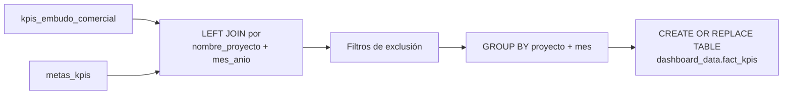

# `fact_kpis` — tabla de hechos consolidada

## ¿Qué representa?

Tabla materializada que cruza los **KPIs reales** del embudo (`kpis_embudo_comercial`) contra las **metas cargadas** (`metas_kpis`), poniendo ambos valores lado a lado. Pensada como fuente de verdad para dashboards de cumplimiento de metas.

---

## ¿Por qué existe?

Tanto `kpis_embudo_comercial` como `metas_kpis` viven en tablas separadas. Para mostrar "real vs meta" en un dashboard, habría que hacer el JOIN cada vez. Esta tabla lo precalcula y además:

- **Agrega filtros de exclusión** que no se aplican en ningún otro cálculo.
- **Parsea `mes_anio`** a tipo `DATE` como `mes_fecha`, útil para ordenar y filtrar por rango temporal.
- **Trae `meta_hoy`**: porcentaje del mes transcurrido (para proyectar cumplimiento).

---

## Lógica



### Fuentes

| Tabla fuente | Qué aporta |
|---|---|
| `dashboard_data.kpis_embudo_comercial` | Valores `real_*`: CAPTACIONES, VISITAS, SEPARACIONES, VENTAS, LEADS, CITAS_GENERADAS, CITAS_CONCRETADAS |
| `dashboard_data.metas_kpis` | Valores `meta_*`: captaciones, visitas_total, separaciones_totales, ventas, leads, citas_generadas, citas_concretadas |

### Columnas de salida

| Columna | Tipo | Origen |
|---|---|---|
| `team_performance` | STRING | `kpis_embudo_comercial` |
| `nombre_empresa` | STRING | `kpis_embudo_comercial` |
| `nombre_proyecto` | STRING | `kpis_embudo_comercial` |
| `mes_anio` | STRING | `kpis_embudo_comercial` |
| `mes_fecha` | DATE | `PARSE_DATE('%Y-%m', mes_anio)` |
| `meta_hoy` | FLOAT | `metas_kpis.meta_hoy` — porcentaje del mes transcurrido |
| `real_captaciones` | INTEGER | `SUM(CAPTACIONES)` |
| `meta_captaciones` | INTEGER | `SUM(metas.captaciones)` |
| `real_leads` / `meta_leads` | INTEGER | ídem |
| `real_citas_generadas` / `meta_citas_generadas` | INTEGER | ídem |
| `real_citas_concretadas` / `meta_citas_concretadas` | INTEGER | ídem |
| `real_visitas` / `meta_visitas` | INTEGER | ídem |
| `real_separaciones` / `meta_separaciones` | INTEGER | ídem |
| `real_ventas` / `meta_ventas` | INTEGER | ídem |

---

## Reglas de negocio

### 1. Filtros de exclusión hardcodeados

```sql
WHERE team_performance    NOT IN ('SIN TEAM', 'VYVE')
  AND grupo_inmobiliario  NOT IN ('TALE INMOBILIARIA')
```

> **`SIN TEAM`**: proyectos sin equipo asignado — no se deben considerar en KPIs de cumplimiento.
> **`VYVE`**: grupo inmobiliario que se excluye de este reporte específico.
> **`TALE INMOBILIARIA`**: grupo inmobiliario excluido.

Estos filtros **solo aplican a `fact_kpis`** — no aparecen en `kpis_embudo_comercial` ni en el funnel.

### 2. `CREATE OR REPLACE TABLE` (no INSERT INTO)

A diferencia del resto de tablas dashboard que usan `INSERT INTO` incremental por esquema, esta tabla usa `CREATE OR REPLACE` — se reconstruye completa en cada corrida.

### 3. Se ejecuta una sola vez por corrida

No se itera por esquema. Se ejecuta al final de todos los cálculos, después de que todos los esquemas ya insertaron sus datos en `kpis_embudo_comercial` y `metas_kpis`.

---

## Cosas a tener en cuenta

- **Si se agrega un nuevo grupo a excluir**, hay que editar el `WHERE` en `dashboard_operations.py` → `calculate_fact_kpis()`.
- **Si se agrega una nueva métrica al embudo** (por ejemplo PRE_SEPARACIONES), hay que sumar las columnas `real_*` y `meta_*` correspondientes.
- **`meta_hoy` puede ser NULL** si el proyecto no tiene meta en el mes. El dashboard debe manejar ese caso.
- **La columna `mes_fecha`** es la única tabla dashboard donde `mes_anio` se parsea a tipo `DATE`. Todas las demás usan el string `"YYYY-MM"`.

---

## Referencia al código

- `dashboard_operations.py` → `calculate_fact_kpis(bq_client)`.
- Se ejecuta en `dashboard_runner.py` línea ~770, justo antes de la historización.
