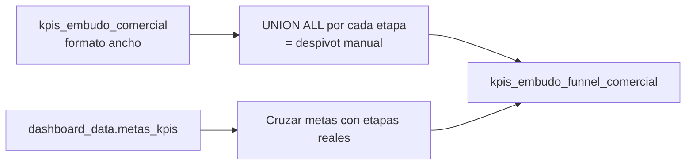
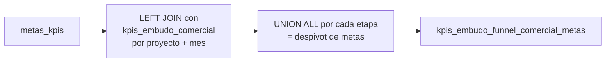

# `kpis_embudo_funnel_comercial` (post-procesamiento)

## ¿Qué representa?

Un "despivot" de `kpis_embudo_comercial`. La tabla original tiene una columna por cada etapa del embudo (CAPTACIONES, VENTAS, etc.), pero hay dashboards que necesitan los datos en formato **largo** — una fila por etapa.

---

## Antes vs después

**`kpis_embudo_comercial` (formato ancho):**

| proyecto | mes | CAPTACIONES | VISITAS | SEPARACIONES | VENTAS |
|---|---|---|---|---|---|
| Torre Sol | 2026-01 | 50 | 30 | 8 | 5 |

**`kpis_embudo_funnel_comercial` (formato largo):**

| proyecto | mes | etapa | valor |
|---|---|---|---|
| Torre Sol | 2026-01 | CAPTACIONES | 50 |
| Torre Sol | 2026-01 | VISITAS | 30 |
| Torre Sol | 2026-01 | SEPARACIONES | 8 |
| Torre Sol | 2026-01 | VENTAS | 5 |

El segundo formato es mejor para gráficos tipo "funnel" o "comparación de etapas".

---

## Lógica



### Cómo se hace
- Por cada etapa (CAPTACIONES, VISITAS, SEPARACIONES, VENTAS, LEADS, SEPARACIONES_ACTIVAS, CITAS_GENERADAS, CITAS_CONCRETADAS, TRANSITO, SEPARACIONES_DIGITALES) se hace un `SELECT` que extrae el valor de esa columna y lo etiqueta:
  ```sql
  SELECT ..., 'CAPTACIONES' AS etapa, CAPTACIONES AS valor
  FROM dashboard_data.kpis_embudo_comercial
  ```
- Todos los `SELECT` se hacen `UNION ALL`.
- También se cruzan con la tabla de **metas** (`metas_kpis`) para que cada etapa tenga su valor de meta correspondiente.

---

## Reglas de negocio

### 1. Misma etapa puede aparecer dos veces
Una vez con valor real, otra con valor meta. Los dashboards distinguen via columna `tipo` (real / meta) o porque hay dos consultas separadas.

### 2. Sin filtros adicionales
Esta función NO recalcula nada — solo reorganiza. Si los KPIs originales tienen un bug, se propaga sin cambios.

### 3. Mantenimiento
Si se agrega una nueva etapa al embudo (por ejemplo PRE_SEPARACIONES), hay que:
1. Agregarla a `kpis_embudo_comercial` (capa 4 + capa 6).
2. Agregar el `SELECT ... 'PRE_SEPARACIONES' AS etapa, PRE_SEPARACIONES AS valor UNION ALL` en `calculate_funnel_embudo_comercial`.

---

## Cosas a tener en cuenta

- **Es post-procesamiento.** Se ejecuta después de que los `calculate_kpis_*` poblaron `kpis_embudo_comercial` con las 3 fuentes.
- **Se ejecuta una sola vez por corrida** (no por esquema), a diferencia de los `calculate_kpis_*`.
- **El `metas_kpis` se cruza por nombre de proyecto + mes**, no por ID. Match frágil si nombres difieren.

---

## Segunda tabla: `kpis_embudo_funnel_comercial_metas`

La misma función `calculate_funnel_embudo_comercial` también inserta en una **segunda tabla** que contiene los valores de las metas en formato funnel:



### Diferencia con la tabla principal

| Tabla | Contiene | Fuente de datos |
|---|---|---|
| `kpis_embudo_funnel_comercial` | Valores **reales** (despivot de KPIs) | `kpis_embudo_comercial` |
| `kpis_embudo_funnel_comercial_metas` | Valores **meta** (despivot de metas) | `metas_kpis` LEFT JOIN `kpis_embudo_comercial` |

### Detalle del JOIN de metas

```sql
FROM dashboard_data.metas_kpis AS km
LEFT JOIN dashboard_data.kpis_embudo_comercial AS kb
    ON km.proyecto = kb.nombre_proyecto AND km.anio_mes = kb.mes_anio
WHERE kb.nombre_proyecto IS NOT NULL
```

Se hace `LEFT JOIN` desde metas hacia KPIs, pero el `WHERE kb.nombre_proyecto IS NOT NULL` lo convierte en un INNER JOIN efectivo — solo metas que tienen proyecto en KPIs.

### Etapas incluidas en metas

Mismas que la tabla principal: CAPTACIONES, VISITAS, SEPARACIONES, VENTAS, LEADS, CITAS_GENERADAS, CITAS_CONCRETADAS, TRANSITO, SEPARACIONES_DIGITALES.

Los valores de meta se toman de las columnas correspondientes del CSV (`captaciones`, `visitas_total`, `separaciones_totales`, `ventas`, etc.).

---

## Referencia al código

- `dashboard_operations.py` → `calculate_funnel_embudo_comercial(bq_client)`.
- Schema: `dashboard_tables_helper.py` → `create_kpis_comercial_funnel_table(...)`.
- La función hace **dos inserts**: uno en `kpis_embudo_funnel_comercial` y otro en `kpis_embudo_funnel_comercial_metas`.
