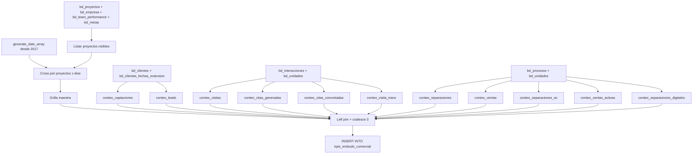

# `kpis_embudo_comercial`

## ¿Qué representa?

La **tabla central de KPIs comerciales**. Una fila por proyecto + día con todas las métricas del embudo de ventas: captaciones, leads, visitas, citas, separaciones y ventas.

Es la fuente de los gráficos principales del dashboard comercial (funnel, evolución mensual de cada etapa del embudo).

---

## Granularidad

```
Una fila = (proyecto, fecha)
```

Donde `fecha` es un día puntual desde **2017-01-01** hasta **hoy**. Un proyecto activo en producción genera **miles** de filas (~3000 por año por proyecto).

> Si en un día puntual no hubo ningún evento, igual aparece la fila con todas las métricas en `0`. Ese es el comportamiento del cross join con calendario.

---

## Métricas que calcula

| Columna | Qué cuenta | Regla principal |
|---|---|---|
| `CAPTACIONES` | Clientes nuevos captados ese día | Prospecto único del mes o cliente convertido |
| `LEADS` | Captaciones provenientes de canales digitales | Solo si `medio_captacion_categoria` está en META, WEB, PORTALES, TIKTOK, MAILING |
| `VISITAS` | Visitas presenciales al proyecto | Una por cliente por mes (no se cuentan re-visitas en el mismo mes) |
| `CITAS_GENERADAS` | Citas agendadas | `tipo_evento = 'SE CITÓ'` |
| `CITAS_CONCRETADAS` | Citas que efectivamente se realizaron | `tipo_evento = 'SE CITÓ'` y `fechavisita` posterior a `fecha_interaccion` |
| `SEPARACIONES` | Separaciones de unidades | Procesos con `nombre = 'SEPARACION'`, fecha_inicio NOT NULL, unidad CASA o DEPARTAMENTO |
| `SEPARACIONES_ACTIVAS` | Separaciones que NO fueron devueltas | `fecha_devolucion IS NULL` |
| `SEPARACIONES_DIGITALES` | Separaciones cuyo origen fue canal digital | `medio_captacion_categoria` digital y `tipo_origen = 'CLIENTE'` |
| `VENTAS` | Ventas cerradas | Procesos con `nombre = 'VENTA'`, fecha_fin NOT NULL |
| `VENTAS_ACTIVAS` | Ventas que NO fueron devueltas | `fecha_devolucion IS NULL` |
| `TRANSITO` | Visitas de canales NO digitales | Visitas excluyendo medios digitales |

---

## ¿De dónde vienen los datos?

| Tabla `bd_*` | Aporta |
|---|---|
| `bd_proyectos` | Lista de proyectos + id_empresa, team |
| `bd_empresa` | Nombre empresa |
| `bd_team_performance` | Grupo inmobiliario |
| `bd_metas` | Para decidir `is_visible` |
| `bd_clientes` | Para captaciones y leads |
| `bd_clientes_fechas_extension` | Fechas de registro y categoría de medio |
| `bd_interacciones` | Visitas y citas |
| `bd_procesos` | Separaciones y ventas |
| `bd_unidades` | Filtro por tipo de unidad (CASA, DEPARTAMENTO) |
| `dashboard_data.metas_kpis` | Para `is_visible` y team final |

---

## Lógica detallada

### Paso 1 — Calendario
```sql
fechas_mensuales = generate_date_array('2017-01-01', current_date(), interval 1 day)
```
Una fila por día.

### Paso 2 — Proyectos visibles
```sql
proyectos = SELECT * FROM bd_proyectos WHERE activo = 'Si'
            JOIN bd_empresa, bd_team_performance, bd_metas
```
Aquí se decide:
- `grupo_inmobiliario`: hardcoded para proyecto 1620 y 2001 = "VYVE", el resto desde `bd_team_performance` o `'NEW BUSINESS'` si es NULL.
- `is_visible`: TRUE si tiene fila en `bd_metas`, FALSE si no.

### Paso 3 — Cross join
```sql
proyectos_meses = proyectos × fechas_mensuales
```
Esta es la **grilla maestra**. Cada celda es (proyecto, día).

### Paso 4 — Calcular cada métrica (CTEs separados)

Cada métrica vive en su propio CTE:
- `conteo_captaciones`
- `conteo_leads`
- `conteo_visitas`
- `conteo_citas_generadas`
- `conteo_citas_concretadas`
- `conteo_separaciones`
- `conteo_separaciones_ac` (separaciones activas)
- `conteo_separaciones_digitales`
- `conteo_ventas`
- `conteo_ventas_activas`
- `conteo_visita_trans` (tránsito)

### Paso 5 — Left joins + coalesce
Para cada métrica:
```sql
LEFT JOIN conteo_captaciones cc 
  ON pm.id_proyecto_evolta = cc.id_proyecto_evolta 
  AND pm.fecha = cc.fecha_registro
```
Y al final:
```sql
COALESCE(cc.captaciones, 0) AS CAPTACIONES
```

### Paso 6 — Insert final
```sql
INSERT INTO dashboard_data.kpis_embudo_comercial (...) 
SELECT ... FROM proyectos_meses pm LEFT JOIN ...
```

---

## Diagrama del flujo



---

## Reglas de negocio importantes

### 1. Filtros sobre procesos
Todos los CTE de procesos aplican estos filtros:
- `motivo_caida != 'ERROR DATA'` (o NULL).
- `motivo_caida != 'ERROR EN REFINANCIAMIENTO'` (o NULL).
- `tipo_unidad IN ('CASA', 'DEPARTAMENTO')` — excluye estacionamientos, depósitos, etc.

### 2. Filtros sobre interacciones (visitas)
- `tipo_origen = 'INTERACCION_CLIENTE'`.
- `origen != 'SOLO PROFORMA'`.
- `visita_unica_mes = 'SI'` (cliente solo cuenta una vez por mes).

### 3. Filtros sobre clientes
- `correo != 'TEST@FB.COM'` (clientes de prueba excluidos).

### 4. "Cliente único del mes"
La regla cambia según `tipo_origen`:
- **Si es PROSPECTO**: solo cuenta si `cliente_unico_mes = 'SI'`.
- **Si es CLIENTE**: siempre cuenta.

### 5. Categorías digitales
Los canales considerados "digital" son: META, WEB, PORTALES, TIKTOK, MAILING. Si negocio agrega TikTok Ads, WhatsApp Business u otro, hay que sumarlos a la lista en **todos** los CTE que filtran por estos valores.

### 6. Citas concretadas
Una cita `SE CITÓ` se considera concretada si `fechavisita > fecha_interaccion`. Es decir, si el cliente realmente vino al proyecto en una fecha posterior a cuando se acordó la cita.

### 7. ROW_NUMBER para deduplicar
La mayoría de CTE de conteo usan `ROW_NUMBER() OVER (PARTITION BY id_cliente, id_proyecto, mes)` y filtran por `rn = 1`. Esto evita doble conteo cuando un cliente tiene múltiples interacciones en el mismo mes.

---

## Diferencias entre fuentes

| Aspecto | Evolta | Sperant | Joined |
|---|---|---|---|
| Función | `calculate_kpis_evolta` | `calculate_kpis_sperant` | `calculate_kpis_sperant_evolta` |
| Filtro `activo` | `'Si'` | (verificar) | (verificar) |
| Filtro de cliente test | `correo != 'TEST@FB.COM'` | (verificar) | (verificar) |
| ID principal | `id_proyecto_evolta` | `id_proyecto_sperant` | ambos |

---

## Cosas a tener en cuenta

- **Filtros hardcoded a tipo de unidad CASA/DEPARTAMENTO.** Si negocio empieza a vender oficinas, lotes o locales, no aparecerán en KPIs. Hay que ampliar el filtro.
- **El proyecto VYVE está hardcoded por ID.** IDs `1620` y `2001`. Si se agrega un nuevo proyecto al grupo, hay que sumarlo manualmente en el SQL.
- **Filtro `motivo_caida` con NOT EQUAL en lugar de NOT IN.** El SQL usa `motivo_caida != 'ERROR DATA' OR IS NULL`. Más legible sería `motivo_caida NOT IN (...) OR IS NULL`. Funcionalmente igual.
- **`mes_anio` es STRING `"YYYY-MM"`.** Si se ordena alfabéticamente coincide con orden cronológico — bien. Pero no se puede usar directamente en operaciones de fecha.
- **Performance.** Esta query es **pesada** — múltiples CTE, cross join con miles de días, varios LEFT JOIN. En esquemas con datos muchos puede tardar minutos por esquema. Por 25+ esquemas Evolta = mucho tiempo.
- **El SQL se repite en 3 archivos distintos** (Evolta, Sperant, Joined). Cualquier cambio de regla debe replicarse en los 3.

---

## Schema destino

`dashboard_data.kpis_embudo_comercial` definido en `dashboard_tables_helper.py`.

---

## Referencia al código

- Evolta: `dashboard_operations_evolta.py` → `EvoltaOperationQueryHandler.calculate_kpis_evolta(esquema, bq_client, project_id)`.
- Sperant: `dashboard_operations_sperant.py` → `SperantOperationQueryHandler.calculate_kpis_sperant(...)`.
- Joined: `dashboard_operations_sperant_evolta.py` → `SperantEvoltaOperationQueryHandler.calculate_kpis_sperant_evolta(...)`.
- Schema: `dashboard_tables_helper.py` → `create_kpis_comercial_table(...)`.
