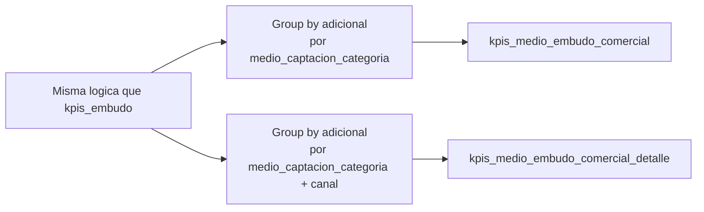

# `kpis_medio_embudo_comercial` y `kpis_medio_embudo_comercial_detalle`

## ¿Qué representan?

Variantes de los KPIs del embudo, pero **agrupados por medio de captación** en lugar de solo por proyecto.

- `kpis_medio_embudo_comercial` — agrupa por categoría de medio (META, WEB, PORTALES, TIKTOK, MAILING, OTROS).
- `kpis_medio_embudo_comercial_detalle` — desagrega aún más, por canal específico dentro de cada categoría (ej. dentro de META: Facebook Ads, Instagram Ads).

Sirven para responder preguntas tipo "¿cuántas ventas vinieron de Facebook este mes?" o "¿cuál es el costo por venta de cada canal?".

---

## Granularidad

| Tabla | Granularidad |
|---|---|
| `kpis_medio_embudo_comercial` | (proyecto, mes, categoría_medio) |
| `kpis_medio_embudo_comercial_detalle` | (proyecto, mes, categoría_medio, canal) |

---

## ¿Qué métricas calculan?

Mismas que `kpis_embudo_comercial`:
- CAPTACIONES, LEADS
- VISITAS, CITAS_GENERADAS, CITAS_CONCRETADAS
- SEPARACIONES, SEPARACIONES_ACTIVAS, SEPARACIONES_DIGITALES
- VENTAS, VENTAS_ACTIVAS

La única diferencia es que se agrupa además por categoría/canal.

---

## ¿De dónde vienen los datos?

Mismas tablas que `kpis_embudo_comercial`. La única diferencia es **agregar al GROUP BY** el campo `medio_captacion_categoria` (y `medio_captacion` para la versión detalle).

---

## Lógica


**Lo que cambia respecto al embudo:**
1. Cada CTE de conteo añade `medio_captacion_categoria` al `GROUP BY`.
2. La grilla maestra hace cross join también con la lista de categorías relevantes.
3. El INSERT lleva la columna extra de medio.

---

## Reglas de negocio

### Categorías reconocidas (hardcoded)
Las categorías "digitales" siguen siendo: **META, WEB, PORTALES, TIKTOK, MAILING**.

Todo lo que no caiga en alguna de esas se mete en una categoría genérica (OTROS o el valor original tal cual). El comportamiento exacto depende de cómo `bd_clientes_fechas_extension` haya mapeado el medio.

### Coalesce de medio
Como en el embudo, el medio final se decide así:
```sql
COALESCE(
  c.medio_captacion_categoria_prospecto,
  f.medio_captacion_categoria,
  c.medio_captacion_categoria_comercial
)
```

### Detalle vs categoría
- En `kpis_medio_embudo_comercial`: solo se queda la **categoría** (META, WEB, etc.).
- En `kpis_medio_embudo_comercial_detalle`: además se conserva el **canal puntual** dentro de la categoría (ej. "Facebook Ads", "Instagram Ads", "Web Banner").

---

## Schema destino

| Tabla | Columnas extra (vs embudo) |
|---|---|
| `kpis_medio_embudo_comercial` | `medio_captacion_categoria` |
| `kpis_medio_embudo_comercial_detalle` | `medio_captacion_categoria` + `medio_captacion` |

---

## Cosas a tener en cuenta

- **El conteo NO es la suma de las categorías.** Un mismo cliente puede aparecer en categoría META y también contar en el embudo general. Si se hace `SUM(CAPTACIONES)` agrupando por categoría, el total no necesariamente coincide con el del embudo (porque el embudo dedupea por cliente único, mientras que aquí se dedupea por cliente único **dentro de cada categoría**).
- **`medio_captacion` original viene de `bd_clientes_fechas_extension` o `bd_clientes`.** Si el CSV maestro de medios cambió, los reportes se recalculan en la próxima corrida.
- **Volumen mucho mayor.** Una fila por (proyecto, mes, categoría) explota el tamaño respecto al embudo. La versión `_detalle` aún más.

---

## Referencia al código

- Evolta: `calculate_kpis_medio_evolta(...)` y `calculate_kpis_medio_evolta_detalle(...)`.
- Sperant: `calculate_kpis_medio_sperant(...)` y `calculate_kpis_medio_sperant_detalle(...)`.
- Joined: `calculate_kpis_medio_evolta_sperant(...)` y `calculate_kpis_medio_evolta_sperant_detalle(...)`.
