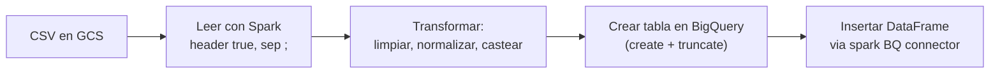

# Carga de metas y blacklist (CSVs externos)

## ¿Qué representa?

Dos cargas desde **archivos CSV** alojados en GCS:

1. **Metas mensuales** (`metas_kpis`) — meta de captaciones, visitas, separaciones, ventas por proyecto y mes.
2. **Blacklist de unidades** (`blacklist_unidades`) — unidades que negocio quiere excluir del stock comercial.

A diferencia del resto de la capa 6, **estas funciones NO calculan nada con SQL** — solo leen un CSV externo, lo limpian, y lo cargan a BigQuery.

---

## Archivos CSV

| Tabla | CSV origen | Bucket |
|---|---|---|
| `dashboard_data.metas_kpis` | `CONSOLIDADO_METAS.csv` | `bucket_metas` (config) |
| `dashboard_data.blacklist_unidades` | `CONSOLIDADO_BLACKLIST_UNIDADES.csv` | `bucket_archivos` (config) |

Separador: `;` (punto y coma) — los archivos vienen de Excel en español.

---

## Diagrama del flujo

---

## `metas_kpis`

### `load_metas_from_bucket(spark, config, project_id, esquema, bq_client)`

Pasos:
1. Calcula la ruta: `gs://{bucket_metas}/CONSOLIDADO_METAS.csv`.
2. Llama a `transform_metas(spark, ruta_archivo)` para obtener un DataFrame limpio.
3. Crea/recrea la tabla `dashboard_data.metas_kpis`.
4. Inserta el DataFrame.

### `transform_metas(spark, ruta_archivo)`

Transformaciones aplicadas al CSV:
- Lee con `header=True`, `inferSchema=True`, `sep=";"`.
- **Normaliza el nombre del proyecto** (`normalizar_columna(...)`) para hacer match con `bd_proyectos`.
- Casteos:
  - Métricas (`captaciones`, `visitas_total`, `separaciones_totales`, `ventas`, etc.) → `INT64`.
  - `anio_mes` → string `"YYYY-MM"`.
- Filtra filas vacías.

### Columnas resultantes

| Columna | Qué guarda |
|---|---|
| `proyecto` | Nombre del proyecto (normalizado) |
| `anio_mes` | "YYYY-MM" |
| `captaciones` | Meta del mes |
| `visitas_total` | Meta del mes |
| `separaciones_totales` | Meta del mes |
| `ventas` | Meta del mes |
| (más métricas según el CSV) | |

### Uso downstream
- `kpis_embudo_comercial.is_visible` se decide con esta tabla (proyecto presente = visible).
- `calculate_funnel_embudo_comercial` cruza KPIs reales contra esta tabla para mostrar "real vs meta".

---

## `blacklist_unidades`

### `load_blacklist_from_bucket(spark, config, project_id, esquema, bq_client)`

Pasos similares al de metas pero apuntando al otro bucket y otro CSV.

### `transform_blacklist(spark, ruta_archivo)`

Transformaciones:
- Lee con separador `;`.
- Normaliza nombres de proyecto y unidad para hacer match con `bd_unidades`.
- Casteos básicos.

### Columnas

| Columna | Qué guarda |
|---|---|
| `nombre_proyecto` | Proyecto al que pertenece la unidad |
| `nombre_unidad` | Identificador de la unidad |
| `motivo` | Por qué está bloqueada (libre texto) |
| Auditoría | Timestamps |

### Uso downstream
- `calculate_stock_comercial_*` hace `LEFT ANTI JOIN` contra esta tabla. Si la unidad está en blacklist, no aparece en stock.

---

## Reglas de negocio

### 1. Frecuencia de actualización
- **Metas**: típicamente se cargan una vez al mes cuando comercial las define. Hay que volver a subir el CSV.
- **Blacklist**: cada vez que negocio decide bloquear o desbloquear una unidad.

### 2. Si el CSV no existe
La función falla con `RuntimeError`. **El ETL completo no debería continuar** (en la práctica, el código sí continúa pero las tablas que dependen quedan inconsistentes).

### 3. Sin merge
Cada corrida hace TRUNCATE + INSERT. Lo que esté en el CSV es la verdad absoluta — si una fila desaparece del CSV, desaparece de BigQuery.

### 4. Match por nombre
Tanto metas como blacklist se enlazan a `bd_proyectos` y `bd_unidades` por **nombre normalizado**, no por ID. Si el nombre cambia en el CRM pero no en el CSV (o viceversa), el match falla.

---

## Cosas a tener en cuenta

- **Encoding del CSV.** Si alguien sube un CSV con encoding raro (ej. ANSI en lugar de UTF-8), las tildes pueden romperse y la normalización falla.
- **Separador `;` no es coma.** Excel en español lo usa por default. Si alguien sube un CSV exportado de otra herramienta con `,`, no se va a parsear bien.
- **Columnas extras en el CSV no rompen nada** (Spark las ignora si no están en el schema esperado).
- **Columnas faltantes sí rompen** — si el CSV no trae `anio_mes` o trae un nombre distinto, falla.
- **`is_visible` depende totalmente de metas cargadas.** Si comercial olvida subir las metas del mes, los proyectos quedan ocultos en los dashboards aunque tengan datos reales.

---

## Referencia al código

- `dashboard_operations.py` → `load_metas_from_bucket(...)` y `transform_metas(...)`.
- `dashboard_operations.py` → `load_blacklist_from_bucket(...)` y `transform_blacklist(...)`.
- Función `normalizar_columna` en `general_utils.py`.
- Schema: `dashboard_tables_helper.py` (las funciones `create_*` correspondientes).
