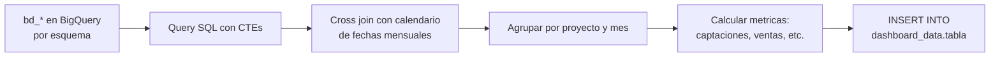
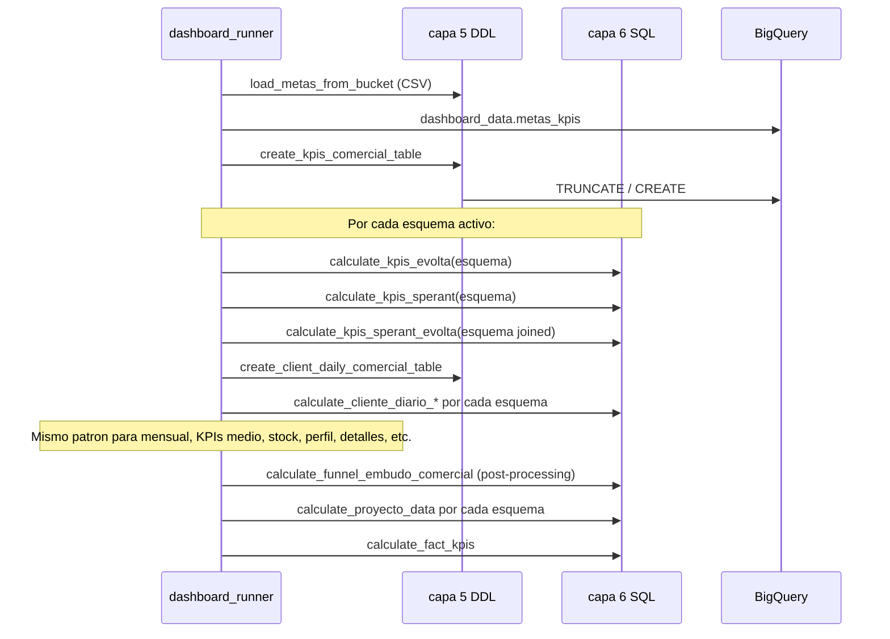
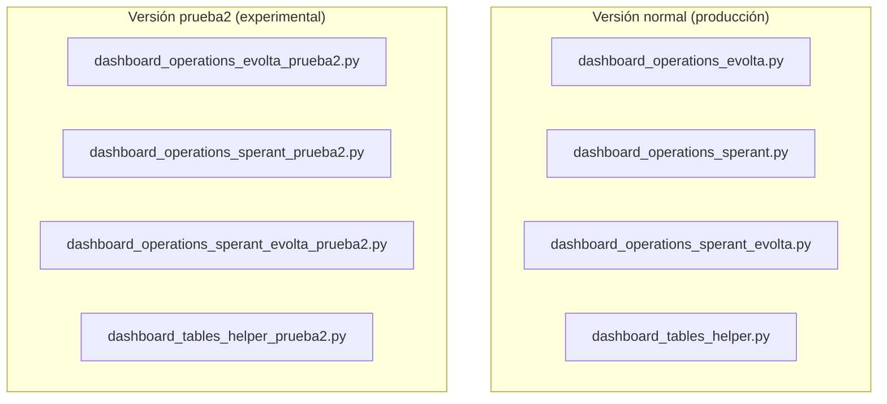

# Capa 5 — Cálculo de tablas de dashboard

## ¿Qué hace esta capa?

Toma las tablas `bd_*` ya cargadas en BigQuery (capa 4) y, por medio de **queries SQL en BigQuery**, calcula las tablas finales del esquema `dashboard_data` que consumen los reportes.

A diferencia de las capas anteriores (que usan Spark + Python), esta capa es **SQL puro ejecutado por el cliente de BigQuery**. Python solo arma la query como string y la dispara con `bq_client.query(...).result()`.

---

## ¿Por qué tres archivos distintos por fuente?

Los cálculos se separan por origen porque las `bd_*` de Evolta, Sperant y Joined tienen **columnas distintas** para los mismos conceptos. Una misma KPI tiene tres queries:

| Archivo | Clase | Cubre |
|---|---|---|
| `dashboard_operations_evolta.py` | `EvoltaOperationQueryHandler` | Esquemas Evolta-puros (`sev_*`) |
| `dashboard_operations_sperant.py` | `SperantOperationQueryHandler` | Esquema Sperant-puro (`checor`) |
| `dashboard_operations_sperant_evolta.py` | `SperantEvoltaOperationQueryHandler` | Esquemas joined (`sev_9`, `sev_121`) |
| `dashboard_operations.py` | (funciones sueltas) | Lógica común: cargar metas, blacklist, calcular embudo funnel y proyecto_data, KPIs fact |

Cada clase tiene una colección de métodos `calculate_*` (uno por tabla del dashboard). Todos los métodos siguen el mismo patrón:
1. Construyen un string SQL con la lógica de la KPI.
2. Insertan el resultado en la tabla del dashboard correspondiente.

---

## Patrón común de cálculo



**Pasos típicos en cada query:**

1. **Generar calendario** (`fechas_mensuales`): se hace `generate_date_array` desde `2017-01-01` hasta hoy. Sirve para que, aunque un proyecto no tenga eventos en un mes, igual aparezca con cero.

2. **Listar proyectos visibles**: lee `bd_proyectos`, hace joins con `bd_empresa`, `bd_team_performance` y `bd_metas`. La columna `is_visible` se decide así:
   ```
   is_visible = TRUE  si el proyecto tiene meta cargada
   is_visible = FALSE en otro caso
   ```

3. **Cross join proyectos × meses** = grilla completa.

4. **Calcular métricas individuales** (CTEs separados):
   - `registros_clientes` (CAPTACIONES, LEADS)
   - `interacciones_visitas` (VISITAS, CITAS)
   - `procesos_separacion` (SEPARACIONES, SEPARACIONES_ACTIVAS, SEPARACIONES_DIGITALES)
   - `procesos_venta` (VENTAS, VENTAS_ACTIVAS)
   - `transito` (clientes en TRANSITO)

5. **Left join** de la grilla contra cada métrica + `coalesce(...,0)` para que los huecos sean 0, no NULL.

6. **INSERT INTO** la tabla del dashboard.

---

## Categorías de cálculos

Las 20+ funciones por fuente se agrupan en estas familias:

```mermaid
graph TD
    DC["Dashboard Calc"] --> KPIS["KPIs principales"]
    DC --> AGG["Agregaciones cliente"]
    DC --> INV["Inventario"]
    DC --> VIS["Vistas operativas"]
    DC --> DET["Detalles"]
    DC --> COM["Comun y post-procesamiento"]

    KPIS --> K1["calculate_kpis_*<br/>embudo comercial"]
    KPIS --> K2["calculate_kpis_medio_*<br/>por medio captacion"]
    KPIS --> K3["calculate_kpis_medio_proforma_*"]
    KPIS --> K4["calculate_kpis_bigdata_*"]
    KPIS --> K5["calculate_canal_digital_*"]

    AGG --> A1["calculate_cliente_diario_*"]
    AGG --> A2["calculate_cliente_mensual_*"]
    AGG --> A3["calculate_cliente_mensual_*_prueba"]

    INV --> I1["calculate_stock_comercial_*"]

    VIS --> V1["calculate_perfil_cliente_*"]
    VIS --> V2["calculate_cliente_vencido_*"]
    VIS --> V3["calculate_acciones_data_*"]
    VIS --> V4["calculate_visitas_data_*"]
    VIS --> V5["calculate_prospectos_data_*"]

    DET --> D1["calculate_prospectos_detalle_*"]
    DET --> D2["calculate_visitas_detalle_*"]
    DET --> D3["calculate_separaciones_detalle_*"]
    DET --> D4["calculate_ventas_detalle_*"]
    DET --> D5["calculate_citas_generadas_detalle_*"]
    DET --> D6["calculate_citas_concretadas_detalle_*"]

    COM --> C1["calculate_funnel_embudo_comercial<br/>convierte KPIs a formato funnel"]
    COM --> C2["calculate_proyecto_data<br/>data agregada por proyecto"]
    COM --> C3["calculate_fact_kpis"]
    COM --> C4["load_metas_from_bucket"]
    COM --> C5["load_blacklist_from_bucket"]
```



---

## Orden de ejecución (en `dashboard_runner.py`)

El runner orquesta TODA la capa 5+6 en este orden:



**Patrón general:** para cada KPI:
1. CREATE/TRUNCATE de la tabla.
2. Loop sobre `source_2.schemas` (Evolta) → `calculate_*_evolta`.
3. Loop sobre `source_1.schemas` (Sperant) → `calculate_*_sperant`.
4. Loop sobre `joined_sources_*` → `calculate_*_sperant_evolta`.

Las tres ramas insertan en la **misma tabla** del dashboard. Por eso primero se hace TRUNCATE — para que los datos de los tres pipelines se acumulen sin duplicados de corridas anteriores.

---

## Cálculos comunes (`dashboard_operations.py`)

Funciones sueltas que no dependen de un esquema específico:

| Función | Qué hace |
|---|---|
| `load_metas_from_bucket(...)` | Lee `CONSOLIDADO_METAS.csv` desde GCS, lo transforma y lo inserta en `dashboard_data.metas_kpis` |
| `transform_metas(...)` | La transformación interna del CSV (limpieza, casteos, normalización de proyectos) |
| `load_blacklist_from_bucket(...)` | Lee `CONSOLIDADO_BLACKLIST_UNIDADES.csv` y lo inserta en `dashboard_data.blacklist_unidades` |
| `transform_blacklist(...)` | Transformación interna del blacklist |
| `calculate_funnel_embudo_comercial(...)` | Toma `kpis_embudo_comercial` (formato ancho con CAPTACIONES, VENTAS, etc. como columnas) y lo "despivota" a un formato largo con `etapa` + `valor`. También cruza con metas |
| `calculate_proyecto_data(...)` | Calcula data agregada por proyecto |
| `calculate_fact_kpis(...)` | KPIs derivados de las métricas existentes |

Estas funciones se llaman **una sola vez por corrida**, no por esquema (a diferencia de los `calculate_*` por fuente).

---

## Indice de docs detallados

| Archivo | Tema |
|---|---|
| `kpis_embudo.md` | Cálculo del embudo comercial (CAPTACIONES → VISITAS → SEPARACIONES → VENTAS) |
| `kpis_medio_captacion.md` | KPIs por medio de captación + detalle por canal |
| `kpis_proforma.md` | KPIs específicos de proformas |
| `cliente_diario_mensual.md` | Agregaciones diarias y mensuales por cliente |
| `stock_comercial.md` | Stock disponible (excluye blacklist) |
| `canal_digital.md` | Performance del canal digital |
| `bigdata.md` | Métricas BigData |
| `perfil_cliente.md` | Perfil consolidado del cliente |
| `clientes_vencidos.md` | Clientes sin actividad reciente |
| `proyecto_data.md` | Data agregada por proyecto |
| `acciones_cliente.md` | Eventos por cliente |
| `metas_y_blacklist.md` | Carga de CSVs externos (metas y blacklist) |
| `funnel_post_procesamiento.md` | Despivot de KPIs a formato funnel |
| `detalles/` | Detalles operativos (prospectos, visitas, citas, separaciones, ventas) |

---

## Reglas y decisiones de negocio importantes

### 1. Calendario fijo desde 2017-01-01

Todos los KPIs se calculan sobre un calendario que arranca el **1 de enero de 2017**. Si negocio quiere ver datos anteriores, hay que ajustar el `generate_date_array` en cada query.

### 2. `is_visible` depende de tener meta cargada

Si un proyecto **no tiene una fila en el CSV de metas**, se marca como `is_visible = FALSE`. Los dashboards filtran por `is_visible = TRUE` por defecto. Esta es la forma de "ocultar" proyectos del dashboard sin sacarlos del ETL.

### 3. Reglas hardcoded de grupo inmobiliario

En las queries hay reglas tipo:
```sql
CASE 
    WHEN p.id_proyecto_evolta = 1620 OR p.id_proyecto_evolta = 2001 THEN 'VYVE'
    WHEN tp.grupo_inmobiliario IS NULL THEN 'NEW BUSINESS'
    ELSE tp.grupo_inmobiliario 
END
```
Estos IDs están hardcoded en el SQL. Si negocio agrega un proyecto al grupo VYVE, hay que editar el SQL.

### 4. Cero vs NULL

Las métricas se hacen con `coalesce(..., 0)` para que un proyecto sin eventos en un mes muestre `0`, no `NULL`. Es importante para que los dashboards no rompan con NULL en cálculos.

### 5. Filtro `WHERE p.activo = 'Si'`

Todas las queries del lado Evolta filtran proyectos activos por `activo = 'Si'`. Si Evolta cambia el formato (`'S'`, `True`, `1`), se rompe.

### 6. SQL como string

Las queries son strings de Python f-formateados con el nombre del esquema (`{esquema}`). No hay validación previa — si la SQL tiene un typo, falla en runtime.

---

## ¿Cuándo editar este código?

| Caso | Qué archivo y qué función |
|---|---|
| Agregar una métrica nueva al embudo | `dashboard_operations_*.py` → `calculate_kpis_*` (los 3 archivos) y schema en `dashboard_tables_helper.py` |
| Cambiar la regla de qué cuenta como "captación" | `calculate_kpis_*` → CTE `registros_clientes` (los 3 archivos deben quedar consistentes) |
| Agregar un proyecto al grupo VYVE | Buscar el `CASE WHEN p.id_proyecto_evolta = 1620 ...` en todos los `calculate_*` y agregar el ID |
| Agregar una columna al perfil de cliente | `calculate_perfil_cliente_*` (los 3) + schema en `dashboard_tables_helper.py` |
| Agregar un nuevo dashboard | Sumar función `create_*` en helper, función `calculate_*` en cada uno de los 3 handlers, y registrar en `dashboard_runner.py` |

---

## Cosas a tener en cuenta

- **El SQL es enorme.** Cada función `calculate_*` puede tener 200-500 líneas de SQL con múltiples CTEs. Las versiones de Evolta, Sperant y Joined deben mantenerse en sincronía conceptual aunque los nombres de columnas sean distintos.
- **No hay tests automatizados sobre las queries.** Si negocio cambia una definición y solo se actualiza una de las tres versiones, los dashboards van a mostrar inconsistencias.
- **El esquema mensual viene como string `mes_anio = "YYYY-MM"`.** No es una fecha — los dashboards que ordenen por mes deben ordenar lexicográficamente o castear.
- **El runner ejecuta todo secuencialmente por esquema.** Una corrida sobre 25 esquemas Evolta + 1 Sperant + 2 Joined puede tardar **horas**. No hay paralelización.

---

## Variantes `_prueba` y `_prueba2`

### ¿Qué son?

Existen archivos y funciones duplicados con sufijos `_prueba` y `_prueba2` que corren **en paralelo** con las versiones normales:



### ¿Qué funciones tienen variante `_prueba`?

| Función normal | Función prueba | Tabla destino |
|---|---|---|
| `calculate_cliente_mensual_*` | `calculate_cliente_mensual_*_prueba` | `cliente_mensual_comercial_prueba` |
| `create_client_mensual_comercial_table` | `create_client_mensual_comercial_table_prueba` | DDL de la tabla prueba |

### ¿Cómo se ejecutan?

El `dashboard_runner.py` ejecuta **ambas versiones** secuencialmente:

1. Primero corre la versión normal (`calculate_cliente_mensual_*`)
2. Después corre la versión prueba (`calculate_cliente_mensual_*_prueba`)

Ambas insertan en tablas **distintas** (`cliente_mensual_comercial` vs `cliente_mensual_comercial_prueba`), así que no se pisan.

### ¿Cuál es la diferencia de lógica?

Las versiones `_prueba2` contienen lógica alternativa en evaluación por negocio. Los archivos `*_prueba2.py` son copias completas de los archivos normales con ajustes en las queries SQL.

> **Estado actual:** confirmar con negocio si las variantes `_prueba` deben reemplazar a las normales, mantenerse en paralelo, o eliminarse. Mientras tanto, ambas corren en cada ejecución.

