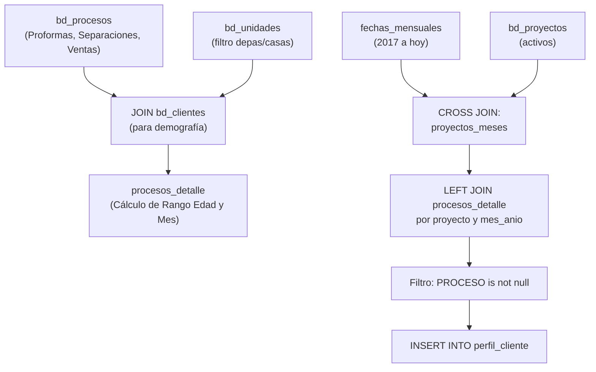

# `perfil_cliente` — perfil demográfico por proceso comercial

## ¿Qué representa?

A pesar de su nombre, esta tabla **no** es un maestro de "una fila por cliente". En realidad, representa el **perfil demográfico de los clientes en el momento en que realizan un proceso comercial** (Proforma, Separación, Venta, etc.), estructurado a lo largo del tiempo (por mes) y por proyecto.

Sirve para los dashboards comerciales que buscan responder preguntas como: *"¿Cuál es el rango de edad o el estado civil de las personas que nos compraron (Ventas) o cotizaron (Proformas) en el proyecto X durante el mes Y?"*.

---

## ¿Por qué existe?

Para analizar la conversión y el éxito comercial cruzado con la demografía. Al precalcular esta vista, se evita tener que hacer cruces pesados entre `bd_procesos` y `bd_clientes` en tiempo de visualización. 

Permite a los tableros filtrar por `PROCESO` (ej. "VENTA") y ver de inmediato:
- El género predominante.
- El rango de edad.
- El medio de captación (cómo se enteraron).
- La profesión u ocupación de los compradores.

---

## Granularidad

**Una fila = Un proceso comercial válido (Proforma, Separación, Venta, etc.) enriquecido con el perfil del cliente.**

---

## Lógica

### Diagrama de flujo

### Fuentes

| Tabla fuente | Qué aporta |
|---|---|
| `bd_proyectos` / `bd_empresa` | Estructura base: `grupo_inmobiliario`, `nombre_empresa`, `team_performance`, proyectos activos. |
| `bd_procesos` | El evento central: tipo de proceso (`PROFORMA`, `VENTA`, etc.), fechas para ubicar en el mes, `motivo_compra`, `distrito`. |
| `bd_clientes` | El perfil de la persona: `genero`, `estado_civil`, `profesion`, `ocupacion` y cálculo de `rango_edad` según fecha de nacimiento. |
| `bd_unidades` | Filtro para asegurar que el proceso fue sobre unidades tipo Departamento o Casa. |
| `dashboard_data.metas_kpis` | Validar si el proyecto tiene visibilidad en las metas comerciales. |

---

## Métricas / atributos consolidados

| Categoría | Columnas principales |
|---|---|
| **Estructura Proyecto** | `grupo_inmobiliario`, `nombre_empresa`, `team_performance`, `nombre_proyecto`, `is_visible`, `mes_anio` |
| **Evento Comercial** | `PROCESO` (Proforma, Separación, Venta, etc.), `MOTIVO_COMPRA`, `DISTRITO` |
| **Perfil Cliente** | `NOMBRE_CLIENTE`, `MEDIO_CAPTACION_CATEGORIA`, `GENERO`, `ESTADO_CIVIL`, `PUESTO`, `PROFESION`, `OCUPACION`, `RANGO_EDAD` |

---

## Reglas de negocio

### 1. Filtro de Procesos Válidos
Solo se toman en cuenta procesos que sean: `'PROFORMA'`, `'SEPARACION'`, `'SEPARACION TEMPORAL'`, `'VENTA'`, o `'MINUTA'`. Se excluyen anulaciones explícitas (`fecha_anulacion is null`).

### 2. Filtro de Unidades
El proceso debe estar asociado a una unidad cuyo tipo contenga `'DEPARTAMENTO'` o `'CASA'`.

### 3. Asignación del Mes (`mes_anio`)
El evento no se ubica por cuándo se creó el registro, sino por su fecha oficial según el proceso:
- **PROFORMA:** `fecha_proforma`
- **SEPARACION / SEPARACION TEMPORAL:** `fecha_inicio`
- **VENTA / MINUTA:** `fecha_impresion_contrato`

### 4. Cálculo de Rango de Edad en el Momento del Proceso
No se toma la edad actual del cliente, sino la edad **que tenía en la fecha del proceso**. Si la fecha de nacimiento es `1900-01-01` o nula, queda como `NULL`.

### 5. Exclusión de Responsables Dummy / Prueba
Se excluyen procesos cuyos responsables consolidados sean cuentas de prueba o administración (ej. `'nreyes'`, `'VITO HUILLCA'`, etc.).

---

## Cosas a tener en cuenta

- **No es un maestro de clientes:** Si un cliente hizo 3 proformas y luego compró, aparecerá 4 veces en esta tabla (una por cada evento), con su demografía replicada.
- **`PROCESO is not null`:** Aunque la consulta hace un `CROSS JOIN` de proyectos y meses (para tener un esqueleto completo), al final hace un `WHERE pd.PROCESO is not null`, por lo que **solo se guardan los meses donde realmente hubo procesos**.
- **Cruce con metas:** Se usa la tabla `metas_kpis` (que viene de un Google Sheet) solo para levantar el flag `is_visible` (si el proyecto está siendo medido).

---

## Referencia al código

Como bien has identificado, hay 3 versiones de este cálculo dependiendo de la fuente de los datos (Evolta, Sperant o Joined):

- Origen Evolta: `infra/src/etl/dashboard_operations_evolta.py` → `calculate_perfil_cliente_evolta(...)`
- Origen Sperant: `infra/src/etl/dashboard_operations_sperant.py` → `calculate_perfil_cliente_sperant(...)`
- Origen Joined: `infra/src/etl/dashboard_operations_sperant_evolta_prueba2.py` (y sin prueba) → `calculate_perfil_cliente_evolta_sperant(...)`
- Definición de Schema: `infra/src/etl/dashboard_tables_helper.py` → `create_perfil_cliente_table(...)`
