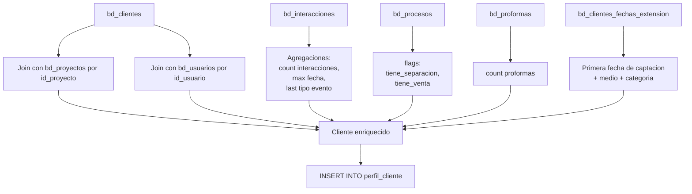

# `perfil_cliente`

## ¿Qué representa?

Una vista **consolidada por cliente**: una fila por cliente con todos sus atributos demográficos, su historial comercial, último vendedor, último proyecto, estado actual.

Sirve para el módulo "perfil de cliente" del dashboard — cuando un asesor quiere ver toda la info de un cliente puntual.

---

## Granularidad

```
Una fila = un cliente
```

---

## ¿De dónde vienen los datos?

| Tabla | Aporta |
|---|---|
| `bd_clientes` | Base principal: datos personales y demográficos |
| `bd_clientes_fechas_extension` | Eventos clave del cliente (captación, primera interacción) |
| `bd_interacciones` | Para `total_interacciones`, `fecha_ultima_interaccion`, `ultimo_tipo_interaccion` |
| `bd_procesos` | Para `tiene_separacion`, `tiene_venta` |
| `bd_proformas` | Para conteo de proformas |
| `bd_proyectos` | Para nombre del proyecto principal |
| `bd_usuarios` | Para nombre del último vendedor |

---

## Lógica



---

## Métricas / atributos consolidados

| Categoría | Columnas |
|---|---|
| **Identificación** | `id_cliente`, IDs duales, `nombres`, `apellidos`, `tipo_documento`, `nrodocumento`, `correo`, `celular` |
| **Demográficos** | `genero`, `estado_civil`, `pais_residencia`, `rango_edad`, `puesto`, `profesion` |
| **Ubicación** | `direccion`, `departamento`, `provincia`, `distrito` |
| **Captación** | `medio_captacion`, `agrupacion_medio_captacion`, `canal_entrada`, `fecha_registro`, UTMs |
| **Estado actual** | `estado_cliente`, `estado_proceso`, `nivel_interes`, `ha_desistido`, `razon_desistimiento` |
| **Actividad** | `total_interacciones`, `fecha_ultima_interaccion`, `ultimo_tipo_interaccion`, `proxima_tarea` |
| **Comercial** | `ultimo_proyecto`, `proyectos_relacionados`, `ultimo_vendedor`, `tipo_financiamiento` |
| **Flags** | `tiene_proforma`, `tiene_separacion`, `tiene_venta` |

---

## Reglas de negocio

### 1. Una fila por cliente, sin importar cuántos proyectos vio
Aunque un cliente haya visitado 5 proyectos, solo aparece una vez en perfil. Los proyectos relacionados se concatenan en `proyectos_relacionados`.

### 2. "Último vendedor" es el del último proceso comercial
Se ordena por fecha y se queda con el responsable más reciente.

### 3. "Última interacción" considera todas las tablas
- Última `bd_interacciones`.
- Última `bd_procesos`.
- Última `bd_proformas`.
La fecha máxima de las tres.

### 4. Apellidos
- Evolta: `apellido_paterno` + `apellido_materno` separados (concatenados con espacio para mostrar).
- Sperant: ambos campos tienen el mismo valor (toda la cadena de apellidos junta).

### 5. UTMs
Solo se conservan los del **primer registro**. Si el cliente vino por TikTok la primera vez y luego por Facebook, el UTM_SOURCE del perfil será `TIKTOK`.

---

## Cosas a tener en cuenta

- **Si un cliente tiene `correo` o `celular` duplicado pero distinto `id_cliente`, aparecen dos filas distintas.** No hay deduplicación por persona real.
- **Filas con datos vacíos.** No todos los clientes tienen UTM, ni demográficos completos. Los dashboards deben manejar NULL.
- **`fecha_actualizacion` se usa para detectar clientes "frescos".** Si un cliente no tiene actualización en X meses, puede entrar a `clientes_vencidos`.
- **El perfil se reconstruye desde cero en cada corrida.** No hay historia — solo el snapshot actual.

---

## Referencia al código

- Evolta: `calculate_perfil_cliente_evolta(...)`.
- Sperant: `calculate_perfil_cliente_sperant(...)`.
- Joined: `calculate_perfil_cliente_sperant_evolta(...)`.
- Schema: `dashboard_tables_helper.py` → `create_perfil_cliente_table(...)`.
- SQL referenciado en `src/sql/dashboards/master/perfil_cliente_joined.sql` (versión SQL "como código").
