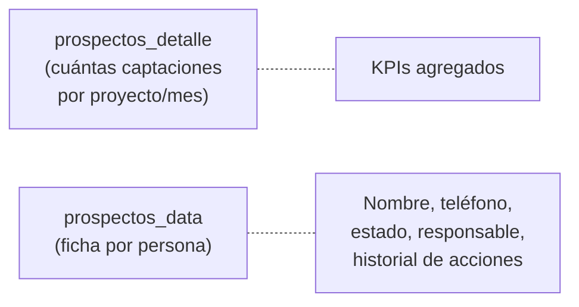
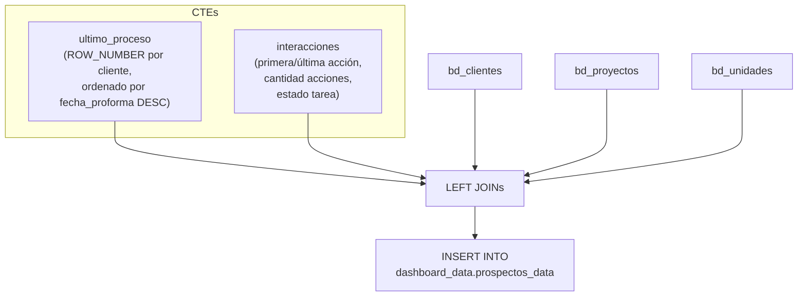
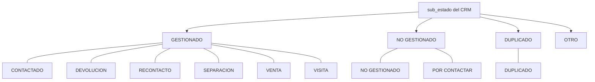

# `prospectos_data` — ficha completa por cliente/prospecto

## ¿Qué representa?

Vista operativa que muestra **una fila por cliente** con toda su información consolidada: datos personales, interacciones, estado de proceso, responsable, UTMs, y clasificación de sub-estado. Es la tabla para que el equipo comercial tenga el "expediente completo" de cada lead.

---

## ¿Por qué existe?

`prospectos_detalle` (en `detalles/prospectos.md`) muestra KPIs agregados de captaciones por proyecto y mes. `prospectos_data` es diferente: muestra **una fila por persona** con toda la info que necesita el vendedor para gestionar al lead.



---

## Lógica



### Tablas fuente

| Tabla | Qué aporta |
|---|---|
| `bd_clientes` | Base principal: nombres, documento, contacto, medio captación, estado, sub_estado, UTMs, responsable |
| `bd_proyectos` | Empresa |
| `bd_procesos` (via CTE `ultimo_proceso`) | Último proceso del cliente: tipo visita, fecha separación, fecha venta, referido |
| `bd_unidades` | Nombre de unidad del último proceso |
| `bd_interacciones` (via CTE `interacciones`) | Conteo y fechas de acciones |

### CTE `ultimo_proceso`

```sql
ROW_NUMBER() OVER(PARTITION BY id_cliente_evolta ORDER BY fecha_proforma DESC) AS rn
-- Solo se usa rn = 1 (el proceso más reciente)
WHERE origen_proforma != 'SOLO PROFORMA'
```

Trae del proceso más reciente: `origen_proforma`, `fecha_inicio`, `fecha_fin`, `referido_por`, `id_unidad_evolta`.

---

## Reglas de negocio

### 1. Clasificación de sub-estados (`NUEVO_SUB_ESTADO`)

Regla central de esta tabla. Agrupa los sub_estados del CRM en tres categorías:



| sub_estado CRM | NUEVO_SUB_ESTADO | ORDEN_SUBESTADO |
|---|---|---|
| CONTACTADO | GESTIONADO | 3 |
| DEVOLUCION | GESTIONADO | 3 |
| RECONTACTO | GESTIONADO | 3 |
| SEPARACION | GESTIONADO | 3 |
| VENTA | GESTIONADO | 3 |
| VISITA | GESTIONADO | 3 |
| NO GESTIONADO | NO GESTIONADO | 1 |
| POR CONTACTAR | NO GESTIONADO | 1 |
| DUPLICADO | DUPLICADO | 2 |
| *(otro)* | OTRO | 0 |

### 2. Datos del proceso solo para CLIENTE (no PROSPECTO)

Campos como `TipoVisita`, `FechaSeparacion`, `FechaVenta`, `NroInmueble` solo se llenan cuando `tipo_origen = 'CLIENTE'`. Para prospectos quedan NULL.

### 3. Código e Identificador

```sql
CASE 
    WHEN cl.tipo_origen = 'CLIENTE' THEN NULL
    WHEN cl.tipo_origen = 'PROSPECTO' THEN cl.id_cliente_evolta
END AS Codigo
```
Solo los prospectos tienen código visible. Los clientes no (por diseño del dashboard).

### 4. Rango de edad con protección

```sql
CASE 
    WHEN cl.fecha_nacimiento = DATE '1900-01-01' THEN NULL
    ELSE DATE_DIFF(CURRENT_DATE(), cl.fecha_nacimiento, YEAR)
END AS RangoEdad
```
Evita mostrar edades de 126 años para registros con fecha placeholder.

### 5. Tipo fijo = 'LEAD'

Todos los registros se marcan como `Tipo = 'LEAD'`.

---

## Cosas a tener en cuenta

- **No tiene filtro por tipo_origen**: trae tanto CLIENTES como PROSPECTOS (a diferencia de `visitas_data` que solo trae CLIENTES).
- **Se ejecuta por esquema** — cada fuente (Evolta, Sperant, Joined) inserta en la misma tabla.
- **El join con `bd_proyectos` usa `CAST(cl.ultimo_proyecto AS INT64)`** — si `ultimo_proyecto` no es numérico, falla silenciosamente (no trae empresa).
- **Columnas NULL de compatibilidad**: `TelefonoCasa`, `Banios`, `Ambientes`, `Score`, `Es_Cotizador_Evolta`, `Acepta_Publicidad`, etc.

---

## Referencia al código

- DDL: `dashboard_tables_helper.py` → `create_prospectos_data_table(...)`.
- Cálculo: `dashboard_operations_evolta.py` → `calculate_prospectos_data_evolta(...)` (y equivalentes sperant/joined).
- Runner: `dashboard_runner.py` líneas ~503-534.
