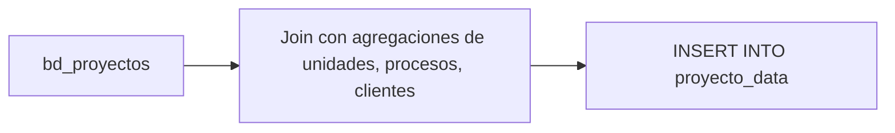

# `proyecto_data`

## ¿Qué representa?

Una **vista resumida por proyecto**: una fila por proyecto con sus principales indicadores agregados (cantidad de unidades, vendidas, disponibles, valor promedio, etc.).

Es la primera tabla que ven los dashboards al cargar — una "tarjeta resumen" por cada proyecto activo.

---

## Granularidad

```
Una fila = un proyecto
```

---

## Métricas típicas

| Columna | Qué guarda |
|---|---|
| `total_unidades` | Total de unidades del proyecto |
| `unidades_disponibles` | En stock |
| `unidades_separadas` | Con separación activa |
| `unidades_vendidas` | Vendidas (no devueltas) |
| `precio_promedio` | Promedio de precio venta |
| `precio_metro2_promedio` | Promedio del precio por m² |
| `total_proformas` | Cantidad emitida |
| `total_clientes_activos` | Clientes con interacción reciente |
| `fecha_inicio_venta` | Cuándo arrancó la venta |
| `fecha_entrega` | Cuándo se entrega |

---

## ¿De dónde vienen los datos?

| Tabla | Aporta |
|---|---|
| `bd_proyectos` | Datos base del proyecto |
| `bd_unidades` | Conteo y estado de unidades |
| `bd_procesos` | Separaciones y ventas |
| `bd_proformas` | Proformas emitidas |
| `bd_clientes` | Clientes activos |
| `bd_subdivision` | Etapas/torres |

---

## Lógica

A diferencia de `kpis_embudo_comercial` (que es por mes), `proyecto_data` es **acumulado a la fecha actual**. Un solo número por proyecto.



---

## Reglas de negocio

### 1. Estados que cuentan como "vendido"
- Procesos `nombre = 'VENTA'` con `fecha_devolucion IS NULL`.

### 2. Estados que cuentan como "separado"
- Procesos `nombre = 'SEPARACION'` con `fecha_devolucion IS NULL` y sin VENTA posterior.

### 3. Estados de unidad considerados "disponible"
- Como en `stock_comercial`: estado en lista de "disponibles" + no en blacklist.

### 4. Conteo de proformas
- Distinct por `codigo_proforma`. Si una proforma se modifica, no cuenta dos veces.

---

## Cosas a tener en cuenta

- **Se calcula sobre todo el histórico**, no por período. Si un proyecto está en el ETL desde 2017, la cifra es acumulada.
- **No coincide automáticamente con el embudo mensual**. Si sumas SEPARACIONES por todos los meses, puede no dar igual a `unidades_separadas` aquí (porque uno es por evento, otro es por estado actual).
- **Útil para un "summary dashboard"** que muestre todos los proyectos en un vistazo.

---

## Referencia al código

- Función común: `dashboard_operations.py` → `calculate_proyecto_data(esquema, bq_client, project_id)`.
- Schema: `dashboard_tables_helper.py` → `create_proyecto_data_table(...)`.
