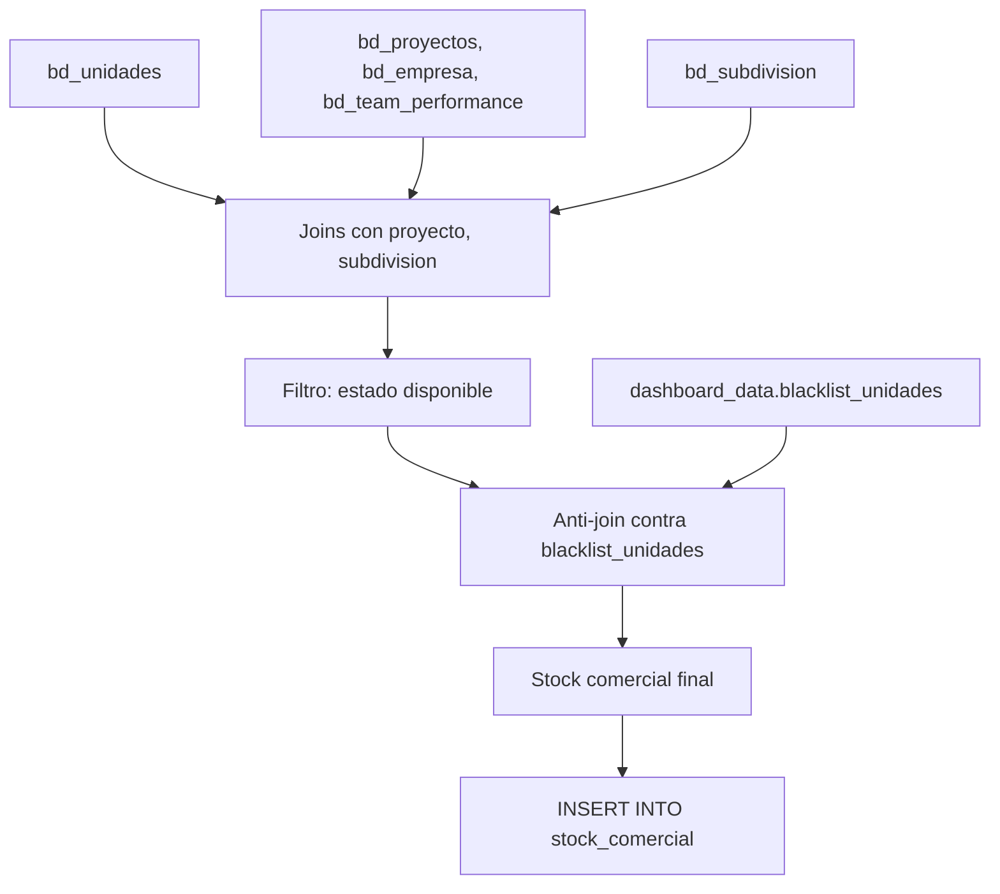

# `stock_comercial`

## ¿Qué representa?

El **inventario disponible** para venta en cada proyecto: una fila por unidad, con su precio actual, áreas, modalidad, estado, descuentos.

Sirve para los dashboards de stock: "¿cuántos departamentos de 2 dormitorios están disponibles en el proyecto X?", "¿cuál es el precio promedio del m² disponible?".

---

## Granularidad

```
Una fila = una unidad inmobiliaria
```

A diferencia de los KPIs (que son agregaciones), `stock_comercial` es un **detalle**: si hay 200 unidades disponibles, hay 200 filas.

---

## ¿De dónde vienen los datos?

| Tabla | Aporta |
|---|---|
| `bd_unidades` | Datos principales de la unidad |
| `bd_proyectos`, `bd_empresa`, `bd_team_performance` | Identificación del proyecto |
| `bd_subdivision` | Etapa/torre |
| `bd_proformas` | Para saber si la unidad está en proforma vigente |
| `bd_procesos` | Para saber si está separada o vendida |
| `dashboard_data.blacklist_unidades` | **Unidades a excluir** (cargadas de CSV externo) |

---

## Lógica



### Pasos
1. **Join** de `bd_unidades` con proyecto, subdivisión, empresa.
2. **Filtro** por estado de unidad: solo las "DISPONIBLE" o equivalente (excluye separadas, vendidas, bloqueadas).
3. **Filtro** por tipo de unidad cuando aplica (CASA, DEPARTAMENTO).
4. **Anti-join contra `blacklist_unidades`**: si una unidad está en el blacklist, no aparece en el stock aunque esté disponible.
5. **Cálculos derivados**: precio efectivo (precio - descuento), precio por m² actualizado, etc.

---

## Reglas de negocio importantes

### 1. Blacklist excluye unidades manualmente

El CSV `CONSOLIDADO_BLACKLIST_UNIDADES.csv` contiene una lista de unidades que negocio quiere ocultar del dashboard de stock (típicamente son unidades en disputa legal, problemas técnicos, no comercializables temporalmente).

```
Si la unidad está en blacklist → NO aparece en stock_comercial
```

Se actualiza editando el CSV en el bucket. La próxima corrida del ETL la oculta.

### 2. Estado "disponible"
Solo entran unidades cuyo `estado` indica que están a la venta. Estados típicos excluidos:
- VENDIDO
- SEPARADO
- BLOQUEADO
- ANULADO
- ENTREGADO

(El listado exacto está en el `WHERE` de la query.)

### 3. Precio efectivo
Si la unidad tiene descuento, el precio que se muestra al dashboard es:
```
precio_efectivo = precio_venta - descuento
```
Y el m² se calcula con el `precio_efectivo`.

### 4. Sperant vs Evolta
- En Evolta el estado viene de `bi_stock.estado`.
- En Sperant viene de `unidades.estado_comercial`.

Ambas se mapean a una nomenclatura común antes de filtrar.

### 5. Subdivisión / etapa
Si la unidad pertenece a una etapa/torre que ya cerró ventas (etapa entregada), igual aparece si está marcada como disponible. Negocio decide si quiere ver esto o no — verificar.

---

## Schema destino

`dashboard_data.stock_comercial` con ~60 columnas. Definido en `dashboard_tables_helper.py` → `crear_tabla_stock_comercial(...)`.

Las columnas cubren:
- IDs (proyecto, unidad, subdivisión, empresa, team).
- Tipologías (CASA, DEPARTAMENTO, etc.).
- Áreas (libre, techada, total, construida, jardín, terraza, terreno).
- Precios (base, lista, proforma, venta, descuento, precio_metro2).
- Estado y modalidad de contrato.
- Fechas de vencimiento (garantías).
- Atributos de la subdivisión (nombre, tipo, fecha entrega).

---

## Cosas a tener en cuenta

- **Si el CSV de blacklist no se carga, las unidades excluidas reaparecerán en stock.** Verificar logs de `load_blacklist_from_bucket`.
- **El stock cambia en cada corrida.** No es histórico — solo refleja el momento actual. Para ver evolución, usar `stock_comercial_historico` (snapshots diarios).
- **No es una vista filtrable por fecha.** Si negocio quiere "stock al 1ro de enero", hay que consultar `stock_comercial_historico` con `WHERE fecha_creacion = '2026-01-01'`.
- **Sin filtro `is_visible` global.** Aunque un proyecto no esté visible en otros dashboards, sus unidades sí pueden aparecer en stock. Si se quiere consistencia, agregar el filtro.
- **Performance.** Stock no es agregación — es detalle. Pero las unidades por esquema son miles, no millones, así que la query es relativamente rápida.

---

## Referencia al código

- Evolta: `calculate_stock_comercial_evolta(...)` en `dashboard_operations_evolta.py`.
- Sperant: `calculate_stock_comercial_sperant(...)`.
- Joined: `calculate_stock_comercial_sperant_evolta(...)`.
- Schema: `dashboard_tables_helper.py` → `crear_tabla_stock_comercial(...)`.
- Carga del blacklist: `dashboard_operations.py` → `load_blacklist_from_bucket(...)`.
