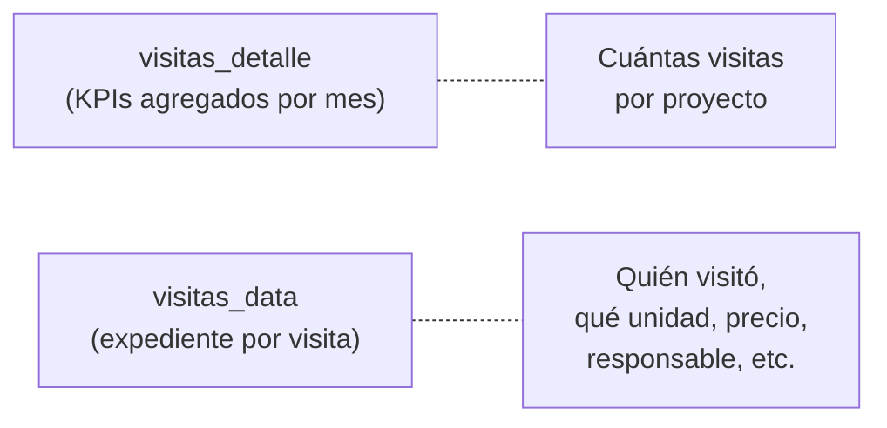
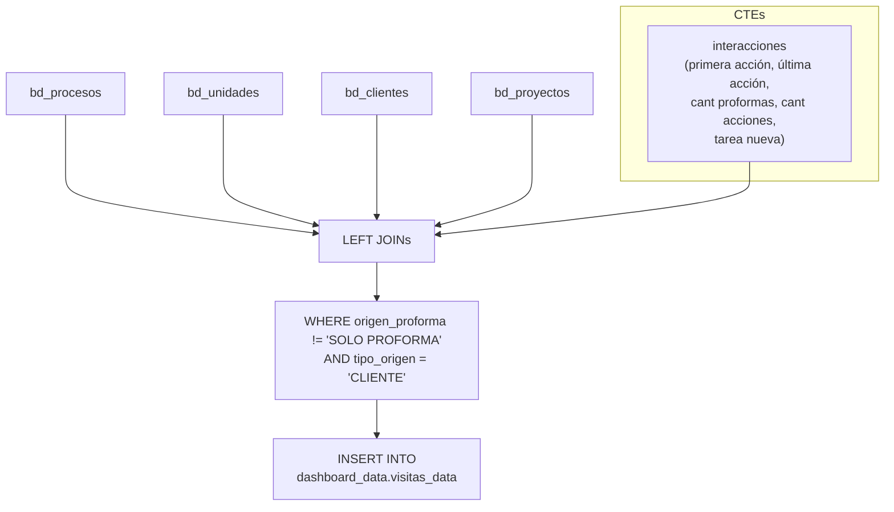

# `visitas_data` — detalle de visitas con contexto comercial

## ¿Qué representa?

Vista operativa que muestra cada **visita/proforma con contexto comercial completo**: datos del cliente, unidad visitada, precio, financiamiento, responsable, y el historial de interacciones asociado. Es la tabla para que el equipo comercial vea el detalle de "quién visitó qué, cuándo, y qué pasó después".

---

## ¿Por qué existe?

La tabla `visitas_detalle` (en la carpeta `detalles/`) muestra KPIs agregados por proyecto y mes. `visitas_data` es diferente: muestra **una fila por proceso comercial** del cliente que hizo la visita, con todos los datos de la operación. Es como un "expediente" de cada visita.



---

## Lógica



### Tablas fuente (por esquema `bd_*`)

| Tabla | Qué aporta |
|---|---|
| `bd_procesos` | Base principal: proyecto, unidad, moneda, precios, fechas separación/venta, responsable |
| `bd_unidades` | Subdivisión, edificio, tipo inmueble, modelo, piso, vista, áreas |
| `bd_clientes` | Nombres, documentos, contacto, medio captación, UTMs, estado desistimiento |
| `bd_proyectos` | Empresa e inmobiliaria |
| `bd_interacciones` | Cálculos agregados: primera/última acción, conteo proformas, conteo acciones, tarea nueva |

### CTE `interacciones`

Agrega por `id_cliente_evolta`:

| Campo calculado | Cómo se calcula |
|---|---|
| `Fecha_PrimeraAccion` | `MIN(fecha_interaccion)` donde `estado = '7'` |
| `Cant_proformas` | `COUNTIF(nombre_interaccion IN ('SE CREO SOLO PROFORMA', 'SE CREO PROFORMA VIRTUAL', 'SE CREO PROFORMA PRESENCIAL'))` |
| `Cant_Acciones` | `COUNTIF(estado = '7' AND NOT es proforma)` |
| `Fecha_UltimaAccion` | `MAX(fecha_interaccion)` donde `estado = '7'` |
| `Titulo_UltimaAccion` | Nombre de la última interacción `estado = '7'` |
| `Descrip_UltimaAccion` | Descripción de la última interacción `estado = '7'` |
| `Fecha_TareaNueva` | `MAX(fecha_interaccion)` donde `estado = '6'` |
| `Titulo_TareaNueva` | Nombre de la última tarea `estado = '6'` |

---

## Reglas de negocio

### 1. Solo procesos con visita real
```sql
WHERE prc.origen_proforma != 'SOLO PROFORMA'
```
Se excluyen las proformas que fueron creadas sin que el cliente haya visitado el proyecto.

### 2. Solo clientes (no prospectos)
```sql
AND cl.tipo_origen = 'CLIENTE'
```
Prospectos sin operación comercial no aparecen en esta vista.

### 3. Columnas con `CAST(NULL AS ...)`
Varios campos como `TelefonoCasa`, `TelefonoCelular2`, `Score`, `Es_Cotizador_Evolta`, `MigracionMasiva` se dejan como NULL. Existen en el schema para compatibilidad con otros pipelines que sí los llenan.

---

## Cosas a tener en cuenta

- **Se ejecuta por esquema**, no es una tabla global. Cada esquema (Evolta, Sperant, Joined) inserta sus filas en la misma tabla `dashboard_data.visitas_data`.
- **No tiene calendario cross join** (a diferencia de los KPIs). Si un mes no tiene visitas, simplemente no hay filas para ese mes.
- **Variantes por fuente:** `calculate_visitas_data_evolta`, `calculate_visitas_data_sperant`, `calculate_visitas_data_evolta_sperant`. Misma lógica, columnas de ID adaptadas a cada CRM.

---

## Referencia al código

- DDL: `dashboard_tables_helper.py` → `create_visitas_data_table(...)`.
- Cálculo: `dashboard_operations_evolta.py` → `calculate_visitas_data_evolta(...)` (y sus equivalentes sperant/joined).
- Runner: `dashboard_runner.py` líneas ~469-500.
