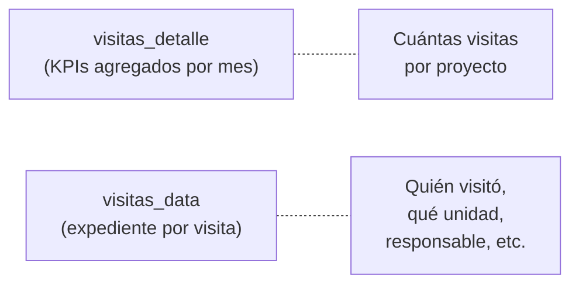
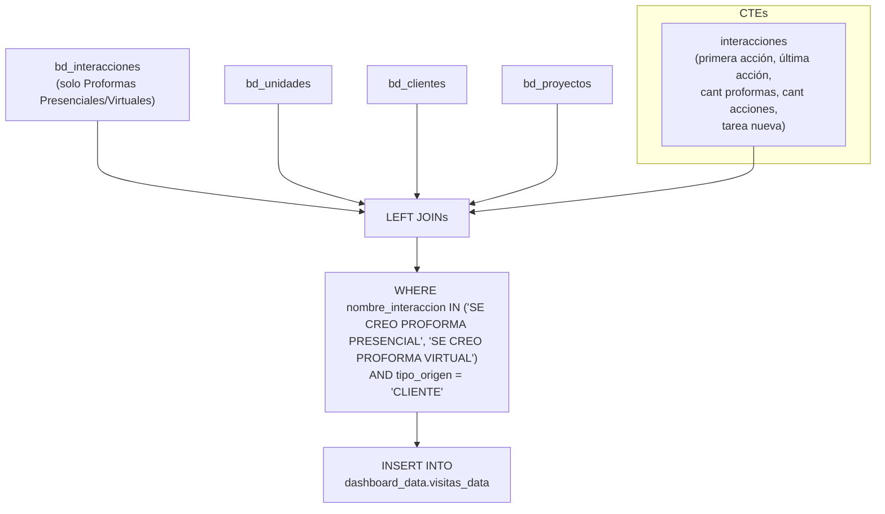

# `visitas_data` — detalle de visitas (proformas) con contexto comercial

## ¿Qué representa?

Vista operativa que muestra cada **visita (registrada como interacción de proforma presencial o virtual) con su contexto comercial completo**: datos del cliente, unidad visitada, responsable, y el historial de interacciones asociado. Es la tabla para que el equipo comercial vea el detalle de "quién visitó qué, cuándo, y qué pasó después".

---

## ¿Por qué existe?

La tabla `visitas_detalle` (en la carpeta `detalles/`) muestra KPIs agregados por proyecto y mes. `visitas_data` es diferente: muestra **una fila por visita (interacción de proforma)** del cliente, con todos los datos de la operación. Es como un "expediente" de cada visita real.



---

## Lógica



### Tablas fuente (por esquema `bd_*`)

| Tabla | Qué aporta |
|---|---|
| `bd_interacciones` (Main) | Base principal de la tabla: se filtran las interacciones que representan una visita (proforma presencial o virtual). |
| `bd_unidades` | Datos del inmueble de interés (si aplica): Subdivisión, edificio, tipo inmueble, modelo, piso, vista, áreas. |
| `bd_clientes` | Nombres, documentos, contacto, medio captación, UTMs, estado desistimiento. |
| `bd_proyectos` | Empresa e inmobiliaria. |
| `bd_interacciones` (Subquery) | Cálculos agregados para el cliente: primera/última acción, conteo total de proformas, conteo de acciones, última tarea nueva. |

### CTE `interacciones` (Subquery)

Agrega el historial por `id_cliente_evolta` para enriquecer la fila de la visita:

| Campo calculado | Cómo se calcula |
|---|---|
| `Fecha_PrimeraAccion` | `MIN(fecha_interaccion)` donde `estado = '7'` |
| `Cant_proformas` | `COUNTIF(nombre_interaccion IN ('SE CREO SOLO PROFORMA', 'SE CREO PROFORMA VIRTUAL', 'SE CREO PROFORMA PRESENCIAL'))` |
| `Cant_Acciones` | `COUNTIF(estado = '7' AND NOT es proforma)` |
| `Fecha_UltimaAccion` | `MAX(fecha_interaccion)` donde `estado = '7'` |
| `Titulo_UltimaAccion` | Nombre de la última interacción `estado = '7'` |
| `Descrip_UltimaAccion` | Descripción de la última interacción `estado = '7'` |
| `Fecha_TareaNueva` | `MAX(fecha_interaccion)` donde `estado = '6'` |
| `Titulo_TareaNueva` | Nombre de la última tarea `estado = '6'` |

---

## Reglas de negocio

### 1. Solo interacciones que denotan visita
```sql
WHERE prc.nombre_interaccion in ('SE CREO PROFORMA PRESENCIAL','SE CREO PROFORMA VIRTUAL')
```
La tabla no jala procesos de venta, sino que asume que una "Visita" queda registrada operativamente como la creación de una proforma presencial o virtual en `bd_interacciones`.

### 2. Solo clientes (no prospectos)
```sql
AND cl.tipo_origen = 'CLIENTE'
```
Se excluyen los prospectos puros (leads no contactados o que no llegaron a cliente).

### 3. Columnas referenciales en NULL
Dado que la base no es `bd_procesos`, las fechas fuertes de cierre comercial (`FechaSeparacion`, `FechaVenta`) se envían como `CAST(NULL AS DATE)`. Del mismo modo, montos, financiamiento, y números de teléfono secundarios quedan en `NULL` para mantener compatibilidad estructural del schema sin cruzar tablas pesadas que no aplican a una interacción.

---

## Cosas a tener en cuenta

- **Es una tabla de interacciones, no de procesos.** Si se quiere ver el precio final de venta o fecha de separación, esa información vive en los módulos de ventas/procesos, no en `visitas_data`.
- **Granularidad:** Si un cliente tiene 3 visitas registradas (3 proformas presenciales distintas en el tiempo), tendrá 3 filas distintas en esta vista.
- **Se ejecuta por esquema**, cada esquema (Evolta, Sperant, Joined) inserta sus filas en la misma tabla `dashboard_data.visitas_data`.

---

## Referencia al código

- DDL: `dashboard_tables_helper.py` → `create_visitas_data_table(...)`.
- Cálculo: `dashboard_operations_evolta.py` → `calculate_visitas_data_evolta(...)` (y sus equivalentes sperant/joined).
