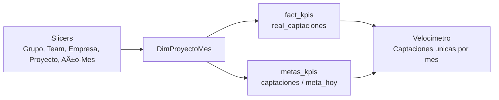
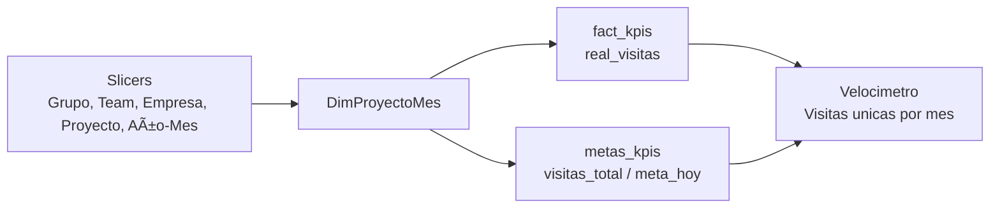
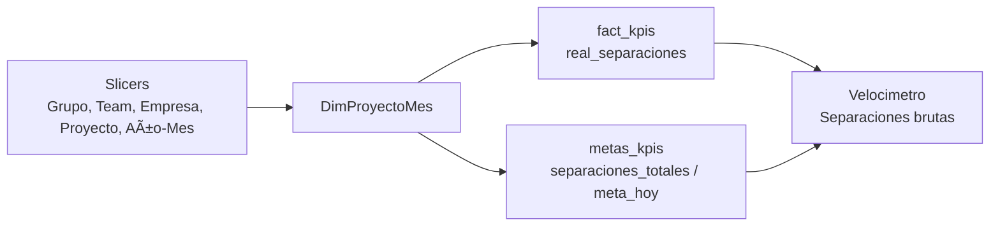
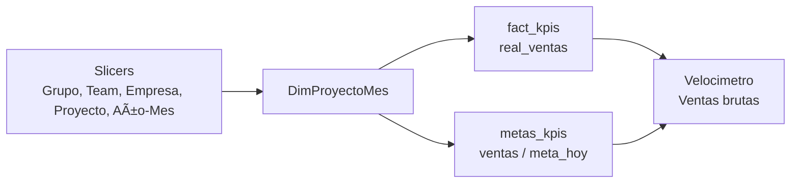

# Graficos del Reporte Embudo

## Proposito

Este archivo documenta como se construyen los visuales del reporte **Embudo de marketing** en Power BI: medidas DAX, tablas usadas, campos del visual, filtros y lectura de negocio.

---

## Pagina: Embudo de marketing

La pagina resume el avance mensual del embudo comercial:

| Visual | Que mide |
|---|---|
| Captaciones unicas por mes | Avance de captaciones reales contra meta mensual |
| Visitas unicas por mes | Avance de visitas reales contra meta mensual |
| Separaciones brutas | Avance de separaciones contra meta mensual |
| Ventas brutas | Avance de ventas contra meta mensual |

Filtros principales de la pagina:

| Slicer | Funcion |
|---|---|
| Grupo | Filtra por grupo inmobiliario |
| Team | Filtra por equipo comercial |
| Empresa | Filtra por empresa |
| Proyecto | Filtra por proyecto |
| Año-Mes | Filtra el mes analizado |

---

## Visual 1: Velocimetro - Captaciones unicas por mes

### Objetivo

Muestra el avance de captaciones unicas del mes seleccionado contra la meta mensual, y lo compara contra la meta esperada al dia de corte.

Lectura de negocio:

```text
Si el avance real esta por encima de meta_hoy, el mes va adelantado.
Si el avance real esta por debajo de meta_hoy, el mes va atrasado.
```

---

### Medida del valor

El valor principal del velocimetro es la medida:

```DAX
% Avance Captaciones Mes =
DIVIDE(
    SUM(fact_kpis[real_captaciones]),
    SUM(metas_kpis[captaciones]),
    0
)
```

Que significa:

| Parte | Campo | Descripcion |
|---|---|---|
| Numerador | `fact_kpis[real_captaciones]` | Captaciones reales del mes en el contexto filtrado |
| Denominador | `metas_kpis[captaciones]` | Meta total de captaciones del mes |
| Resultado | `% Avance Captaciones Mes` | Porcentaje de cumplimiento mensual |

`DIVIDE(..., 0)` evita errores cuando la meta esta vacia o es cero.

---

### Valor de destino

El valor de destino del velocimetro es:

```DAX
MAX(metas_kpis[meta_hoy])
```

`meta_hoy` es una columna de la tabla `metas_kpis`. Representa el porcentaje esperado de avance hasta el dia de corte del mes.

Se usa `MAX` porque `meta_hoy` funciona como una referencia porcentual del contexto actual, no como una meta que deba sumarse. Si hubiera mas de una fila relacionada en el contexto, sumar `meta_hoy` inflaria incorrectamente la linea objetivo.

---

### Configuracion del visual

Tipo de visual:

```text
Medidor / Gauge
```

Campos:

| Bucket | Campo |
|---|---|
| Valor | `% Avance Captaciones Mes` |
| Valor minimo | `0` |
| Valor maximo | `1` |
| Valor de destino | `MAX(metas_kpis[meta_hoy])` |

Como la medida esta formateada como porcentaje, Power BI muestra:

```text
0 = 0 %
1 = 100 %
```

---

### Tablas involucradas

| Tabla | Uso |
|---|---|
| `fact_kpis` | Aporta el real: `real_captaciones` |
| `metas_kpis` | Aporta la meta mensual: `captaciones`, y la meta al dia: `meta_hoy` |
| `DimProyectoMes` | Propaga filtros de grupo, team, empresa, proyecto y mes |
| `CalendarioMes` | Controla el filtro de Año-Mes |

Relaciones esperadas:

```text
DimProyectoMes[ProjectMonthKey] -> fact_kpis[ProjectMonthKey]
DimProyectoMes[ProjectMonthKey] -> metas_kpis[ProjectMonthKey]
CalendarioMes[mes_inicio]      -> DimProyectoMes[mes_inicio]
```

---

### Flujo del calculo



---

### Validacion rapida

Para validar el numero del velocimetro:

```text
% Avance Captaciones Mes =
SUM(fact_kpis[real_captaciones]) / SUM(metas_kpis[captaciones])
```

Para validar la linea objetivo:

```text
Valor de destino =
MAX(metas_kpis[meta_hoy])
```

Si el resultado no cuadra, revisar primero:

| Problema posible | Que revisar |
|---|---|
| Meta no cruza | `ProjectMonthKey` entre `metas_kpis` y `DimProyectoMes` |
| Meta duplicada | Cardinalidad de relaciones |
| Mes incorrecto | Relacion con `CalendarioMes` |
| Avance en cero | `metas_kpis[captaciones]` vacio o en cero |

---

### Resumen

```text
Visual: Captaciones unicas por mes
Tipo: Medidor / Gauge
Valor: % Avance Captaciones Mes
Formula valor: SUM(real_captaciones) / SUM(captaciones)
Valor de destino: MAX(metas_kpis[meta_hoy])
Escala: 0 % a 100 %
Pagina: Embudo de marketing
```

---

## Visual 2: Velocimetro - Visitas unicas por mes

### Objetivo

Muestra el avance de visitas unicas del mes seleccionado contra la meta mensual de visitas, y lo compara contra la meta esperada al dia de corte.

Lectura de negocio:

```text
Si el avance real esta por encima de meta_hoy, las visitas van adelantadas.
Si el avance real esta por debajo de meta_hoy, las visitas van atrasadas.
```

---

### Medida del valor

El valor principal del velocimetro es la medida:

```DAX
% Avance Visitas Mes =
DIVIDE(
    SUM(fact_kpis[real_visitas]),
    SUM(metas_kpis[visitas_total]),
    0
)
```

Que significa:

| Parte | Campo | Descripcion |
|---|---|---|
| Numerador | `fact_kpis[real_visitas]` | Visitas reales del mes en el contexto filtrado |
| Denominador | `metas_kpis[visitas_total]` | Meta total de visitas del mes |
| Resultado | `% Avance Visitas Mes` | Porcentaje de cumplimiento mensual |

`DIVIDE(..., 0)` evita errores cuando la meta esta vacia o es cero.

---

### Valor de destino

El valor de destino del velocimetro es:

```DAX
MAX(metas_kpis[meta_hoy])
```

`meta_hoy` representa el porcentaje esperado de avance hasta el dia de corte del mes. Se usa como linea objetivo del medidor para comparar si las visitas reales van por encima o por debajo del ritmo esperado.

Se usa `MAX` porque `meta_hoy` es una referencia porcentual del contexto actual, no una meta mensual acumulable.

---

### Configuracion del visual

Tipo de visual:

```text
Medidor / Gauge
```

Campos:

| Bucket | Campo |
|---|---|
| Valor | `% Avance Visitas Mes` |
| Valor minimo | `0` |
| Valor maximo | `1` |
| Valor de destino | `MAX(metas_kpis[meta_hoy])` |

Como la medida esta formateada como porcentaje, Power BI muestra la escala de `0 %` a `100 %`.

---

### Tablas involucradas

| Tabla | Uso |
|---|---|
| `fact_kpis` | Aporta el real: `real_visitas` |
| `metas_kpis` | Aporta la meta mensual: `visitas_total`, y la meta al dia: `meta_hoy` |
| `DimProyectoMes` | Propaga filtros de grupo, team, empresa, proyecto y mes |
| `CalendarioMes` | Controla el filtro de Año-Mes |

Relaciones esperadas:

```text
DimProyectoMes[ProjectMonthKey] -> fact_kpis[ProjectMonthKey]
DimProyectoMes[ProjectMonthKey] -> metas_kpis[ProjectMonthKey]
CalendarioMes[mes_inicio]      -> DimProyectoMes[mes_inicio]
```

---

### Flujo del calculo



---

### Validacion rapida

Para validar el numero del velocimetro:

```text
% Avance Visitas Mes =
SUM(fact_kpis[real_visitas]) / SUM(metas_kpis[visitas_total])
```

Para validar la linea objetivo:

```text
Valor de destino =
MAX(metas_kpis[meta_hoy])
```

Si el resultado no cuadra, revisar primero:

| Problema posible | Que revisar |
|---|---|
| Meta no cruza | `ProjectMonthKey` entre `metas_kpis` y `DimProyectoMes` |
| Meta duplicada | Cardinalidad de relaciones |
| Mes incorrecto | Relacion con `CalendarioMes` |
| Avance en cero | `metas_kpis[visitas_total]` vacio o en cero |

---

### Resumen

```text
Visual: Visitas unicas por mes
Tipo: Medidor / Gauge
Valor: % Avance Visitas Mes
Formula valor: SUM(real_visitas) / SUM(visitas_total)
Valor de destino: MAX(metas_kpis[meta_hoy])
Escala: 0 % a 100 %
Pagina: Embudo de marketing
```

---

## Visual 3: Velocimetro - Separaciones brutas

### Objetivo

Muestra el avance de separaciones brutas del mes seleccionado contra la meta mensual de separaciones, y lo compara contra la meta esperada al dia de corte.

Lectura de negocio:

```text
Si el avance real esta por encima de meta_hoy, las separaciones van adelantadas.
Si el avance real esta por debajo de meta_hoy, las separaciones van atrasadas.
```

---

### Medida del valor

El valor principal del velocimetro es la medida:

```DAX
% Avance Separaciones Mes =
DIVIDE(
    SUM(fact_kpis[real_separaciones]),
    SUM(metas_kpis[separaciones_totales]),
    0
)
```

Que significa:

| Parte | Campo | Descripcion |
|---|---|---|
| Numerador | `fact_kpis[real_separaciones]` | Separaciones reales del mes en el contexto filtrado |
| Denominador | `metas_kpis[separaciones_totales]` | Meta total de separaciones del mes |
| Resultado | `% Avance Separaciones Mes` | Porcentaje de cumplimiento mensual |

`DIVIDE(..., 0)` evita errores cuando la meta esta vacia o es cero.

---

### Valor de destino

El valor de destino del velocimetro es:

```DAX
MAX(metas_kpis[meta_hoy])
```

`meta_hoy` representa el porcentaje esperado de avance hasta el dia de corte del mes. Se usa como linea objetivo del medidor para comparar si las separaciones reales van por encima o por debajo del ritmo esperado.

Se usa `MAX` porque `meta_hoy` es una referencia porcentual del contexto actual, no una meta mensual acumulable.

---

### Configuracion del visual

Tipo de visual:

```text
Medidor / Gauge
```

Campos:

| Bucket | Campo |
|---|---|
| Valor | `% Avance Separaciones Mes` |
| Valor minimo | `0` |
| Valor maximo | `1` |
| Valor de destino | `MAX(metas_kpis[meta_hoy])` |

Como la medida esta formateada como porcentaje, Power BI muestra la escala de `0 %` a `100 %`.

---

### Tablas involucradas

| Tabla | Uso |
|---|---|
| `fact_kpis` | Aporta el real: `real_separaciones` |
| `metas_kpis` | Aporta la meta mensual: `separaciones_totales`, y la meta al dia: `meta_hoy` |
| `DimProyectoMes` | Propaga filtros de grupo, team, empresa, proyecto y mes |
| `CalendarioMes` | Controla el filtro de Año-Mes |

Relaciones esperadas:

```text
DimProyectoMes[ProjectMonthKey] -> fact_kpis[ProjectMonthKey]
DimProyectoMes[ProjectMonthKey] -> metas_kpis[ProjectMonthKey]
CalendarioMes[mes_inicio]      -> DimProyectoMes[mes_inicio]
```

---

### Flujo del calculo



---

### Validacion rapida

Para validar el numero del velocimetro:

```text
% Avance Separaciones Mes =
SUM(fact_kpis[real_separaciones]) / SUM(metas_kpis[separaciones_totales])
```

Para validar la linea objetivo:

```text
Valor de destino =
MAX(metas_kpis[meta_hoy])
```

Si el resultado no cuadra, revisar primero:

| Problema posible | Que revisar |
|---|---|
| Meta no cruza | `ProjectMonthKey` entre `metas_kpis` y `DimProyectoMes` |
| Meta duplicada | Cardinalidad de relaciones |
| Mes incorrecto | Relacion con `CalendarioMes` |
| Avance en cero | `metas_kpis[separaciones_totales]` vacio o en cero |

---

### Resumen

```text
Visual: Separaciones brutas
Tipo: Medidor / Gauge
Valor: % Avance Separaciones Mes
Formula valor: SUM(real_separaciones) / SUM(separaciones_totales)
Valor de destino: MAX(metas_kpis[meta_hoy])
Escala: 0 % a 100 %
Pagina: Embudo de marketing
```

---

## Visual 4: Velocimetro - Ventas brutas

### Objetivo

Muestra el avance de ventas brutas del mes seleccionado contra la meta mensual de ventas, y lo compara contra la meta esperada al dia de corte.

Lectura de negocio:

```text
Si el avance real esta por encima de meta_hoy, las ventas van adelantadas.
Si el avance real esta por debajo de meta_hoy, las ventas van atrasadas.
```

---

### Medida del valor

El valor principal del velocimetro es la medida:

```DAX
% Avance Ventas Mes =
DIVIDE(
    SUM(fact_kpis[real_ventas]),
    SUM(metas_kpis[ventas]),
    0
)
```

Que significa:

| Parte | Campo | Descripcion |
|---|---|---|
| Numerador | `fact_kpis[real_ventas]` | Ventas reales del mes en el contexto filtrado |
| Denominador | `metas_kpis[ventas]` | Meta total de ventas del mes |
| Resultado | `% Avance Ventas Mes` | Porcentaje de cumplimiento mensual |

`DIVIDE(..., 0)` evita errores cuando la meta esta vacia o es cero.

---

### Valor de destino

El valor de destino del velocimetro es:

```DAX
MAX(metas_kpis[meta_hoy])
```

`meta_hoy` representa el porcentaje esperado de avance hasta el dia de corte del mes. Se usa como linea objetivo del medidor para comparar si las ventas reales van por encima o por debajo del ritmo esperado.

Se usa `MAX` porque `meta_hoy` es una referencia porcentual del contexto actual, no una meta mensual acumulable.

---

### Configuracion del visual

Tipo de visual:

```text
Medidor / Gauge
```

Campos:

| Bucket | Campo |
|---|---|
| Valor | `% Avance Ventas Mes` |
| Valor minimo | `0` |
| Valor maximo | `1` |
| Valor de destino | `MAX(metas_kpis[meta_hoy])` |

Como la medida esta formateada como porcentaje, Power BI muestra la escala de `0 %` a `100 %`.

---

### Tablas involucradas

| Tabla | Uso |
|---|---|
| `fact_kpis` | Aporta el real: `real_ventas` |
| `metas_kpis` | Aporta la meta mensual: `ventas`, y la meta al dia: `meta_hoy` |
| `DimProyectoMes` | Propaga filtros de grupo, team, empresa, proyecto y mes |
| `CalendarioMes` | Controla el filtro de Año-Mes |

Relaciones esperadas:

```text
DimProyectoMes[ProjectMonthKey] -> fact_kpis[ProjectMonthKey]
DimProyectoMes[ProjectMonthKey] -> metas_kpis[ProjectMonthKey]
CalendarioMes[mes_inicio]      -> DimProyectoMes[mes_inicio]
```

---

### Flujo del calculo



---

### Validacion rapida

Para validar el numero del velocimetro:

```text
% Avance Ventas Mes =
SUM(fact_kpis[real_ventas]) / SUM(metas_kpis[ventas])
```

Para validar la linea objetivo:

```text
Valor de destino =
MAX(metas_kpis[meta_hoy])
```

Si el resultado no cuadra, revisar primero:

| Problema posible | Que revisar |
|---|---|
| Meta no cruza | `ProjectMonthKey` entre `metas_kpis` y `DimProyectoMes` |
| Meta duplicada | Cardinalidad de relaciones |
| Mes incorrecto | Relacion con `CalendarioMes` |
| Avance en cero | `metas_kpis[ventas]` vacio o en cero |

---

### Resumen

```text
Visual: Ventas brutas
Tipo: Medidor / Gauge
Valor: % Avance Ventas Mes
Formula valor: SUM(real_ventas) / SUM(ventas)
Valor de destino: MAX(metas_kpis[meta_hoy])
Escala: 0 % a 100 %
Pagina: Embudo de marketing
```

---

## Visual 5: Tabla - Captaciones por proyecto

### Objetivo

Muestra el avance de captaciones por proyecto dentro del mes seleccionado. Permite ver que proyectos estan cumpliendo, adelantados o atrasados frente a la meta esperada del dia.

La tabla usa una fila por proyecto y cuatro valores principales:

| Columna | Que muestra |
|---|---|
| Proyecto | Nombre del proyecto |
| Real | Captaciones reales del mes |
| Meta hoy | Meta esperada acumulada al dia de corte |
| % | Avance real contra la meta de hoy |
| Meta mes | Meta total de captaciones del mes |

---

### Configuracion del visual

Tipo de visual:

```text
Tabla
```

Campos:

| Bucket | Campo |
|---|---|
| Filas | `DimProyectoMes[nombre_proyecto]` renombrado como `Proyecto` |
| Valores | `Real` |
| Valores | `Meta hoy` |
| Valores | `%` |
| Valores | `Meta mes` |

Filtro del objeto visual:

```text
Proyecto no es (En blanco)
```

Este filtro evita mostrar una fila vacia cuando algun registro no cruza correctamente con la dimension de proyecto.

---

### Medida Real

La columna `Real` usa la medida:

```DAX
Real captaciones =
SUM('fact_kpis'[real_captaciones])
```

Representa las captaciones reales del proyecto en el mes filtrado.

---

### Medida Meta hoy

La columna `Meta hoy` usa la medida:

```DAX
meta_captaciones_hoy =
ROUND(
    SUMX(
        metas_kpis,
        COALESCE(metas_kpis[captaciones], 0) *
        COALESCE(metas_kpis[meta_hoy], 0)
    ),
    0
)
```

Esta medida convierte la meta porcentual del dia (`meta_hoy`) en una meta numerica de captaciones.

Ejemplo:

```text
captaciones = 510
meta_hoy = 39 %

meta_captaciones_hoy = ROUND(510 * 0.39, 0) = 199
```

`COALESCE(..., 0)` evita que valores blank rompan el calculo. `ROUND(..., 0)` deja la meta en numero entero para compararla contra el real.

---

### Medida %

La columna `%` usa la medida:

```DAX
% Avance Captaciones Hoy =
VAR Real = SUM(fact_kpis[real_captaciones])
VAR Meta = [meta_captaciones_hoy]
RETURN
IF(
    ISBLANK(Real) && ISBLANK(Meta),
    BLANK(),
    IF(
        Meta = 0,
        IF(Real >= 1, 1, 0),
        DIVIDE(Real, Meta, BLANK())
    )
)
```

Esta medida compara las captaciones reales contra la meta esperada hasta hoy.

Reglas:

| Caso | Resultado |
|---|---|
| Real y meta estan en blanco | Devuelve `BLANK()` |
| Meta hoy es `0` y Real es mayor o igual a `1` | Devuelve `1` (`100 %`) |
| Meta hoy es `0` y Real es `0` | Devuelve `0` |
| Meta hoy es mayor que `0` | Devuelve `Real / Meta hoy` |

La regla especial para `Meta = 0` evita division entre cero y permite marcar como cumplido un proyecto que ya genero captaciones cuando la meta esperada del dia todavia es cero.

---

### Medida Meta mes

La columna `Meta mes` corresponde a la meta mensual completa de captaciones:

```DAX
Meta mes =
SUM(metas_kpis[captaciones])
```

Esta columna sirve como referencia final del mes. A diferencia de `Meta hoy`, no se multiplica por `meta_hoy`.

---

### Tablas involucradas

| Tabla | Uso |
|---|---|
| `DimProyectoMes` | Aporta el proyecto y recibe los slicers de grupo, team, empresa, proyecto y mes |
| `fact_kpis` | Aporta el real: `real_captaciones` |
| `metas_kpis` | Aporta `captaciones` y `meta_hoy` |
| `CalendarioMes` | Controla el filtro de Año-Mes |

Relaciones esperadas:

```text
DimProyectoMes[ProjectMonthKey] -> fact_kpis[ProjectMonthKey]
DimProyectoMes[ProjectMonthKey] -> metas_kpis[ProjectMonthKey]
CalendarioMes[mes_inicio]      -> DimProyectoMes[mes_inicio]
```

---

### Validacion rapida

Para validar una fila de proyecto:

```text
Real     = SUM(real_captaciones)
Meta hoy = ROUND(SUM(captaciones * meta_hoy), 0)
%        = Real / Meta hoy
Meta mes = SUM(captaciones)
```

Si el resultado no cuadra, revisar primero:

| Problema posible | Que revisar |
|---|---|
| Proyecto aparece en blanco | Relacion con `DimProyectoMes` o `ProjectMonthKey` |
| Meta hoy no coincide | Valor de `metas_kpis[meta_hoy]` para el mes |
| Meta mes duplicada | Cardinalidad de la relacion con `metas_kpis` |
| Real duplicado | Relacion muchos-a-muchos o filtros cruzados |

---

### Resumen

```text
Visual: Tabla de captaciones por proyecto
Tipo: Tabla
Filas: Proyecto
Valores: Real, Meta hoy, %, Meta mes
Real: SUM(fact_kpis[real_captaciones])
Meta hoy: ROUND(SUMX(metas_kpis, captaciones * meta_hoy), 0)
%: Real / Meta hoy
Meta mes: SUM(metas_kpis[captaciones])
Filtro visual: Proyecto no es blanco
Pagina: Embudo de marketing
```

---

## Visual 6: Tabla - Visitas por proyecto

### Objetivo

Muestra el avance de visitas por proyecto dentro del mes seleccionado. Sirve para comparar las visitas reales contra la meta esperada al dia de corte y contra la meta mensual completa.

La tabla usa una fila por proyecto y cuatro valores principales:

| Columna | Que muestra |
|---|---|
| Proyecto | Nombre del proyecto |
| Real | Visitas reales del mes |
| Meta hoy | Meta esperada acumulada al dia de corte |
| % | Avance real contra la meta de hoy |
| Meta mes | Meta total de visitas del mes |

---

### Configuracion del visual

Tipo de visual:

```text
Tabla
```

Campos:

| Bucket | Campo |
|---|---|
| Filas | `DimProyectoMes[nombre_proyecto]` renombrado como `Proyecto` |
| Valores | `Real` |
| Valores | `Meta hoy` |
| Valores | `%` |
| Valores | `Meta mes` |

Filtro del objeto visual:

```text
Proyecto no es (En blanco)
```

---

### Medida Real

La columna `Real` usa la medida:

```DAX
Real visitas =
SUM('fact_kpis'[real_visitas])
```

Representa las visitas reales del proyecto en el mes filtrado.

---

### Medida Meta hoy

La columna `Meta hoy` usa la medida:

```DAX
meta_visitas_hoy =
ROUND(
    SUMX(
        metas_kpis,
        COALESCE(metas_kpis[visitas_total], 0) *
        COALESCE(metas_kpis[meta_hoy], 0)
    ),
    0
)
```

Esta medida convierte la meta porcentual del dia (`meta_hoy`) en una meta numerica de visitas.

Ejemplo:

```text
visitas_total = 150
meta_hoy = 39 %

meta_visitas_hoy = ROUND(150 * 0.39, 0) = 59
```

---

### Medida %

La columna `%` usa la medida:

```DAX
% Avance Visitas Hoy =
VAR Real = SUM(fact_kpis[real_visitas])
VAR Meta = [meta_visitas_hoy]
RETURN
IF(
    ISBLANK(Real) && ISBLANK(Meta),
    BLANK(),
    IF(
        Meta = 0,
        IF(Real >= 1, 1, 0),
        DIVIDE(Real, Meta, BLANK())
    )
)
```

Esta medida compara las visitas reales contra la meta esperada hasta hoy.

Reglas:

| Caso | Resultado |
|---|---|
| Real y meta estan en blanco | Devuelve `BLANK()` |
| Meta hoy es `0` y Real es mayor o igual a `1` | Devuelve `1` (`100 %`) |
| Meta hoy es `0` y Real es `0` | Devuelve `0` |
| Meta hoy es mayor que `0` | Devuelve `Real / Meta hoy` |

---

### Medida Meta mes

La columna `Meta mes` corresponde a la meta mensual completa de visitas:

```DAX
Meta mes =
SUM(metas_kpis[visitas_total])
```

---

### Tablas involucradas

| Tabla | Uso |
|---|---|
| `DimProyectoMes` | Aporta el proyecto y recibe los slicers de grupo, team, empresa, proyecto y mes |
| `fact_kpis` | Aporta el real: `real_visitas` |
| `metas_kpis` | Aporta `visitas_total` y `meta_hoy` |
| `CalendarioMes` | Controla el filtro de Año-Mes |

Relaciones esperadas:

```text
DimProyectoMes[ProjectMonthKey] -> fact_kpis[ProjectMonthKey]
DimProyectoMes[ProjectMonthKey] -> metas_kpis[ProjectMonthKey]
CalendarioMes[mes_inicio]      -> DimProyectoMes[mes_inicio]
```

---

### Validacion rapida

Para validar una fila de proyecto:

```text
Real     = SUM(real_visitas)
Meta hoy = ROUND(SUM(visitas_total * meta_hoy), 0)
%        = Real / Meta hoy
Meta mes = SUM(visitas_total)
```

Si el resultado no cuadra, revisar primero:

| Problema posible | Que revisar |
|---|---|
| Proyecto aparece en blanco | Relacion con `DimProyectoMes` o `ProjectMonthKey` |
| Meta hoy no coincide | Valor de `metas_kpis[meta_hoy]` para el mes |
| Meta mes duplicada | Cardinalidad de la relacion con `metas_kpis` |
| Real duplicado | Relacion muchos-a-muchos o filtros cruzados |

---

### Resumen

```text
Visual: Tabla de visitas por proyecto
Tipo: Tabla
Filas: Proyecto
Valores: Real, Meta hoy, %, Meta mes
Real: SUM(fact_kpis[real_visitas])
Meta hoy: ROUND(SUMX(metas_kpis, visitas_total * meta_hoy), 0)
%: Real / Meta hoy
Meta mes: SUM(metas_kpis[visitas_total])
Filtro visual: Proyecto no es blanco
Pagina: Embudo de marketing
```

---

## Visual 7: Tabla - Separaciones por proyecto

### Objetivo

Muestra el avance de separaciones por proyecto dentro del mes seleccionado. Permite comparar las separaciones reales contra la meta esperada al dia de corte y contra la meta mensual completa.

La tabla usa una fila por proyecto y cuatro valores principales:

| Columna | Que muestra |
|---|---|
| Proyecto | Nombre del proyecto |
| Real | Separaciones reales del mes |
| Meta hoy | Meta esperada acumulada al dia de corte |
| % | Avance real contra la meta de hoy |
| Meta mes | Meta total de separaciones del mes |

---

### Configuracion del visual

Tipo de visual:

```text
Tabla
```

Campos:

| Bucket | Campo |
|---|---|
| Filas | `DimProyectoMes[nombre_proyecto]` renombrado como `Proyecto` |
| Valores | `Real` |
| Valores | `Meta hoy` |
| Valores | `%` |
| Valores | `Meta mes` |

Filtro del objeto visual:

```text
Proyecto no es (En blanco)
```

---

### Medida Real

La columna `Real` usa la medida:

```DAX
Real separaciones =
SUM('fact_kpis'[real_separaciones])
```

Representa las separaciones reales del proyecto en el mes filtrado.

---

### Medida Meta hoy

La columna `Meta hoy` usa la medida:

```DAX
meta_separaciones_hoy =
ROUND(
    SUMX(
        metas_kpis,
        COALESCE(metas_kpis[separaciones_totales], 0) *
        COALESCE(metas_kpis[meta_hoy], 0)
    ),
    0
)
```

Esta medida convierte la meta porcentual del dia (`meta_hoy`) en una meta numerica de separaciones.

Ejemplo:

```text
separaciones_totales = 8
meta_hoy = 39 %

meta_separaciones_hoy = ROUND(8 * 0.39, 0) = 3
```

---

### Medida %

La columna `%` usa la medida:

```DAX
% Avance Separaciones Hoy =
VAR Real = SUM(fact_kpis[real_separaciones])
VAR Meta = [meta_separaciones_hoy]
RETURN
IF(
    ISBLANK(Real) && ISBLANK(Meta),
    BLANK(),
    IF(
        Meta = 0,
        IF(Real >= 1, 1, 0),
        DIVIDE(Real, Meta, BLANK())
    )
)
```

Esta medida compara las separaciones reales contra la meta esperada hasta hoy.

Reglas:

| Caso | Resultado |
|---|---|
| Real y meta estan en blanco | Devuelve `BLANK()` |
| Meta hoy es `0` y Real es mayor o igual a `1` | Devuelve `1` (`100 %`) |
| Meta hoy es `0` y Real es `0` | Devuelve `0` |
| Meta hoy es mayor que `0` | Devuelve `Real / Meta hoy` |

---

### Medida Meta mes

La columna `Meta mes` corresponde a la meta mensual completa de separaciones:

```DAX
Meta mes =
SUM(metas_kpis[separaciones_totales])
```

---

### Tablas involucradas

| Tabla | Uso |
|---|---|
| `DimProyectoMes` | Aporta el proyecto y recibe los slicers de grupo, team, empresa, proyecto y mes |
| `fact_kpis` | Aporta el real: `real_separaciones` |
| `metas_kpis` | Aporta `separaciones_totales` y `meta_hoy` |
| `CalendarioMes` | Controla el filtro de Año-Mes |

Relaciones esperadas:

```text
DimProyectoMes[ProjectMonthKey] -> fact_kpis[ProjectMonthKey]
DimProyectoMes[ProjectMonthKey] -> metas_kpis[ProjectMonthKey]
CalendarioMes[mes_inicio]      -> DimProyectoMes[mes_inicio]
```

---

### Validacion rapida

Para validar una fila de proyecto:

```text
Real     = SUM(real_separaciones)
Meta hoy = ROUND(SUM(separaciones_totales * meta_hoy), 0)
%        = Real / Meta hoy
Meta mes = SUM(separaciones_totales)
```

Si el resultado no cuadra, revisar primero:

| Problema posible | Que revisar |
|---|---|
| Proyecto aparece en blanco | Relacion con `DimProyectoMes` o `ProjectMonthKey` |
| Meta hoy no coincide | Valor de `metas_kpis[meta_hoy]` para el mes |
| Meta mes duplicada | Cardinalidad de la relacion con `metas_kpis` |
| Real duplicado | Relacion muchos-a-muchos o filtros cruzados |

---

### Resumen

```text
Visual: Tabla de separaciones por proyecto
Tipo: Tabla
Filas: Proyecto
Valores: Real, Meta hoy, %, Meta mes
Real: SUM(fact_kpis[real_separaciones])
Meta hoy: ROUND(SUMX(metas_kpis, separaciones_totales * meta_hoy), 0)
%: Real / Meta hoy
Meta mes: SUM(metas_kpis[separaciones_totales])
Filtro visual: Proyecto no es blanco
Pagina: Embudo de marketing
```

---

## Visual 8: Tabla - Ventas por proyecto

### Objetivo

Muestra el avance de ventas por proyecto dentro del mes seleccionado. Permite comparar las ventas reales contra la meta esperada al dia de corte y contra la meta mensual completa.

La tabla usa una fila por proyecto y cuatro valores principales:

| Columna | Que muestra |
|---|---|
| Proyecto | Nombre del proyecto |
| Real | Ventas reales del mes |
| Meta hoy | Meta esperada acumulada al dia de corte |
| % | Avance real contra la meta de hoy |
| Meta mes | Meta total de ventas del mes |

---

### Configuracion del visual

Tipo de visual:

```text
Tabla
```

Campos:

| Bucket | Campo |
|---|---|
| Filas | `DimProyectoMes[nombre_proyecto]` renombrado como `Proyecto` |
| Valores | `Real` |
| Valores | `Meta hoy` |
| Valores | `%` |
| Valores | `Meta mes` |

Filtro del objeto visual:

```text
Proyecto no es (En blanco)
```

---

### Medida Real

La columna `Real` usa la medida:

```DAX
Real ventas =
SUM('fact_kpis'[real_ventas])
```

Representa las ventas reales del proyecto en el mes filtrado.

---

### Medida Meta hoy

La columna `Meta hoy` usa la medida:

```DAX
meta_ventas_hoy =
ROUND(
    SUMX(
        metas_kpis,
        COALESCE(metas_kpis[ventas], 0) *
        COALESCE(metas_kpis[meta_hoy], 0)
    ),
    0
)
```

Esta medida convierte la meta porcentual del dia (`meta_hoy`) en una meta numerica de ventas.

Ejemplo:

```text
ventas = 3
meta_hoy = 39 %

meta_ventas_hoy = ROUND(3 * 0.39, 0) = 1
```

---

### Medida %

La columna `%` usa la medida:

```DAX
% Avance Ventas Hoy =
VAR Real = SUM(fact_kpis[real_ventas])
VAR Meta = [meta_ventas_hoy]
RETURN
IF(
    ISBLANK(Real) && ISBLANK(Meta),
    BLANK(),
    IF(
        Meta = 0,
        IF(Real >= 1, 1, 0),
        DIVIDE(Real, Meta, BLANK())
    )
)
```

Esta medida compara las ventas reales contra la meta esperada hasta hoy.

Reglas:

| Caso | Resultado |
|---|---|
| Real y meta estan en blanco | Devuelve `BLANK()` |
| Meta hoy es `0` y Real es mayor o igual a `1` | Devuelve `1` (`100 %`) |
| Meta hoy es `0` y Real es `0` | Devuelve `0` |
| Meta hoy es mayor que `0` | Devuelve `Real / Meta hoy` |

---

### Medida Meta mes

La columna `Meta mes` corresponde a la meta mensual completa de ventas:

```DAX
Meta mes =
SUM(metas_kpis[ventas])
```

---

### Tablas involucradas

| Tabla | Uso |
|---|---|
| `DimProyectoMes` | Aporta el proyecto y recibe los slicers de grupo, team, empresa, proyecto y mes |
| `fact_kpis` | Aporta el real: `real_ventas` |
| `metas_kpis` | Aporta `ventas` y `meta_hoy` |
| `CalendarioMes` | Controla el filtro de Año-Mes |

Relaciones esperadas:

```text
DimProyectoMes[ProjectMonthKey] -> fact_kpis[ProjectMonthKey]
DimProyectoMes[ProjectMonthKey] -> metas_kpis[ProjectMonthKey]
CalendarioMes[mes_inicio]      -> DimProyectoMes[mes_inicio]
```

---

### Validacion rapida

Para validar una fila de proyecto:

```text
Real     = SUM(real_ventas)
Meta hoy = ROUND(SUM(ventas * meta_hoy), 0)
%        = Real / Meta hoy
Meta mes = SUM(ventas)
```

Si el resultado no cuadra, revisar primero:

| Problema posible | Que revisar |
|---|---|
| Proyecto aparece en blanco | Relacion con `DimProyectoMes` o `ProjectMonthKey` |
| Meta hoy no coincide | Valor de `metas_kpis[meta_hoy]` para el mes |
| Meta mes duplicada | Cardinalidad de la relacion con `metas_kpis` |
| Real duplicado | Relacion muchos-a-muchos o filtros cruzados |

---

### Resumen

```text
Visual: Tabla de ventas por proyecto
Tipo: Tabla
Filas: Proyecto
Valores: Real, Meta hoy, %, Meta mes
Real: SUM(fact_kpis[real_ventas])
Meta hoy: ROUND(SUMX(metas_kpis, ventas * meta_hoy), 0)
%: Real / Meta hoy
Meta mes: SUM(metas_kpis[ventas])
Filtro visual: Proyecto no es blanco
Pagina: Embudo de marketing
```

---

## Visual 9: Barra horizontal - Captaciones por medio

### Objetivo

Muestra la distribucion de captaciones del mes por categoria de medio de captacion. Sirve para identificar que medios concentran mayor volumen de prospectos captados.

Lectura de negocio:

```text
Cada barra representa una categoria de medio.
Mientras mas larga la barra, mayor cantidad de captaciones aporta ese medio.
```

---

### Configuracion del visual

Tipo de visual:

```text
Grafico de barras horizontal
```

Campos:

| Bucket | Campo |
|---|---|
| Eje Y | `kpis_medio_embudo_comercial_detalle[medio_captacion_categoria]` |
| Eje X | `SUM(kpis_medio_embudo_comercial_detalle[captaciones])` |
| Leyenda | vacio |
| Multiples pequeños | vacio |

---

### Medida / agregacion

El valor de cada barra es:

```DAX
Suma de captaciones =
SUM(kpis_medio_embudo_comercial_detalle[captaciones])
```

Power BI lo muestra como agregacion implicita porque se usa directamente la columna numerica `captaciones` en el eje X.

---

### Filtros del objeto visual

Filtros aplicados:

| Filtro | Condicion |
|---|---|
| `medio_captacion_categoria` | todos |
| `captaciones` | todos |
| `SUM(captaciones)` | mayor o igual que `1` |

El filtro `SUM(captaciones) >= 1` evita mostrar categorias sin captaciones en el mes seleccionado.

---

### Tabla involucrada

| Tabla | Uso |
|---|---|
| `kpis_medio_embudo_comercial_detalle` | Aporta la categoria de medio y el total de captaciones |
| `DimProyectoMes` | Propaga filtros de grupo, team, empresa, proyecto y mes mediante `ProjectMonthKey` |
| `CalendarioMes` | Controla el filtro de Año-Mes |

Relaciones esperadas:

```text
DimProyectoMes[ProjectMonthKey] -> kpis_medio_embudo_comercial_detalle[ProjectMonthKey]
CalendarioMes[mes_inicio]      -> DimProyectoMes[mes_inicio]
```

---

### Validacion rapida

Para validar una barra:

```text
Captaciones por medio =
SUM(captaciones)
agrupado por medio_captacion_categoria
```

Ejemplo:

```text
medio_captacion_categoria = META
captaciones = 5580
```

Si el resultado no cuadra, revisar primero:

| Problema posible | Que revisar |
|---|---|
| Categoria no aparece | `SUM(captaciones)` es menor que `1` |
| Categoria duplicada | Normalizacion de `medio_captacion_categoria` |
| Total no coincide con fact principal | Diferencia entre tabla por medio y `fact_kpis` |
| Slicers no filtran | Relacion por `ProjectMonthKey` con `DimProyectoMes` |

---

### Resumen

```text
Visual: Captaciones por medio
Tipo: Grafico de barras horizontal
Eje Y: medio_captacion_categoria
Eje X: SUM(captaciones)
Tabla: kpis_medio_embudo_comercial_detalle
Filtro visual: SUM(captaciones) >= 1
Pagina: Embudo de marketing
```

---

## Visual 10: Barra horizontal - Visitas por medio

### Objetivo

Muestra la distribucion de visitas del mes por categoria de medio de captacion. Sirve para identificar que medios generan mayor volumen de visitas.

Lectura de negocio:

```text
Cada barra representa una categoria de medio.
Mientras mas larga la barra, mayor cantidad de visitas aporta ese medio.
```

---

### Configuracion del visual

Tipo de visual:

```text
Grafico de barras horizontal
```

Campos:

| Bucket | Campo |
|---|---|
| Eje Y | `kpis_medio_embudo_comercial_detalle[medio_captacion_categoria]` |
| Eje X | `SUM(kpis_medio_embudo_comercial_detalle[visitas])` |
| Leyenda | vacio |
| Multiples pequeños | vacio |

---

### Medida / agregacion

El valor de cada barra es:

```DAX
Suma de visitas =
SUM(kpis_medio_embudo_comercial_detalle[visitas])
```

Power BI lo muestra como agregacion implicita porque se usa directamente la columna numerica `visitas` en el eje X.

---

### Filtros del objeto visual

Filtros aplicados:

| Filtro | Condicion |
|---|---|
| `medio_captacion_categoria` | todos |
| `visitas` | todos |
| `SUM(visitas)` | mayor o igual que `1` |

El filtro `SUM(visitas) >= 1` evita mostrar categorias sin visitas en el mes seleccionado.

---

### Tabla involucrada

| Tabla | Uso |
|---|---|
| `kpis_medio_embudo_comercial_detalle` | Aporta la categoria de medio y el total de visitas |
| `DimProyectoMes` | Propaga filtros de grupo, team, empresa, proyecto y mes mediante `ProjectMonthKey` |
| `CalendarioMes` | Controla el filtro de Año-Mes |

Relaciones esperadas:

```text
DimProyectoMes[ProjectMonthKey] -> kpis_medio_embudo_comercial_detalle[ProjectMonthKey]
CalendarioMes[mes_inicio]      -> DimProyectoMes[mes_inicio]
```

---

### Validacion rapida

Para validar una barra:

```text
Visitas por medio =
SUM(visitas)
agrupado por medio_captacion_categoria
```

Ejemplo:

```text
medio_captacion_categoria = META
visitas = 160
```

Si el resultado no cuadra, revisar primero:

| Problema posible | Que revisar |
|---|---|
| Categoria no aparece | `SUM(visitas)` es menor que `1` |
| Categoria duplicada | Normalizacion de `medio_captacion_categoria` |
| Total no coincide con fact principal | Diferencia entre tabla por medio y `fact_kpis` |
| Slicers no filtran | Relacion por `ProjectMonthKey` con `DimProyectoMes` |

---

### Resumen

```text
Visual: Visitas por medio
Tipo: Grafico de barras horizontal
Eje Y: medio_captacion_categoria
Eje X: SUM(visitas)
Tabla: kpis_medio_embudo_comercial_detalle
Filtro visual: SUM(visitas) >= 1
Pagina: Embudo de marketing
```

---

## Visual 11: Barra horizontal - Separaciones por medio

### Objetivo

Muestra la distribucion de separaciones del mes por categoria de medio de captacion. Sirve para identificar que medios generan mayor volumen de separaciones.

Lectura de negocio:

```text
Cada barra representa una categoria de medio.
Mientras mas larga la barra, mayor cantidad de separaciones aporta ese medio.
```

---

### Configuracion del visual

Tipo de visual:

```text
Grafico de barras horizontal
```

Campos:

| Bucket | Campo |
|---|---|
| Eje Y | `kpis_medio_embudo_comercial_detalle[medio_captacion_categoria]` |
| Eje X | `SUM(kpis_medio_embudo_comercial_detalle[separaciones])` |
| Leyenda | vacio |
| Multiples pequeños | vacio |

---

### Medida / agregacion

El valor de cada barra es:

```DAX
Suma de separaciones =
SUM(kpis_medio_embudo_comercial_detalle[separaciones])
```

Power BI lo muestra como agregacion implicita porque se usa directamente la columna numerica `separaciones` en el eje X.

---

### Filtros del objeto visual

Filtros aplicados:

| Filtro | Condicion |
|---|---|
| `medio_captacion_categoria` | todos |
| `separaciones` | todos |
| `SUM(separaciones)` | mayor o igual que `1` |

El filtro `SUM(separaciones) >= 1` evita mostrar categorias sin separaciones en el mes seleccionado.

---

### Tabla involucrada

| Tabla | Uso |
|---|---|
| `kpis_medio_embudo_comercial_detalle` | Aporta la categoria de medio y el total de separaciones |
| `DimProyectoMes` | Propaga filtros de grupo, team, empresa, proyecto y mes mediante `ProjectMonthKey` |
| `CalendarioMes` | Controla el filtro de Año-Mes |

Relaciones esperadas:

```text
DimProyectoMes[ProjectMonthKey] -> kpis_medio_embudo_comercial_detalle[ProjectMonthKey]
CalendarioMes[mes_inicio]      -> DimProyectoMes[mes_inicio]
```

---

### Validacion rapida

Para validar una barra:

```text
Separaciones por medio =
SUM(separaciones)
agrupado por medio_captacion_categoria
```

Ejemplo:

```text
medio_captacion_categoria = META
separaciones = 19
```

Si el resultado no cuadra, revisar primero:

| Problema posible | Que revisar |
|---|---|
| Categoria no aparece | `SUM(separaciones)` es menor que `1` |
| Categoria duplicada | Normalizacion de `medio_captacion_categoria` |
| Total no coincide con fact principal | Diferencia entre tabla por medio y `fact_kpis` |
| Slicers no filtran | Relacion por `ProjectMonthKey` con `DimProyectoMes` |

---

### Resumen

```text
Visual: Separaciones por medio
Tipo: Grafico de barras horizontal
Eje Y: medio_captacion_categoria
Eje X: SUM(separaciones)
Tabla: kpis_medio_embudo_comercial_detalle
Filtro visual: SUM(separaciones) >= 1
Pagina: Embudo de marketing
```

---

## Visual 12: Barra horizontal - Ventas por medio

### Objetivo

Muestra la distribucion de ventas del mes por categoria de medio de captacion. Sirve para identificar que medios generan mayor volumen de ventas cerradas.

Lectura de negocio:

```text
Cada barra representa una categoria de medio.
Mientras mas larga la barra, mayor cantidad de ventas aporta ese medio.
```

---

### Configuracion del visual

Tipo de visual:

```text
Grafico de barras horizontal
```

Campos:

| Bucket | Campo |
|---|---|
| Eje Y | `kpis_medio_embudo_comercial_detalle[medio_captacion_categoria]` |
| Eje X | `SUM(kpis_medio_embudo_comercial_detalle[ventas])` |
| Leyenda | vacio |
| Multiples pequeños | vacio |

---

### Medida / agregacion

El valor de cada barra es:

```DAX
Suma de ventas =
SUM(kpis_medio_embudo_comercial_detalle[ventas])
```

Power BI lo muestra como agregacion implicita porque se usa directamente la columna numerica `ventas` en el eje X.

---

### Filtros del objeto visual

Filtros aplicados:

| Filtro | Condicion |
|---|---|
| `medio_captacion_categoria` | todos |
| `ventas` | todos |
| `SUM(ventas)` | mayor o igual que `1` |

El filtro `SUM(ventas) >= 1` evita mostrar categorias sin ventas en el mes seleccionado.

---

### Tabla involucrada

| Tabla | Uso |
|---|---|
| `kpis_medio_embudo_comercial_detalle` | Aporta la categoria de medio y el total de ventas |
| `DimProyectoMes` | Propaga filtros de grupo, team, empresa, proyecto y mes mediante `ProjectMonthKey` |
| `CalendarioMes` | Controla el filtro de Año-Mes |

Relaciones esperadas:

```text
DimProyectoMes[ProjectMonthKey] -> kpis_medio_embudo_comercial_detalle[ProjectMonthKey]
CalendarioMes[mes_inicio]      -> DimProyectoMes[mes_inicio]
```

---

### Validacion rapida

Para validar una barra:

```text
Ventas por medio =
SUM(ventas)
agrupado por medio_captacion_categoria
```

Ejemplo:

```text
medio_captacion_categoria = META
ventas = 3
```

Si el resultado no cuadra, revisar primero:

| Problema posible | Que revisar |
|---|---|
| Categoria no aparece | `SUM(ventas)` es menor que `1` |
| Categoria duplicada | Normalizacion de `medio_captacion_categoria` |
| Total no coincide con fact principal | Diferencia entre tabla por medio y `fact_kpis` |
| Slicers no filtran | Relacion por `ProjectMonthKey` con `DimProyectoMes` |

---

### Resumen

```text
Visual: Ventas por medio
Tipo: Grafico de barras horizontal
Eje Y: medio_captacion_categoria
Eje X: SUM(ventas)
Tabla: kpis_medio_embudo_comercial_detalle
Filtro visual: SUM(ventas) >= 1
Pagina: Embudo de marketing
```

