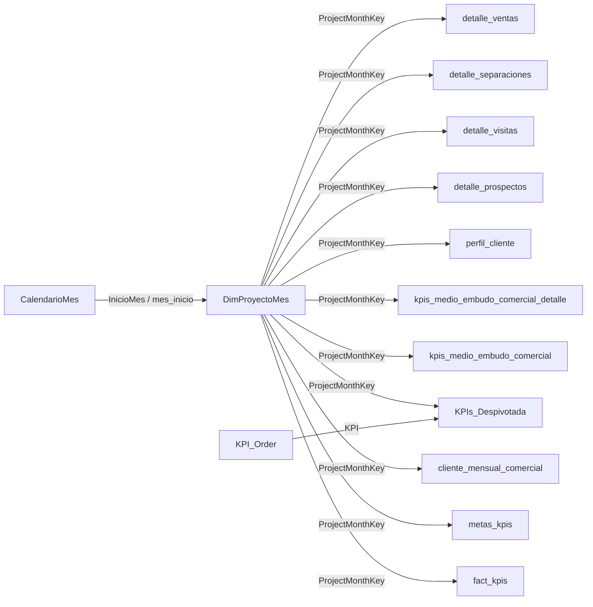

# Modelo de Datos del Reporte Embudo

## Proposito

Este archivo documenta el modelo de datos usado por el reporte Power BI del embudo comercial: tablas, rol de cada tabla, llaves de relacion, filtros principales y flujo de propagacion de filtros.

La documentacion se basa en:

| Fuente | Uso |
|---|---|
| `embudo.lsdl.yaml` | Identificacion de tablas, columnas, medidas y campos semanticos del modelo |
| Modelo visual de Power BI | Lectura de la estructura general y relaciones entre tablas |
| Power Query documentado | Confirmacion de columnas calculadas como `ProjectMonthKey` y `mes_inicio` |

---

## Vision general del modelo

El modelo esta organizado alrededor de dos dimensiones principales:

| Dimension | Funcion |
|---|---|
| `DimProyectoMes` | Dimension puente por proyecto y mes. Centraliza grupo, team, empresa, proyecto y mes |
| `CalendarioMes` | Dimension calendario mensual. Controla filtros de año, mes y ultimos periodos |

Las tablas de hechos se conectan principalmente mediante:

```text
ProjectMonthKey = nombre_proyecto | yyyy-MM
```

Esta llave permite que los filtros de proyecto y mes se propaguen desde `DimProyectoMes` hacia las tablas del embudo.

---

## Diagrama logico



---

## Tablas del modelo

### Dimensiones

| Tabla | Rol | Grano esperado | Campos clave |
|---|---|---|---|
| `DimProyectoMes` | Dimension principal de filtros de proyecto y mes | Un registro por proyecto y mes | `ProjectMonthKey`, `nombre_proyecto`, `nombre_empresa`, `grupo_inmobiliario`, `team_performance`, `mes_inicio` |
| `CalendarioMes` | Calendario mensual | Un registro por mes | `InicioMes`, `Año`, `MesNumero`, `Año-Mes`, `MesNombre`, `EsUltimo12Meses`, `EsAnioActual` |
| `KPI_Order` | Ordenamiento de KPIs del reporte consolidado | Un registro por KPI | `KPI`, `KPIOrder` |

---

### Hechos agregados

| Tabla | Rol | Grano esperado | Uso principal |
|---|---|---|---|
| `fact_kpis` | Hechos principales del embudo por proyecto y mes | Proyecto-mes | Velocimetros, tablas por proyecto, ratios generales |
| `metas_kpis` | Metas mensuales y metas al dia | Proyecto-mes | Valor objetivo de velocimetros y comparativos contra meta |
| `cliente_mensual_comercial` | Gestion comercial mensual | Proyecto-mes-asesor/responsable segun visual | Gestion comercial, contactabilidad, recontacto |
| `kpis_medio_embudo_comercial` | KPIs del embudo agrupados por medio | Proyecto-mes-medio | Pie de medios y reporte consolidado por canal |
| `kpis_medio_embudo_comercial_detalle` | Detalle agregado por medio de captacion | Proyecto-mes-medio | Barras horizontales por medio en embudo de marketing |
| `KPIs_Despivotada` | Tabla despivotada de KPIs para matrices mensuales | Proyecto-mes-KPI-medio | Matrices del reporte consolidado |

---

### Hechos de detalle

| Tabla | Rol | Grano esperado | Uso principal |
|---|---|---|---|
| `detalle_prospectos` | Detalle de leads/prospectos | Prospecto/lead | Detalle de prospectos, calidad de leads, subestados |
| `detalle_visitas` | Detalle de visitas | Visita | Drillthrough y detalle de visitas |
| `detalle_separaciones` | Detalle de separaciones | Separacion | Drillthrough y detalle de separaciones |
| `detalle_ventas` | Detalle de ventas | Venta | Drillthrough y detalle de ventas |
| `perfil_cliente` | Perfil de compradores/clientes | Cliente/proceso | Perfil del comprador |

---

## Llaves principales

### ProjectMonthKey

La llave principal del modelo es `ProjectMonthKey`.

Formato:

```text
ProjectMonthKey = nombre_proyecto | yyyy-MM
```

Ejemplo conceptual:

```text
ALMENDRA|2026-05
```

Tablas donde aparece `ProjectMonthKey` segun el modelo:

| Tabla | Campo |
|---|---|
| `DimProyectoMes` | `ProjectMonthKey` |
| `fact_kpis` | `ProjectMonthKey` |
| `metas_kpis` | `ProjectMonthKey` |
| `cliente_mensual_comercial` | `ProjectMonthKey` |
| `kpis_medio_embudo_comercial` | `ProjectMonthKey` |
| `kpis_medio_embudo_comercial_detalle` | `ProjectMonthKey` |
| `KPIs_Despivotada` | `ProjectMonthKey` |
| `detalle_prospectos` | `ProjectMonthKey` |
| `detalle_visitas` | `ProjectMonthKey` |
| `detalle_separaciones` | `ProjectMonthKey` |
| `detalle_ventas` | `ProjectMonthKey` |
| `perfil_cliente` | `ProjectMonthKey` |

Uso:

```text
DimProyectoMes[ProjectMonthKey] filtra las tablas de hechos por proyecto y mes.
```

---

### mes_inicio

`mes_inicio` normaliza el mes a una fecha tipo `date`, normalmente el primer dia del mes.

Formato:

```text
yyyy-MM-01
```

Uso:

```text
CalendarioMes[InicioMes] filtra DimProyectoMes[mes_inicio].
DimProyectoMes propaga luego el filtro hacia las tablas de hechos mediante ProjectMonthKey.
```

---

### KPI

La llave `KPI` se usa para ordenar y presentar la matriz consolidada.

Relacion logica:

```text
KPI_Order[KPI] -> KPIs_Despivotada[KPI]
```

Campos:

| Tabla | Campos |
|---|---|
| `KPI_Order` | `KPI`, `KPIOrder` |
| `KPIs_Despivotada` | `KPI`, `KPIOrder`, `Año-Mes`, `Valor`, `ProjectMonthKey`, `medio_captacion_categoria` |

---

## Relaciones logicas

### Relacion calendario

| Desde | Hacia | Campo | Funcion |
|---|---|---|---|
| `CalendarioMes` | `DimProyectoMes` | `InicioMes` -> `mes_inicio` | Filtrar el modelo por mes |

`CalendarioMes` no debe filtrar directamente todas las tablas de hechos si `DimProyectoMes` ya centraliza proyecto-mes. El flujo esperado es:

```text
CalendarioMes -> DimProyectoMes -> hechos
```

---

### Relaciones por ProjectMonthKey

| Desde | Hacia | Campo | Funcion |
|---|---|---|---|
| `DimProyectoMes` | `fact_kpis` | `ProjectMonthKey` | KPIs principales del embudo |
| `DimProyectoMes` | `metas_kpis` | `ProjectMonthKey` | Metas mensuales y metas al dia |
| `DimProyectoMes` | `cliente_mensual_comercial` | `ProjectMonthKey` | Gestion comercial mensual |
| `DimProyectoMes` | `kpis_medio_embudo_comercial` | `ProjectMonthKey` | KPIs por canal/medio |
| `DimProyectoMes` | `kpis_medio_embudo_comercial_detalle` | `ProjectMonthKey` | Barras por medio de captacion |
| `DimProyectoMes` | `KPIs_Despivotada` | `ProjectMonthKey` | Matrices del consolidado |
| `DimProyectoMes` | `detalle_prospectos` | `ProjectMonthKey` | Detalle y calidad de leads |
| `DimProyectoMes` | `detalle_visitas` | `ProjectMonthKey` | Detalle de visitas |
| `DimProyectoMes` | `detalle_separaciones` | `ProjectMonthKey` | Detalle de separaciones |
| `DimProyectoMes` | `detalle_ventas` | `ProjectMonthKey` | Detalle de ventas |
| `DimProyectoMes` | `perfil_cliente` | `ProjectMonthKey` | Perfil del comprador |

Lectura:

```text
DimProyectoMes es el centro del modelo.
Los slicers de grupo, team, empresa, proyecto y mes deben salir de DimProyectoMes o CalendarioMes.
```

---

## Filtros globales y campos de control

### is_visible

Varias tablas tienen el campo `is_visible`. En el LSDL aparecen condiciones semanticas de visibilidad para estas tablas:

| Tabla | Filtro esperado |
|---|---|
| `fact_kpis` | `is_visible = true` |
| `kpis_medio_embudo_comercial` | `is_visible = true` |
| `kpis_medio_embudo_comercial_detalle` | `is_visible = true` |
| `cliente_mensual_comercial` | `is_visible = true` |
| `detalle_prospectos` | `is_visible = true` |
| `detalle_visitas` | `is_visible = true` |
| `detalle_separaciones` | `is_visible = true` |
| `detalle_ventas` | `is_visible = true` |
| `perfil_cliente` | `is_visible = true` |
| `DimProyectoMes` | `is_visible = true` |

En Power Query, algunas tablas ya llegan filtradas con `is_visible = true`. Este campo evita que proyectos o registros no visibles entren al dashboard.

---

### team_performance

Tambien se usa como filtro de limpieza:

```text
team_performance <> "SIN TEAM"
```

Este filtro aparece en las consultas de `fact_kpis`, `kpis_medio_embudo_comercial`, `DimProyectoMes` y `kpis_medio_embudo_comercial_detalle`.

---

## Jerarquias de filtros

### Jerarquia de proyecto

La dimension `DimProyectoMes` contiene la jerarquia principal:

```text
grupo_inmobiliario
  -> team_performance
  -> nombre_empresa
  -> nombre_proyecto
```

Uso:

```text
Esta jerarquia alimenta slicers y matrices donde se navega desde grupo hasta proyecto.
```

---

### Jerarquia de gestion comercial

En `cliente_mensual_comercial` aparecen jerarquias usadas en la pagina de gestion comercial:

```text
grupo_inmobiliario
  -> team_performance
  -> Proyectos
  -> Responsable
```

Y tambien:

```text
usuario
  -> nombre_proyecto
```

Estas jerarquias permiten analizar gestion comercial por proyecto, responsable y asesor.

---

## Uso de tablas por pagina del reporte

| Pagina | Tablas principales |
|---|---|
| Embudo de marketing | `fact_kpis`, `metas_kpis`, `DimProyectoMes`, `kpis_medio_embudo_comercial_detalle` |
| Pie de medios | `kpis_medio_embudo_comercial`, `DimProyectoMes` |
| Gestion comercial | `cliente_mensual_comercial`, `DimProyectoMes` |
| Reporte consolidado | `KPIs_Despivotada`, `KPI_Order`, `kpis_medio_embudo_comercial`, `fact_kpis`, `DimProyectoMes` |
| Calidad de leads | `cliente_mensual_comercial`, `detalle_prospectos`, `CalendarioMes`, `DimProyectoMes` |
| Perfil del comprador | `perfil_cliente`, `DimProyectoMes` |
| Detalles | `detalle_prospectos`, `detalle_visitas`, `detalle_separaciones`, `detalle_ventas`, `DimProyectoMes` |

---

## Reglas de modelado

### 1. Filtrar desde dimensiones

Los filtros de pagina deben usar preferentemente:

| Filtro | Tabla recomendada |
|---|---|
| Grupo | `DimProyectoMes[grupo_inmobiliario]` |
| Team | `DimProyectoMes[team_performance]` |
| Empresa | `DimProyectoMes[nombre_empresa]` |
| Proyecto | `DimProyectoMes[nombre_proyecto]` |
| Año-Mes | `CalendarioMes[Año-Mes]` |

Esto evita que una tabla de hechos filtre parcialmente a otra tabla de hechos.

---

### 2. No mezclar hechos sin dimension puente

Cuando un visual mezcla campos de dos tablas de hechos, el contexto debe venir de `DimProyectoMes`.

Ejemplo:

```text
fact_kpis[real_captaciones] + metas_kpis[captaciones]
```

Este cruce funciona porque ambas tablas comparten:

```text
ProjectMonthKey
```

---

### 3. Usar CalendarioMes para ventanas temporales

Campos como `EsUltimo12Meses`, `EsAnioActual`, `Año-Mes`, `MesNumero` y `MesNombre` deben venir de `CalendarioMes`.

Esto permite que los graficos historicos y matrices mensuales usen un calendario unico.

---

## Validaciones recomendadas

### Validar ProjectMonthKey

```text
Para cada tabla de hechos:
1. Verificar que ProjectMonthKey no venga en blanco.
2. Verificar que exista en DimProyectoMes.
3. Verificar que el formato sea nombre_proyecto|yyyy-MM.
```

---

### Validar filtros de pagina

Seleccionar un proyecto y mes especifico. Luego comparar:

```text
DimProyectoMes[ProjectMonthKey]
fact_kpis[ProjectMonthKey]
metas_kpis[ProjectMonthKey]
cliente_mensual_comercial[ProjectMonthKey]
```

Si una tabla no responde al filtro, revisar su relacion con `DimProyectoMes`.

---

### Validar calendario

```text
CalendarioMes[InicioMes] debe coincidir con DimProyectoMes[mes_inicio].
```

Si un mes aparece vacio en graficos historicos:

| Posible causa | Revision |
|---|---|
| No existe en `CalendarioMes` | Revisar tabla calendario |
| No existe en `DimProyectoMes` | Revisar construccion de dimension proyecto-mes |
| Existe en hechos pero no en dimension | Revisar `ProjectMonthKey` |

---

## Resumen

```text
Modelo: Embudo comercial Power BI
Dimension central: DimProyectoMes
Dimension temporal: CalendarioMes
Llave principal: ProjectMonthKey
Llave temporal: mes_inicio / InicioMes
Tablas de KPIs: fact_kpis, metas_kpis, kpis_medio_embudo_comercial
Tablas de detalle: detalle_prospectos, detalle_visitas, detalle_separaciones, detalle_ventas
Tablas de apoyo: KPIs_Despivotada, KPI_Order
```
