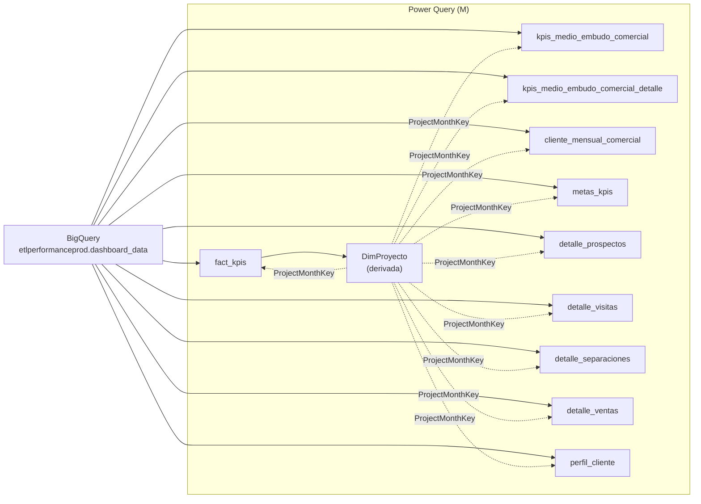

# Reporte Embudo — Power BI

## ¿Qué es este reporte?

Reporte de **Power BI** que visualiza el embudo comercial (CAPTACIONES → LEADS → VISITAS → CITAS → SEPARACIONES → VENTAS) y métricas asociadas por proyecto y mes.

Consume **directamente** las tablas del esquema `etlperformanceprod.dashboard_data` en BigQuery (capa 5) mediante el conector `GoogleBigQuery.Database()` de Power BI. Toda la transformación que se documenta acá ocurre **dentro de Power Query (M Language)**, encima del dato ya calculado por el ETL.

---

## Fuente común

Todas las queries arrancan con el mismo bloque:

```m
Source = GoogleBigQuery.Database(),
etlperformanceprod = Source{[Name="etlperformanceprod"]}[Data],
dashboard_data_Schema = etlperformanceprod{[Name="dashboard_data",Kind="Schema"]}[Data],
<tabla>_Table = dashboard_data_Schema{[Name="<tabla>",Kind="Table"]}[Data]
```

Es decir: proyecto BigQuery `etlperformanceprod` → schema `dashboard_data` → tabla destino.

---

## Patrones que se repiten

### 1. `mes_inicio` (date)

Las tablas del ETL guardan el mes como string `"YYYY-MM"` (`mes_anio` o `anio_mes`). Power Query lo convierte a tipo `date` agregando el día `01`:

```m
mes_inicio = Date.FromText([mes_anio] & "-01")
```

Algunas variantes usan `try ... otherwise null` para tolerar valores mal formados:

```m
mes_inicio = try Date.FromText([mes_anio] & "-01") otherwise null
```

### 2. `ProjectMonthKey` (text)

Clave compuesta `nombre_proyecto|mes_anio` usada para relacionar las tablas entre sí dentro del modelo de Power BI:

```m
ProjectMonthKey =
    if [nombre_proyecto] <> null and [mes_anio] <> null then
        Text.Trim([nombre_proyecto]) & "|" & Text.From([mes_anio])
    else if [nombre_proyecto] <> null and [mes_inicio] <> null then
        Text.Trim([nombre_proyecto]) & "|" & Date.ToText([mes_inicio],"yyyy-MM")
    else
        null
```

> El `Text.Trim` sobre `nombre_proyecto` es **clave** — si una tabla tiene espacios sobrantes y otra no, las relaciones se rompen silenciosamente. La regla aplica en todas las tablas.

### 3. Filtros comunes

| Filtro | Por qué |
|---|---|
| `is_visible = true` | Solo proyectos con meta cargada (regla heredada de la capa 5) |
| `team_performance <> "SIN TEAM"` | Excluye filas sin team asignado |
| `nombre_empresa <> "NOI INMOBILIARIA"` | Hardcoded para excluir esta empresa del reporte |
| `nombre_empresa <> "CHECOR"` | Aplicado en `perfil_cliente` |

---

## Tablas que alimentan el reporte

| Tabla M (Power BI) | Tabla origen BigQuery | Rol en el modelo |
|---|---|---|
| `fact_kpis` | `dashboard_data.fact_kpis` | Fact principal (KPIs por proyecto·mes) |
| `kpis_medio_embudo_comercial` | `dashboard_data.kpis_medio_embudo_comercial` | KPIs desglosados por medio de captación |
| `kpis_medio_embudo_comercial_detalle` | `dashboard_data.kpis_medio_embudo_comercial_detalle` | Detalle fila a fila por medio |
| `DimProyecto` | (derivada de `fact_kpis`) | Dimensión proyecto·mes única |
| `cliente_mensual_comercial` | `dashboard_data.cliente_mensual_comercial` | Agregado cliente mensual |
| `metas_kpis` | `dashboard_data.metas_kpis` | Metas por proyecto·mes |
| `detalle_prospectos` | `dashboard_data.detalle_prospectos` | Detalle prospectos |
| `detalle_visitas` | `dashboard_data.detalle_visitas` | Detalle visitas |
| `detalle_separaciones` | `dashboard_data.detalle_separaciones` | Detalle separaciones |
| `detalle_ventas` | `dashboard_data.detalle_ventas` | Detalle ventas |
| `perfil_cliente` | `dashboard_data.perfil_cliente` | Perfil cliente con motivo de compra normalizado |

---

## Diagrama del modelo



`DimProyecto` actúa como tabla dimensión que se relaciona por `ProjectMonthKey` con todas las facts.

---

## Tabla por tabla — transformaciones detalladas

### 1. `fact_kpis`

**Origen:** `dashboard_data.fact_kpis`

**Pasos:**
1. Agrega `mes_inicio` (date) desde `mes_anio` + `"-01"`.
2. Cambia tipo de `mes_inicio` a `date`.
3. Agrega `ProjectMonthKey` (texto).
4. Filtra:
   - `is_visible = true`
   - `team_performance <> "SIN TEAM"`
   - `nombre_empresa <> "NOI INMOBILIARIA"`

```m
let
    Source = GoogleBigQuery.Database(),
    etlperformanceprod = Source{[Name="etlperformanceprod"]}[Data],
    dashboard_data_Schema = etlperformanceprod{[Name="dashboard_data",Kind="Schema"]}[Data],
    fact_kpis_Table = dashboard_data_Schema{[Name="fact_kpis",Kind="Table"]}[Data],
    #"Added Custom" = Table.AddColumn(fact_kpis_Table, "mes_inicio",
        each Date.FromText([mes_anio] & "-01")),
    #"Changed Type" = Table.TransformColumnTypes(#"Added Custom",{{"mes_inicio", type date}}),
    #"Added Custom1" = Table.AddColumn(#"Changed Type", "ProjectMonthKey",
        each if [nombre_proyecto] <> null and [mes_anio] <> null then
                 Text.Trim([nombre_proyecto]) & "|" & Text.From([mes_anio])
             else if [nombre_proyecto] <> null and [mes_inicio] <> null then
                 Text.Trim([nombre_proyecto]) & "|" & Date.ToText([mes_inicio],"yyyy-MM")
             else null),
    #"Filtered Rows" = Table.SelectRows(#"Added Custom1",
        each ([is_visible] = true)
         and ([team_performance] <> "SIN TEAM")
         and ([nombre_empresa] <> "NOI INMOBILIARIA"))
in
    #"Filtered Rows"
```

> Único caso donde se excluye `NOI INMOBILIARIA`. El resto de facts no aplican este filtro.

---

### 2. `kpis_medio_embudo_comercial`

**Origen:** `dashboard_data.kpis_medio_embudo_comercial`

**Pasos:**
1. Agrega `mes_inicio` (date).
2. Cambia tipo a `date`.
3. Agrega `ProjectMonthKey`.
4. Filtra: `is_visible = true` y `team_performance <> "SIN TEAM"`.

> Mismo patrón que `fact_kpis` **pero sin** el filtro de `NOI INMOBILIARIA`.

---

### 3. `kpis_medio_embudo_comercial_detalle`

**Origen:** `dashboard_data.kpis_medio_embudo_comercial_detalle`

**Pasos idénticos** a `kpis_medio_embudo_comercial`. La única diferencia es que los pasos se nombran `Personalizado1..4` (la query fue armada en otra sesión de Power Query). Sin filtro de empresa.

---

### 4. `DimProyecto` (derivada)

**Origen:** la propia query `fact_kpis` ya cargada en el modelo (`Source = fact_kpis`).

Esta es la **dimensión** que une a todas las tablas. Detalle de pasos:

1. **EnsureMesInicio** — si `mes_inicio` ya existe se respeta y se castea a `date`; si no existe, se intenta construir con dos fallbacks:
   ```m
   try Date.FromText(Text.Start([mes_anio],4) & "-" & Text.End([mes_anio],2) & "-01")
   otherwise try Date.FromText([mes_anio] & "-01")
   otherwise null
   ```
2. **SelectCols** — solo: `nombre_proyecto`, `nombre_empresa`, `grupo_inmobiliario`, `mes_inicio`, `team_performance`, `is_visible`.
3. **Trimmed** — `Text.Trim` a los cuatro campos texto (con guarda anti-null).
4. **RemovedDupes** — `Table.Distinct` por `(nombre_proyecto, mes_inicio)`.
5. **AddKey** — `ProjectMonthKey = nombre_proyecto & "|" & yyyy-MM(mes_inicio)`.
6. **Final** — reordena columnas con `ProjectMonthKey` al inicio.
7. **Filtered Rows** — descarta `team_performance = "SIN TEAM"`.

```m
let
    Source = fact_kpis,
    EnsureMesInicio =
        if Table.HasColumns(Source, "mes_inicio") then
            Table.TransformColumnTypes(Source, {{"mes_inicio", type date}})
        else
            Table.AddColumn(Source, "mes_inicio",
                each try Date.FromText(Text.Start([mes_anio],4) & "-" & Text.End([mes_anio],2) & "-01")
                     otherwise try Date.FromText([mes_anio] & "-01")
                     otherwise null,
                type date),
    SelectCols = Table.SelectColumns(EnsureMesInicio,
        {"nombre_proyecto","nombre_empresa","grupo_inmobiliario","mes_inicio","team_performance","is_visible"}),
    Trimmed = Table.TransformColumns(SelectCols, {
        {"nombre_proyecto",   each if _ = null then null else Text.Trim(_), type text},
        {"nombre_empresa",    each if _ = null then null else Text.Trim(_), type text},
        {"grupo_inmobiliario",each if _ = null then null else Text.Trim(_), type text},
        {"team_performance",  each if _ = null then null else Text.Trim(_), type text}}),
    RemovedDupes = Table.Distinct(Trimmed, {"nombre_proyecto","mes_inicio"}),
    AddKey = Table.AddColumn(RemovedDupes, "ProjectMonthKey",
        each Text.From([nombre_proyecto]) & "|" & Date.ToText([mes_inicio],"yyyy-MM"), type text),
    Final = Table.SelectColumns(AddKey,
        {"ProjectMonthKey","nombre_proyecto","nombre_empresa","grupo_inmobiliario","mes_inicio","team_performance","is_visible"}),
    #"Filtered Rows" = Table.SelectRows(Final, each ([team_performance] <> "SIN TEAM"))
in
    #"Filtered Rows"
```

> Como deriva de `fact_kpis` (que ya filtró `NOI INMOBILIARIA`, `is_visible=true`, `team_performance <> "SIN TEAM"`), `DimProyecto` hereda esos filtros. El `Table.SelectRows` final por `team_performance <> "SIN TEAM"` es redundante pero defensivo.

---

### 5. `cliente_mensual_comercial`

**Origen:** `dashboard_data.cliente_mensual_comercial`

**Pasos:**
1. `mes_inicio = Date.FromText([mes_anio] & "-01")`.
2. Cambia tipo a `date`.
3. `ProjectMonthKey` — **única diferencia**: la rama principal usa `Date.ToText([mes_inicio],"yyyy-MM")` (no `Text.From([mes_anio])`). Funcionalmente equivalente cuando `mes_anio` está bien formado.
4. Cambia tipo de `ProjectMonthKey` a `text`.
5. Filtra: `is_visible = true`. **No** filtra `team_performance`.

---

### 6. `metas_kpis`

**Origen:** `dashboard_data.metas_kpis`

**Diferencias notables respecto al patrón estándar:**
- La columna mes se llama `anio_mes` (no `mes_anio`).
- La columna proyecto se llama `proyecto` (no `nombre_proyecto`).
- Usa `try ... otherwise null` para `mes_inicio`.
- **Sin filtros**.

```m
mes_inicio = try Date.FromText([anio_mes] & "-01") otherwise null
ProjectMonthKey =
    if [proyecto] <> null and [anio_mes] <> null then
        Text.Trim([proyecto]) & "|" & [anio_mes]
    else if [proyecto] <> null and [mes_inicio] <> null then
        Text.Trim([proyecto]) & "|" & Date.ToText([mes_inicio],"yyyy-MM")
    else null
```

> Importante: la `ProjectMonthKey` se construye con `proyecto` pero las facts la construyen con `nombre_proyecto`. Para que las relaciones cierren, **ambos campos deben coincidir en string** (incluyendo capitalización y acentos). Si el CSV de metas tiene un nombre diferente, esa meta no se cruza.

---

### 7. `detalle_prospectos`

**Origen:** `dashboard_data.detalle_prospectos`

**Pasos:**
1. `mes_inicio` con `try ... otherwise null`.
2. `ProjectMonthKey` con el patrón estándar (`Text.From([mes_anio])` en la rama principal).
3. **Sin** `Table.TransformColumnTypes` sobre `mes_inicio` — queda como `any` si la fila falla en el `try`.
4. **Sin filtros**.

---

### 8. `detalle_visitas`

**Origen:** `dashboard_data.detalle_visitas`

**Pasos:** idénticos a `detalle_prospectos` **pero** además se castea `mes_inicio` a `date` y `ProjectMonthKey` a `text`. **Sin filtros**.

---

### 9. `detalle_separaciones`

**Origen:** `dashboard_data.detalle_separaciones`

Mismo patrón que `detalle_visitas`. Castea `mes_inicio` y `ProjectMonthKey`. **Sin filtros**.

---

### 10. `detalle_ventas`

**Origen:** `dashboard_data.detalle_ventas`

Mismo patrón que `detalle_separaciones` **+ un filtro**:

```m
#"Filtered Rows" = Table.SelectRows(#"Changed Type1", each ([VENTAS] <> 0))
```

> Excluye filas con `VENTAS = 0`. La tabla origen ya viene con la grilla completa (cross join con calendario en capa 5), por lo que muchas filas tienen `VENTAS = 0`. Acá se eliminan para que el detalle solo muestre meses con venta real.

---

### 11. `perfil_cliente`

**Origen:** `dashboard_data.perfil_cliente`

**Pasos:**
1. `mes_inicio` con `try ... otherwise null`.
2. Castea a `date`.
3. `ProjectMonthKey` patrón estándar.
4. Castea `ProjectMonthKey` a `text`.
5. **Filtros estrictos**:
   ```m
   grupo_inmobiliario IN ("NEW BUSINESS", "TALE INMOBILIARIA", "V&V GRUPO INMOBILIARIO")
   AND nombre_empresa <> "CHECOR"
   ```
6. **Normalización de `MOTIVO_COMPRA`** — cuatro `Table.ReplaceValue` encadenados:

| De | A |
|---|---|
| `"INVERSION"` | `"INVERSIÓN"` (agrega tilde) |
| `"VIS INVERSIÓN"` | `"INVERSIÓN"` (colapsa categoría VIS) |
| `"1ª VIVIENDA VIS"` | `"VIVIENDA"` |
| `"VIS VIVIENDA"` | `"VIVIENDA"` |

> El orden importa: primero se pone tilde a `INVERSION` y **después** se colapsa `VIS INVERSIÓN` (que ya tiene tilde) a `INVERSIÓN`. Si se invierte el orden el último reemplazo no encuentra match.
>
> `Replacer.ReplaceText` hace match exacto sobre la celda entera, no substring. `"VIS INVERSIÓN"` no afecta a otras filas con la palabra `INVERSIÓN`.

---

## Resumen de filtros aplicados por tabla

| Tabla | `is_visible=true` | `team <> "SIN TEAM"` | Filtro empresa | Otros |
|---|:-:|:-:|---|---|
| `fact_kpis` | ✔ | ✔ | `<> NOI INMOBILIARIA` | — |
| `kpis_medio_embudo_comercial` | ✔ | ✔ | — | — |
| `kpis_medio_embudo_comercial_detalle` | ✔ | ✔ | — | — |
| `DimProyecto` | (hereda) | ✔ | (hereda) | dedup por proyecto·mes |
| `cliente_mensual_comercial` | ✔ | — | — | — |
| `metas_kpis` | — | — | — | — |
| `detalle_prospectos` | — | — | — | — |
| `detalle_visitas` | — | — | — | — |
| `detalle_separaciones` | — | — | — | — |
| `detalle_ventas` | — | — | — | `VENTAS <> 0` |
| `perfil_cliente` | — | — | `<> CHECOR` | `grupo IN (NEW BUSINESS, TALE, V&V)`, normaliza `MOTIVO_COMPRA` |

---

## Reglas y decisiones de negocio importantes

### 1. Filtros heredados de la capa 5

`is_visible`, `team_performance` y `grupo_inmobiliario` ya vienen calculados desde el ETL. Power Query solo los filtra, no los recalcula. Si negocio quiere cambiar la definición de "visible" hay que editar **la capa 5** (`dashboard_operations_*.py`), no Power BI.

### 2. Hardcoded de empresas a excluir

- `fact_kpis` excluye `NOI INMOBILIARIA`.
- `perfil_cliente` excluye `CHECOR`.

Ambos están **hardcoded en M** y no en el ETL. Si negocio quiere reincorporarlas hay que editar esta query.

### 3. Hardcoded de grupos en `perfil_cliente`

Solo se muestran `NEW BUSINESS`, `TALE INMOBILIARIA`, `V&V GRUPO INMOBILIARIO`. Cualquier otro grupo nuevo (ej: VYVE) **no aparece** en perfil de cliente hasta que se agregue al filtro.

### 4. Normalización de `MOTIVO_COMPRA`

La unificación de categorías VIS → VIVIENDA/INVERSIÓN se hace **en Power Query**, no en el ETL. Si hay otro reporte que consume `perfil_cliente` directo desde BigQuery va a ver las categorías sin unificar.

### 5. `ProjectMonthKey` es la clave de relación universal

Todo el modelo se conecta por `ProjectMonthKey`. Cualquier diferencia de capitalización, acento o espacio en `nombre_proyecto` o `mes_anio` rompe relaciones de forma **silenciosa** — no hay error, simplemente las medidas devuelven blank. Por eso todas las queries hacen `Text.Trim`.

### 6. `metas_kpis` usa otros nombres de columnas

`anio_mes` (no `mes_anio`) y `proyecto` (no `nombre_proyecto`). Para que las metas crucen con las facts, los nombres de proyecto deben coincidir **exactamente** entre el CSV de metas y las tablas de proyectos del ETL.

### 7. `detalle_ventas` filtra `VENTAS <> 0`

Único detalle que aplica filtro de valor. Los otros detalles muestran filas con 0 (heredado del cross join con calendario en capa 5).

---

## Cosas a tener en cuenta

- **No hay Query Folding garantizado** — algunas transformaciones (sobre todo `try ... otherwise`, `Table.AddColumn` con condicionales) se ejecutan en el cliente Power BI, no en BigQuery. Para tablas grandes esto puede ser lento en el refresh.
- **Modo de conexión** — confirmar si el dataset está en Import o DirectQuery. Las transformaciones M se comportan distinto: en Import se materializan al refrescar, en DirectQuery se traducen a SQL si es posible.
- **`DimProyecto` se rompe si `fact_kpis` cambia** — al depender de `fact_kpis` como origen, cualquier cambio en su estructura (renombrar `nombre_proyecto`, eliminar `mes_anio`) propaga error.
- **Los filtros de empresa en M no documentan el "por qué"** — `NOI INMOBILIARIA` y `CHECOR` están excluidas sin comentario. Si alguien lo necesita, hay que confirmar con negocio (probablemente data sucia o empresas fuera de scope del reporte).
- **`Replacer.ReplaceText` distingue acentos** — `INVERSION` y `INVERSIÓN` son strings distintos. El orden de los reemplazos importa.
- **No hay tipado fuerte en `detalle_prospectos`** — falta el `Table.TransformColumnTypes` sobre `mes_inicio`. Si Power BI infiere tipo desde la primera fila y hay un `null`, la columna queda como `any` y puede fallar joins.

---

## Referencias al código

- Tablas origen calculadas en: **Capa 5 — Dashboard Calc** (`dashboard_operations_*.py`).
- Schemas destino: `dashboard_tables_helper.py` → `create_*_table`.
- Las queries M viven dentro del archivo `.pbix` del reporte (no en este repo).

---

## ¿Cuándo editar este reporte?

| Caso | Qué hacer |
|---|---|
| Cambiar definición de "captación" o cualquier KPI | Editar capa 5 (`calculate_kpis_*`). Power BI hereda automáticamente. |
| Excluir una empresa nueva | Agregar filtro `nombre_empresa <> "..."` en la query M correspondiente. |
| Agregar un grupo inmobiliario a `perfil_cliente` | Editar el `Table.SelectRows` con la lista de grupos. |
| Agregar una nueva categoría de `MOTIVO_COMPRA` | Sumar un `Table.ReplaceValue` después de los existentes, respetando orden. |
| Agregar una tabla nueva del esquema `dashboard_data` | Crear nueva query M con el mismo patrón: `Source → mes_inicio → ProjectMonthKey → filtros`. |
