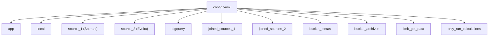
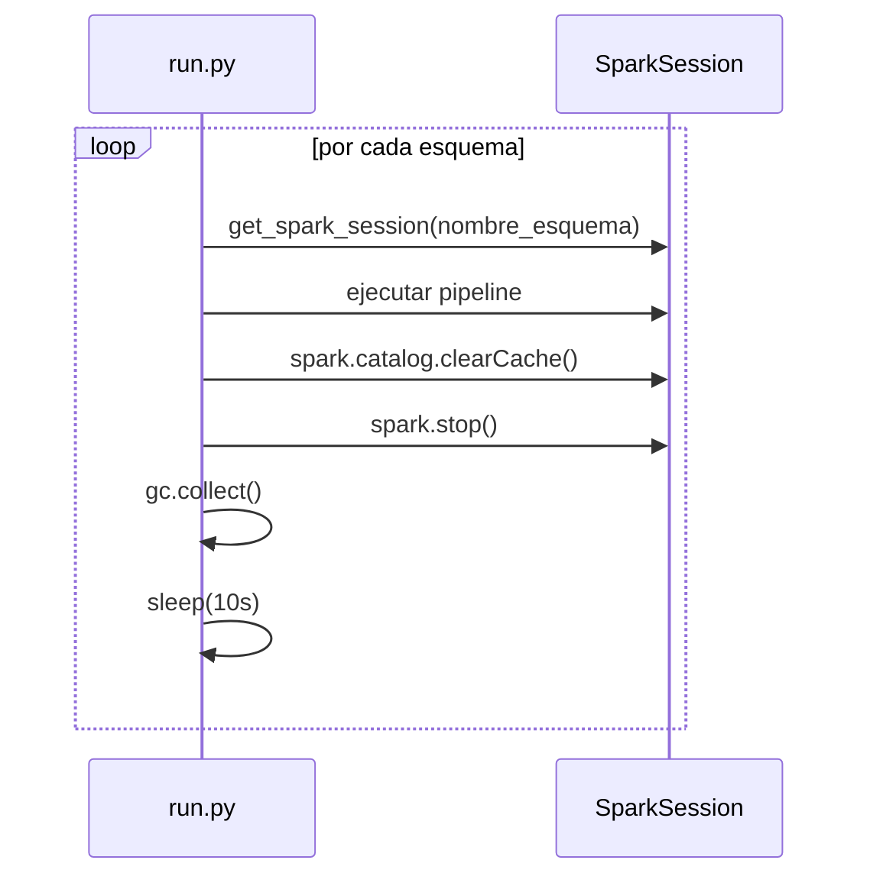

# Referencia de configuración — `config.yaml`

Documento de referencia para todos los parámetros del archivo `infra/src/etl/config.yaml` y configuraciones relacionadas.

---

## Estructura general



---

## Parámetros

### Generales

| Parámetro | Tipo | Ejemplo | Descripción |
|---|---|---|---|
| `app.name` | string | `dataproc-etl` | Nombre base para las SparkSession. Se le agrega `_{esquema}` en runtime. |
| `local` | boolean | `True` | Si `True`, Spark carga el JAR de PostgreSQL local. En producción (Dataproc) debe ser `False`. |
| `only_run_calculations` | boolean | `True` | Si `True`, salta capas 1-4 (extract/transform/load) y ejecuta solo capas 5-8 (dashboard). Útil para recalcular dashboards sin re-ingestar datos. |
| `limit_get_data` | integer | `0` | Si > 0, agrega `LIMIT N` a las queries de extracción. Solo para desarrollo/debug. En producción debe ser `0`. |

### `source_1` — Sperant

| Parámetro | Descripción |
|---|---|
| `url` | JDBC URL de Redshift (Postgres-compatible) |
| `user` / `password` | Credenciales de conexión |
| `active` | Si `False`, se salta todo el pipeline Sperant |
| `schemas` | Lista de esquemas a procesar (típicamente solo `checor`) |

### `source_2` — Evolta

| Parámetro | Descripción |
|---|---|
| `url` | JDBC URL de PostgreSQL Azure |
| `user` / `password` | Credenciales de conexión |
| `active` | Si `False`, se salta todo el pipeline Evolta |
| `schemas` | Lista de esquemas `sev_*` a procesar (~24 esquemas) |

### `joined_sources_N` — Esquemas mixtos

Cada bloque `joined_sources_N` configura un esquema que lee de **ambos** CRMs:

| Parámetro | Descripción |
|---|---|
| `active` | Si `False`, se salta este esquema joined |
| `bigquery_schema` | Nombre del esquema destino en BigQuery (ej: `sev_9`) |
| `source_1.url/user/password/schema` | Conexión Evolta para este esquema |
| `source_2.url/user/password/schema` | Conexión Sperant para este esquema |

> **Convención invertida en joined:** dentro de `joined_sources_N`, `source_1` apunta a **Evolta** y `source_2` apunta a **Sperant**. En el config raíz es al revés. Esto puede confundir.

### Buckets GCS

| Parámetro | Descripción |
|---|---|
| `bucket_metas.name` | Bucket con `CONSOLIDADO_METAS.csv` |
| `bucket_archivos.name` | Bucket con CSVs maestros (blacklist, asesores, estados, proyectos, etc.) |

### BigQuery

| Parámetro | Descripción |
|---|---|
| `bigquery.project_id` | Proyecto GCP destino (`etlperformanceprod`) |

---

## Parámetro inyectado en runtime

El `run.py` agrega un parámetro dinámico al dict `config` durante la ejecución del pipeline joined:

```python
config["actual_joined_esquema"] = config_name  # ej: "joined_sources_1"
```

Esto permite a las funciones de transformación joined saber qué bloque de config usar para obtener las credenciales correctas.

---

## SparkSession

Aunque no está en `config.yaml`, la configuración de Spark se define en `run.py` → `get_spark_session()`:

| Config Spark | Valor | Impacto |
|---|---|---|
| `spark.jars.packages` | `spark-3.3-bigquery:0.42.1` | Versión del conector BigQuery |
| `spark.hadoop.fs.gs.impl` | `GoogleHadoopFileSystem` | Necesario para leer de GCS |
| `spark.sql.session.timeZone` | `UTC` | Timestamps se interpretan como UTC |
| `spark.jars` | JAR de PostgreSQL + GCS connector | Solo en modo local |

### Ciclo de vida por esquema



Cada esquema crea y destruye su propia sesión para liberar memoria. El `sleep(10s)` entre esquemas es para dar tiempo a la JVM de liberar recursos.

---

## Referencia al código

- Config: `infra/src/etl/config.yaml`.
- Lectura: `run.py` → `main()` (soporte para leer desde filesystem o desde ZIP).
- SparkSession: `run.py` → `get_spark_session()`.
