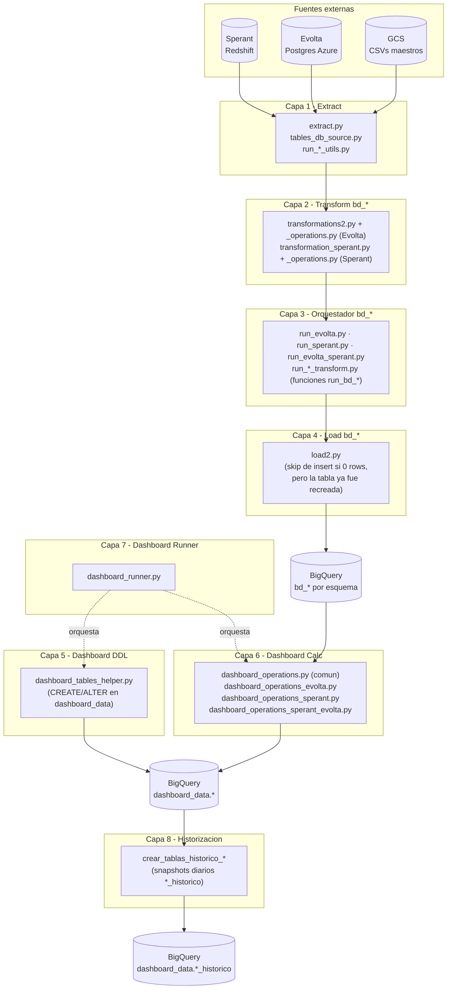
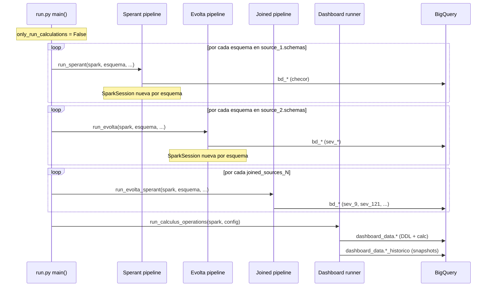
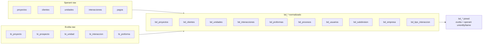

# Documentación Lógica y Reglas de Negocio — ETL `infra/src/etl/`

> Esta carpeta documenta **qué hace cada capa del ETL**, **por qué existe cada tabla**, y **qué reglas de negocio aplica cada transformación**.
> Para detalles de implementación / código → leer los archivos `.py` directamente.
> Para *qué* y *por qué* → estos docs.

---

## 1. Visión general

El ETL ingesta datos de dos CRMs inmobiliarios distintos (**Evolta** y **Sperant**), los normaliza a un esquema común `bd_*`, los carga a BigQuery, y a partir de ahí calcula tablas de dashboards comerciales (`dashboard_data.*`).

**Fuentes:**

| Fuente | Tipo | Origen | Schemas |
|---|---|---|---|
| **Sperant** (Source 1 / TYPE 1) | CRM ventas inmobiliarias | Redshift (Postgres-compatible) | `checor` |
| **Evolta** (Source 2 / TYPE 2) | CRM ventas inmobiliarias | Postgres Azure | `sev_4`, `sev_8`, `sev_10`, `sev_11`, `sev_13`, `sev_14`, `sev_15`, `sev_17`, `sev_18`, `sev_19`, `sev_20`, `sev_21`, `sev_22`, `sev_34`, `sev_35`, `sev_36`, `sev_40`, `sev_83`, `sev_84`, `sev_87`, `sev_88`, `sev_106`, `sev_111`, `sev_157`, `sev_162` |
| **Joined** (TYPE 3) | Evolta + Sperant unificados | Ambos | `sev_9`, `sev_121` (configurados en `joined_sources_*`) |

**Destino:** BigQuery — proyecto `etlperformanceprod`.

**Archivos auxiliares (GCS):**
- Bucket `carga_archivo_metas_prod` — metas mensuales por proyecto.
- Bucket `carga_archivos_maestros_etl_prod` — blacklist unidades, asesores, medios de captación, data empresa.

---

## 2. Arquitectura por capas



---

## 3. Flujo de ejecución (`run.py main()`)

Orden controlado por flags en `config.yaml`:

| Flag | Comportamiento |
|---|---|
| `only_run_calculations: False` | Ejecuta pipeline completo (capas 1 a 8) |
| `only_run_calculations: True`  | Salta capas 1 a 4, ejecuta solo capas 5 a 8 |
| `source_1.active: False` | Salta procesamiento Sperant |
| `source_2.active: False` | Salta procesamiento Evolta |
| `joined_sources_N.active: False` | Salta esquema joined N |

**Secuencia completa:**



**Aislamiento entre esquemas:** cada esquema crea/destruye su propia `SparkSession` (limpia caché y libera memoria entre corridas con `spark.catalog.clearCache()` + `spark.stop()` + `gc.collect()`).

---

## 4. Tablas `bd_*` generadas (capa 2)

Cada fuente produce el mismo conjunto base de tablas normalizadas. La capa joined las une en una sola por esquema.



| Tabla | Contenido |
|---|---|
| `bd_empresa` | Datos de la empresa propietaria del CRM |
| `bd_grupo_inmobiliario` | Grupo inmobiliario al que pertenece la empresa |
| `bd_proyectos` | Proyectos inmobiliarios |
| `bd_proyecto_extension` | Atributos extra de proyectos |
| `bd_proyectos_mapping` | Mapping códigos proyecto entre Evolta y Sperant |
| `bd_subdivision` | Subdivisiones / etapas / torres por proyecto |
| `bd_unidades` | Unidades inmobiliarias (deptos, casas, lotes) |
| `bd_usuarios` | Asesores / vendedores |
| `bd_clientes` | Clientes / prospectos |
| `bd_clientes_fechas_extension` | Fechas hito por cliente (captación, separación, venta) |
| `bd_tipo_interaccion` | Catálogo tipos de interacción |
| `bd_interacciones` | Interacciones cliente-asesor (visitas, llamadas, citas) |
| `bd_proformas` | Proformas / cotizaciones |
| `bd_procesos` | Procesos comerciales (separación, venta, desistimiento) |
| `bd_metas` | Metas mensuales por proyecto (CSV externo) |
| `bd_team_performance` | Indicadores por equipo / asesor |

> Detalle completo de cada tabla: ver `02_transform_bd/{evolta,sperant,joined}/\<tabla\>.md`.

---

## 5. Tablas dashboard generadas (capa 6)

Esquema destino: `dashboard_data`.

```mermaid
graph TD
    BD[bd_* en BigQuery] --> KPIS[KPIs principales]
    BD --> AGG[Agregaciones cliente]
    BD --> INV[Inventario]
    BD --> DET[Detalles operativos]
    CSV[CSVs maestros GCS] --> MAE[Tablas maestras]

    KPIS --> K1[kpis_embudo_comercial]
    KPIS --> K2[kpis_medio_comercial + _detalle]
    KPIS --> K3[kpis_medio_proforma_comercial]
    KPIS --> K4[kpis_bigdata]
    KPIS --> K5[canal_digital]

    AGG --> A1[cliente_diario_comercial]
    AGG --> A2[cliente_mensual_comercial]
    AGG --> A3[acciones_cliente]

    INV --> I1[stock_comercial]
    INV --> I2[proyecto_data]

    MAE --> M1[metas_kpis]
    MAE --> M2[blacklist_unidades]

    DET --> D1[prospectos_detalle]
    DET --> D2[visitas_detalle]
    DET --> D3[citas_generadas_detalle]
    DET --> D4[citas_concretadas_detalle]
    DET --> D5[separaciones_detalle]
    DET --> D6[ventas_detalle]
    DET --> D7[clientes_vencidos]
    DET --> D8[perfil_cliente]
```



**KPIs principales:**
- `kpis_embudo_comercial` — funnel comercial (prospectos → visitas → separaciones → ventas).
- `kpis_medio_comercial` / `kpis_medio_comercial_detalle` — KPIs por medio de captación / canal.
- `kpis_medio_proforma_comercial` — KPIs proformas por medio.
- `kpis_bigdata` — métricas analíticas BigData.
- `canal_digital` — desempeño por canal digital.

**Agregaciones de cliente:**
- `cliente_diario_comercial` — agregado diario.
- `cliente_mensual_comercial` (+ `_prueba`) — agregado mensual.
- `acciones_cliente` — eventos por cliente.

**Inventario:**
- `stock_comercial` — unidades disponibles (excluye `blacklist_unidades`).
- `proyecto_data` — data agregada por proyecto.

**Maestros (cargados de CSV):**
- `metas_kpis` — metas mensuales (`CONSOLIDADO_METAS.csv`).
- `blacklist_unidades` — unidades excluidas del stock (`CONSOLIDADO_BLACKLIST_UNIDADES.csv`).

**Detalles operativos:** `prospectos_detalle`, `visitas_detalle`, `citas_generadas_detalle`, `citas_concretadas_detalle`, `separaciones_detalle`, `ventas_detalle`, `clientes_vencidos`, `perfil_cliente`.

**Historización:** cada tabla anterior tiene su par `*_historico` con snapshots diarios.

---

## 6. Índice de documentación

```
docs/business_logic/
├── README.md                         <- este archivo
├── glossary.md                       <- terminos negocio (proforma, separacion, etc.)
├── config_reference.md               <- referencia config.yaml + SparkSession
├── 01_extract/
│   ├── jdbc_extraction.md
│   └── source_tables_catalog.md
├── 02_transform_bd/
│   ├── README.md
│   ├── evolta/\<tabla\>.md
│   ├── sperant/\<tabla\>.md
│   └── joined/
│       ├── \<tabla\>.md
│       └── bd_proyectos_mapping.md   <- mapeo Evolta↔Sperant (CSV)
├── 03_load_bd/
│   └── spark_to_bigquery.md
├── 04_dashboard_ddl/
│   └── table_schemas.md
└── 05_dashboard_calc/
    ├── README.md                     <- incluye seccion variantes _prueba
    ├── kpis_embudo.md
    ├── kpis_medio_captacion.md
    ├── kpis_proforma.md
    ├── stock_comercial.md
    ├── perfil_cliente.md
    ├── bigdata.md
    ├── canal_digital.md
    ├── cliente_diario_mensual.md
    ├── clientes_vencidos.md
    ├── proyecto_data.md
    ├── acciones_cliente.md
    ├── metas_y_blacklist.md
    ├── funnel_post_procesamiento.md  <- incluye kpis_embudo_funnel_comercial_metas
    ├── fact_kpis.md                  <- tabla de hechos consolidada (real vs meta)
    ├── visitas_data.md               <- expediente por visita con contexto comercial
    ├── prospectos_data.md            <- ficha completa por cliente/prospecto
    └── detalles/
        ├── README.md
        ├── prospectos.md
        ├── visitas.md
        ├── citas.md
        ├── separaciones.md
        └── ventas.md
```

> **Pendiente:** `06_historization/` — se documentará después.

---

## 7. Convención de cada doc de tabla

Cada `.md` de tabla individual sigue este template:

```markdown
# bd_\<nombre\> — \<fuente\>

## Propósito de negocio
\<qué representa, qué pregunta de negocio responde\>

## Tabla(s) fuente
\<schemas y tablas raw de las que se construye\>

## Reglas de filtro / join
\<filtros WHERE, condiciones JOIN, exclusiones\>

## Columnas calculadas
| Columna | Fórmula | Por qué |
|---|---|---|

## Output schema
\<tipos finales BigQuery\>

## Consumidores downstream
\<qué queries dashboard la usan\>

## Notas / gotchas
\<edge cases, divergencias entre fuentes, bugs históricos\>
```

---

## 8. Cómo mantener esta doc

- **Cada vez que cambie una regla de negocio** (filtro, fórmula, join) → actualizar el `.md` de esa tabla.
- **Cada vez que se agregue una tabla `bd_*` o `dashboard_data.*`** → crear el `.md` correspondiente.
- **Cada vez que se descubra un gotcha** (tipo divergente, columna ausente en una fuente, etc.) → registrarlo en la sección "Notas / gotchas".
- Los `.md` viven cerca del código (`docs/business_logic/`), no en wiki externa, para que el PR que cambia código incluya el doc en el mismo commit.
